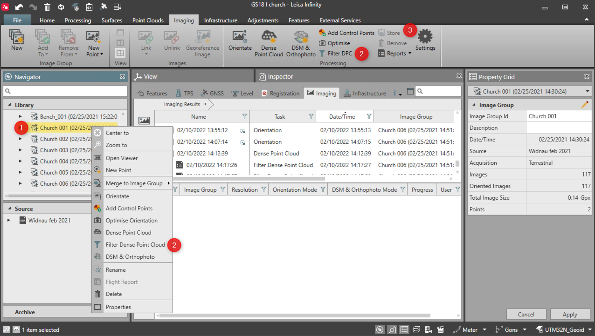

# Filtering of the Dense Point Cloud

### Filtering of the Dense Point Cloud

The DPC can be filtered according to the settings described in the Image Processing Settings.

To filter the stored DPC, do the following:

**To filter the stored DPC, do the following:**

|  |  |
| --- | --- |

| 1. | Highlight the image group object from which you created the DPC. |
| --- | --- |
| 2. | Select Filter Dense Point Cloud from the context menu or the ribbon bar. |
| 3. | To store the filtered DPC result and see it in the View:Highlight it and select Store from the Imaging ribbon bar or the context menu. |

**Filter Dense Point Cloud**

**Store**

The Filter DPC functionality is active only when a DPC task is already stored.

