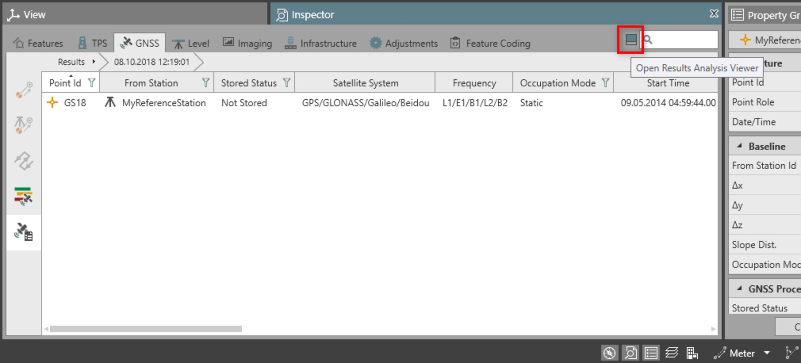
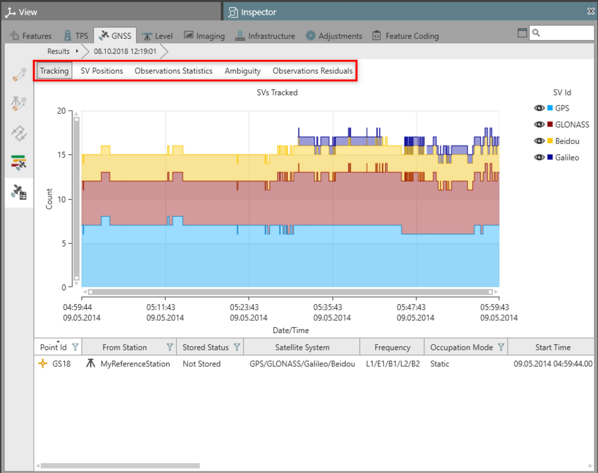
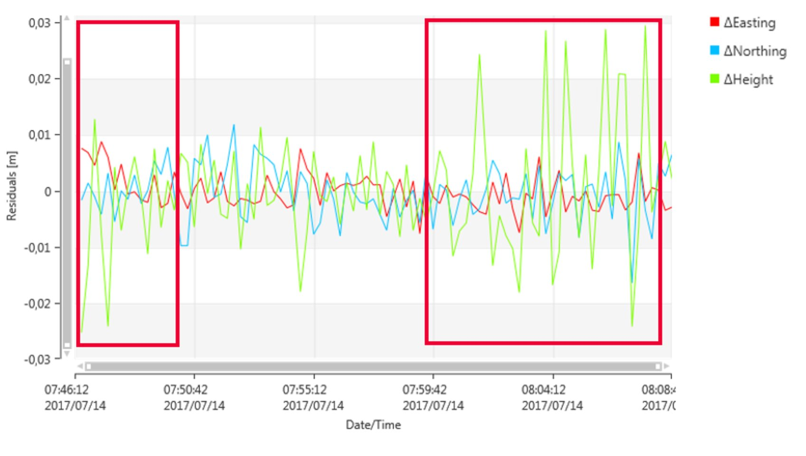
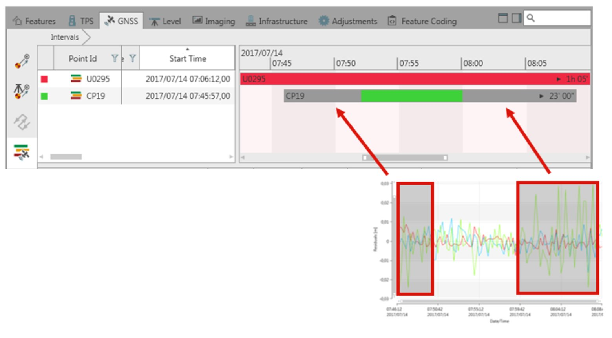
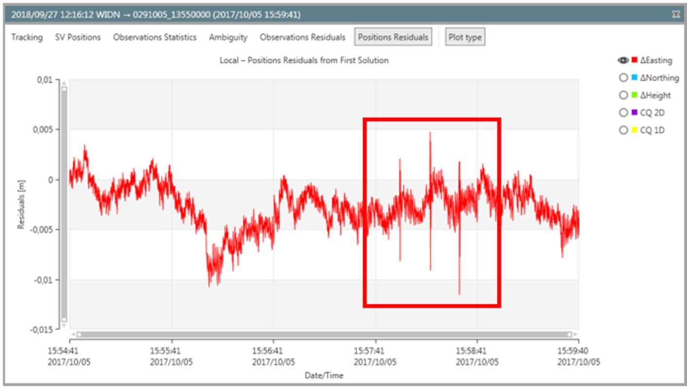
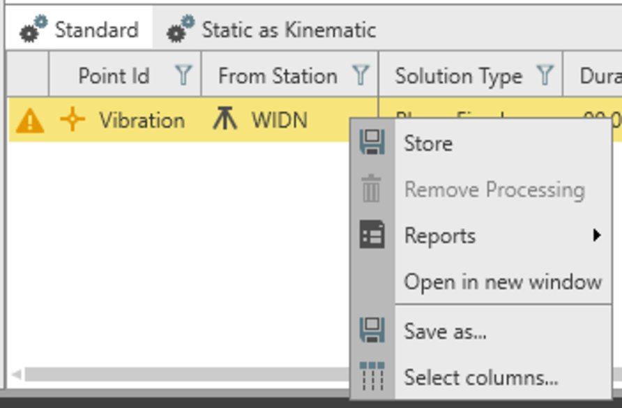
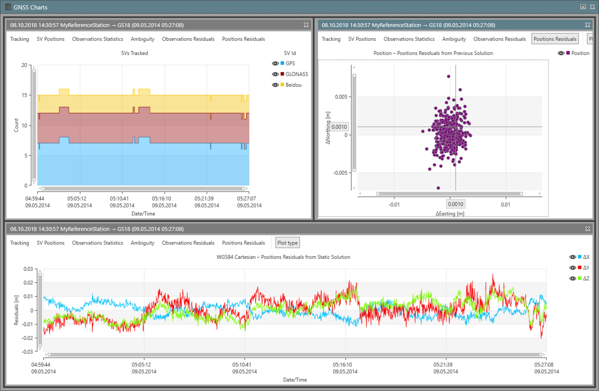

# GNSS Analysis Tools

### GNSS Analysis Tools

The GNSS post-processing module offers tools to investigate the details of the processing results.

To visualise the charts within the application:

**To visualise the charts within the application:**

| 1. | Open the GNSS processing results from the Inspector > GNSS > Results. |
| --- | --- |
| 2. | Open the Results Analysis Viewer, by selecting the option situated in the top right of the GNSS Inspector. |
| 3. | The GNSS > Inspector > Results, is split into two parts.Bottom partHas the processing results.Top partHas the charts with information about: Tracking (with used/rejected satellites and used/rejected observations per epoch), SV Position, Observations Statistics, Ambiguity and Observations Residuals.You can navigate within the charts by selecting the chart menu at the top of the plots. |

**Inspector**

**GNSS**

**Results**

**Results Analysis Viewer**

**GNSS**

**Inspector**

**Results**

- Bottom partHas the processing results.
- Top partHas the charts with information about: Tracking (with used/rejected satellites and used/rejected observations per epoch), SV Position, Observations Statistics, Ambiguity and Observations Residuals.

Position Residuals Charts

**Position Residuals Charts**

Position residuals come from the kinematic processing of static data.

The charts are available by:

**The charts are available by:**

- Selecting the **Process & Analyse** option.
- Setting **Process & Analyse Output** to position residuals or observation and position residual in the GNSS advanced settings, see Advanced Settings.

Position residuals are computed with respect to:

**Position residuals are computed with respect to:**

- Static Solution: The coordinates of the computed point (from the static processing) are taken as reference to compute the residuals.
- First Epoch: The coordinates at the first epoch of the kinematic processing are taken as reference to compute the residuals.
- Previous Epoch: The residuals at each epoch (t) are computed with respect to the solution of the kinematic processing at the previous epoch (t-1).
- User Entered: The residuals at each epoch are computed with respect to a point existing in the project. You can select the point through the edit pencil.

In the Inspector > GNSS > Results > Static as Kinematic tab, the statistics over the position residuals are available.

**Inspector**

**GNSS**

**Results**

**Static as Kinematic**

|  | The position residuals plot and statistics, can be used to evaluate the internal reliability of the data set and of the static solution. Residuals with a small dispersion around the zero, are indicator of good reliability. |
| --- | --- |
|  | Position residuals can help to identify possible issues in the solution, and at the same time could suggest a possible workaround. If you realise that part of the residuals are particularly noisy, it is suggested to exclude that range of data from the processing, by applying exclusion windows. In the following example (the chart represent the position residuals from the previous epoch), it is suggested to manually exclude from the processing the first and the last part of the data set. |
|  | The positions residuals plot can also be used to identify displacement of the antenna. The following picture, shows residuals of an antenna subjected to vibration. |
|  | By selecting Open in a new window from the Inspector > GNSS > Results > Advanced, a different type of plot can be opened and compared in a new window. |

**Open**

**Inspector**

**GNSS**

**Results**

**Advanced**

