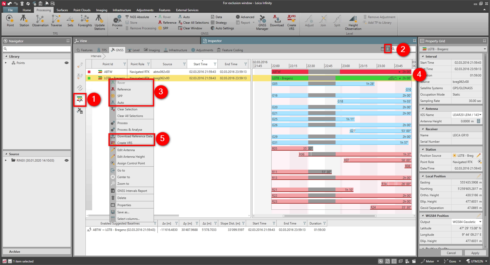
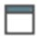
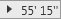
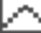
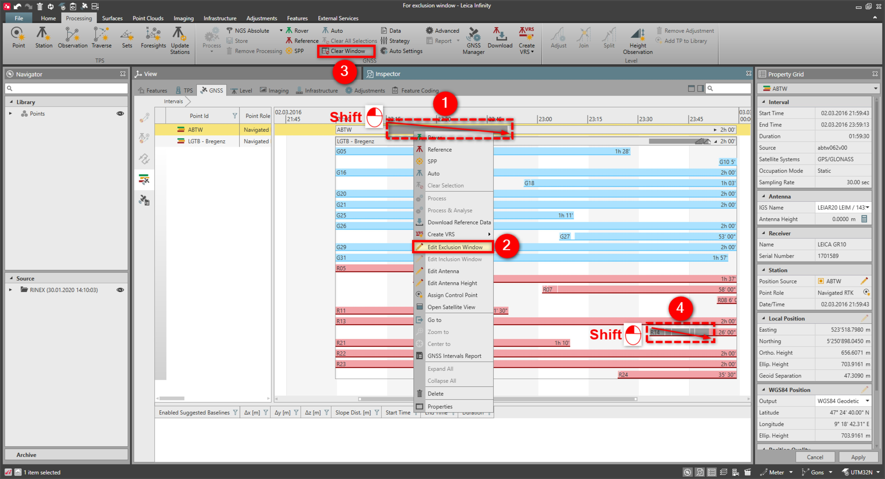
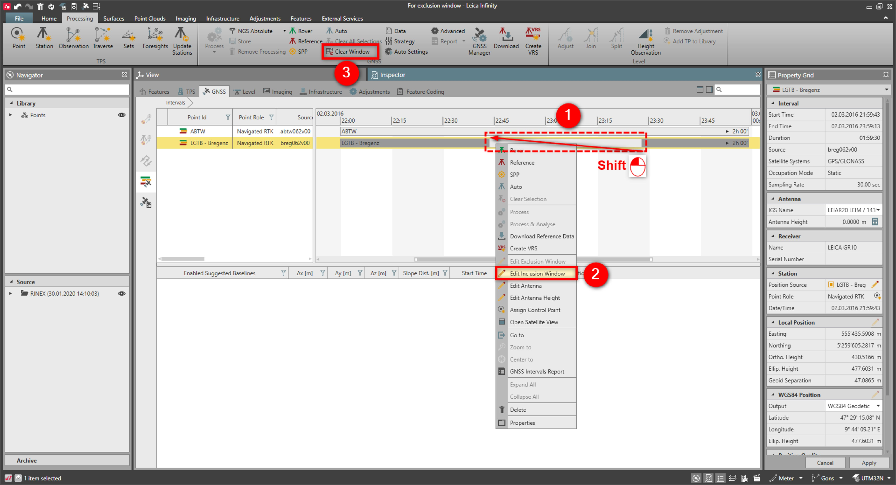

# GNSS Intervals

### GNSS Intervals

GNSS intervals are a graphical representation of the raw data imported into Infinity. They allow you to evaluate the quality of the input data (for example, data completeness and continuity) and to perform some actions on the data set itself (for example, exclude part of the data or download reference station data for data post-processing).

To open or close the interval view:

**To open or close the interval view:**

|  |  |
| --- | --- |

| 1. | Go to GNSS Intervals. |
| --- | --- |
| 2. | Select the    option next to the search field. |
| To set the Interval as a Reference , Rover , SPP or Auto: |
| 3. | Select the Interval and choose the function from the ribbon bar or the context menu. |
| To view the details of the Intervals: |
| 4. | Click the arrow    to open details on each satellite in the satellite view.If you do not see the arrow, zoom over the interval, or expand the interval if you are working with a mixed track.The default view shows satellites grouped by constellation type and includes display of cycle slips.Select the   , to display the SNR values: Red or Orange data is poor data.Select   , to view the elevation of the satellite. |
| To download data from a Reference Station or VRS: |
| 5. | Select Download Reference Data or Create VRS from the context menu.Data to be downloaded matches the date/time of the intervals from permanent reference stations. |

**GNSS Intervals**

**To set the Interval as a Reference , Rover , SPP or Auto:**

**To view the details of the Intervals:**

The default view shows satellites grouped by constellation type and includes display of cycle slips.

**To download data from a Reference Station or VRS:**

**Download Reference Data**

**Create VRS**

Data to be downloaded matches the date/time of the intervals from permanent reference stations.

See also:

**See also:**

Reference Stations

Create a Virtual Reference Station (VRS)

Exclusion Window

**Exclusion Window**

Normally, the whole observation period of an interval is used for processing and Infinity automatically rejects parts of the data which are not beneficial to the results. However, you may want to manually exclude part of the data.

To create an exclusion window:

**To create an exclusion window:**

|  |  |
| --- | --- |

| 1. | Press ‘Shift’ + ‘left mouse button’ and drag the mouse over the Intervals from left to right.An exclusion window is created and is not used in the data processing. |
| --- | --- |
| 2. | You can manually edit the start and end time of the exclusion window by selecting Edit Exclusion Window from the exclusion window context menu. |
| 3. | You can remove the exclusion window by selecting the interval and choosing Clear Window from the GNSS ribbon bar.You can remove the exclusion window also working with the mouse, moving it in the opposite direction (from right to left) like what is described in step 1. |
| 4. | You can create an exclusion window also for single satellites, by using the same functionality described previously. |

An exclusion window is created and is not used in the data processing.

**Edit Exclusion Window**

**Clear Window**

You can remove the exclusion window also working with the mouse, moving it in the opposite direction (from right to left) like what is described in step 1.

Inclusion Window

**Inclusion Window**

You may want to create an inclusion window, because you only want to work with part of the data you collected.

To create an inclusion window:

**To create an inclusion window:**

|  |  |
| --- | --- |

| 1. | Press ‘Shift’ + ‘left mouse button’ and drag the mouse over the Intervals from right to left.An inclusion window is created, and the rest of the data is excluded. |
| --- | --- |
| 2. | You can manually edit the start and end time of the inclusion window by selecting Edit Inclusion Window from the inclusion window context menu. |
| 3. | You can remove the Inclusion windows by selecting the interval and choosing Clear Window from the GNSS ribbon bar.You can also create an inclusion window without working with the mouse, but by directly selecting Edit Inclusion Window from the context menu of the intervals. Enter start and end time of the inclusion window and select OK. |

An inclusion window is created, and the rest of the data is excluded.

**Edit Inclusion Window**

**Clear Window**

You can also create an inclusion window without working with the mouse, but by directly selecting Edit Inclusion Window from the context menu of the intervals. Enter start and end time of the inclusion window and select OK.

**Edit Inclusion Window**

**OK**

See also:

**See also:**

Reference Stations

How to Post-Process GNSS Data?

GNSS Manager

