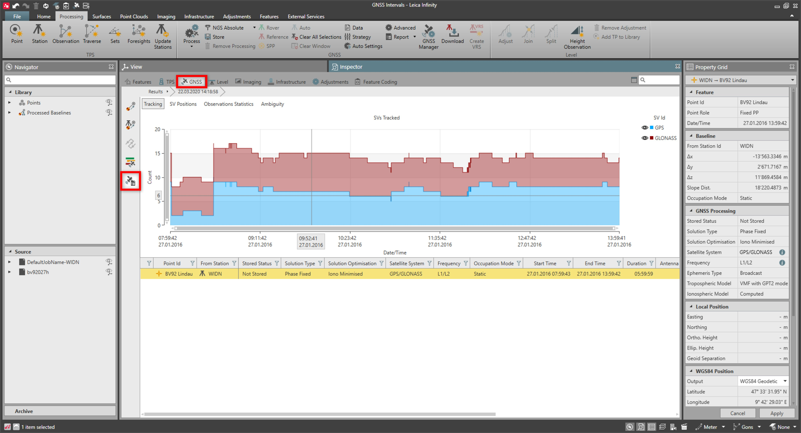

# GNSS Processing Results

### GNSS Processing Results

Drill into a result    and select the    option (next to the search field), to see a graphical representation of the results, for single baselines.

|  |  |
| --- | --- |

See also:

**See also:**

How to Post-Process GNSS Data?

