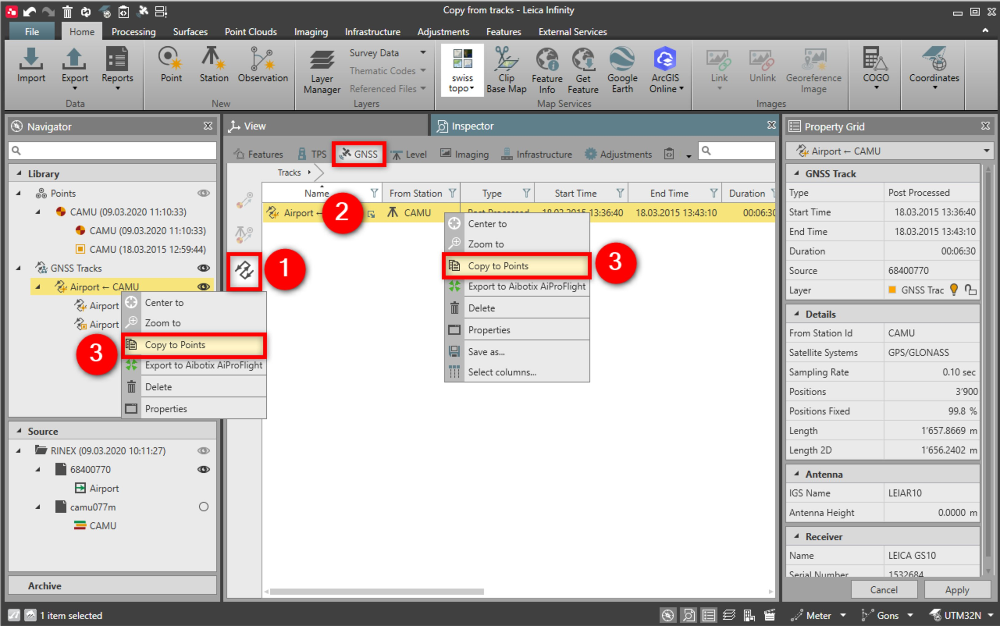

# GNSS Tracks

### GNSS Tracks

The GNSS tracks    tab lists all tracks in the project. A track is created using post-processing and storing moving intervals.

When processing kinematic data from two or more reference stations, a reduced kinematic track is computed. Drill in    into a track to inspect details and visualise the contributors to the tracks.

To extract discrete points from a GNSS track:

**To extract discrete points from a GNSS track:**

|  |  |
| --- | --- |

| 1. | Go to GNSS Tracks. |
| --- | --- |
| 2. | Select the track (entire track or its contributors). |
| 3. | Select Copy to points from the context menu or from the Navigator/Library. |

**GNSS Tracks**

**Copy to points**

The reduced track, its contributors and the copy to point functionality are also available in the navigator library, for quick access and management of the tracks.

