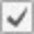
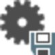

# General Adjustment Settings

### General Adjustment Settings

The parameters for adjustment computations can either be set in the File tab under Info & Settings or from inside the Adjustments ribbon bar.

Changes are stored with the project and applied to all future adjustment runs.

To set the adjustment parameters back to the default values:

**To set the adjustment parameters back to the default values:**

Go to the File tab and select the Defaults option in the    Adjustment Parameters section under Info & Settings.

**File**

**Defaults**

**Adjustment Parameters**

**Info & Settings**

Computation

**Computation**

Store results immediately after computing:

**Store results immediately after computing:**

Decide whether you want to store the results of an adjustment immediately and automatically after computing, or whether you want to store the results manually later on.

By default the option    Store results immediately after computing is active. When you change this setting, it has an immediate effect and also applies to projects which are already open.

When you de-activate this setting, you can store the results manually by selecting    Store Results from the Adjustments ribbon bar.

**Store Results**

**Adjustments**

Controls

**Controls**

Select how    control coordinates shall be introduced into the adjustment computation.

- **Constrained**Two or more control points are kept fixed.
- **Weighted**Control points are kept relatively fixed and are allowed to move according to their standard deviations.

Iterations

**Iterations**

Max. Iterations

**Max. Iterations**

Set the maximum number of iterations or computation runs to perform to try and reach the iteration criteria (see the following). The maximum number of iterations defines an upper limit and prevents the computation from running into an endless loop if there are problematic observations taking part in the adjustment which prevents the iteration criteria from ever being met. With GNSS observations, one iteration is normally sufficient to meet the iteration criteria. In this case, the adjustment automatically stops the computation even if maximum three iterations have been set.

Iteration Criteria

**Iteration Criteria**

The iteration criteria is the maximum allowed size of corrections to the adjusted coordinates which must be reached before the iteration stops. The iteration criterium is subject to the maximum number of iterations.

Visualisation Exaggeration Factors

**Visualisation Exaggeration Factors**

Absolute and Relative Error Ellipses/Reliability

**Absolute and Relative Error Ellipses/Reliability**

Set factors in order to enlarge the visualisation of error ellipses and reliability boxes such that the error ellipses and reliability boxes can properly be seen in the graphical view.

Threshold

**Threshold**

Set a threshold value above which error ellipses and reliability boxes shall be shown in the graphical view. Errors or reliability values below are not displayed independent of the given exaggeration factor.

Confidence Levels

**Confidence Levels**

Here you can set the confidence levels (that is the standard deviations) for Heights - 1D and absolute and relative Error Ellipses - 2D. The given values are stored in the adjustment results and shown in the adjustment report. In the graphical view absolute and relative error ellipses are shown.

The axes of the absolute and relative error ellipses are multiplied by a scale factor that is derived from the confidence levels as set by you for the stored adjustment result. If you use other than the standard confidence levels then confidence ellipses/ellipsoids are shown instead of error ellipses/ellipsoids.

The standard deviation for heights is treated in the same way.

The system default values are the standard one-sigma values, that are:

**The system default values are the standard one-sigma values, that are:**

- For Heights - 1D: 68.3%.
- For Error Ellipses - 2D: 39.4%.

Changing the confidence levels does not have any effect on the statistical tests.

### TPS Accuracy Information

Here you can define the standard deviations and the centering and height errors to be taken into account for the adjustment of TPS data. Altogether the values defined here are used to define an overall accuracy information to be fed into the adjustment.

Standard Deviations

**Standard Deviations**

Here you can define the default standard deviations that shall be applied to all TPS observations when computing an adjustment.

Source for Standard Deviations

**Source for Standard Deviations**

- Select **Individual** to make the adjustment apply the accuracies which are stored with the observations. These are normally the standard deviations pre-defined for all measurements on the instrument.
- Select **Use Defaults** to make the adjustment apply the default settings to be defined below for all observations. A ppm value can be entered to account for the relative length (the distance) of an observation.

Centering/Height Errors

**Centering/Height Errors**

Here you can define the default accuracy that shall be applied to the two end points (setup and target) of a measurement.

The centring error defines the predicted error that could have been made when centring the instrument/target on a point. The height error defines the predicted error when measuring the instrument/target height above a point.

Source for Centering/Height Errors

**Source for Centering/Height Errors**

****

- Select **Individual** to make the adjustment apply the accuracies which are assigned to the two end points (setup and target) individually.
- Select **Use Defaults** to make the adjustment apply the default settings to be defined below for setup and target.

### GNSS Accuracy Information

Here you can define the standard deviations, the centering and height errors and the sigma a priori to be taken into account for the adjustment of GNSS data. Altogether the values defined here are used to define an overall accuracy information to be fed into the adjustment.

Standard Deviations

**Standard Deviations**

Here you can define the default standard deviations that shall be applied to all GNSS observations when computing an adjustment.

Source for Standard Deviations

**Source for Standard Deviations**

- Select **Individual** to make the adjustment apply the accuracies which are stored with the observations.
- Select **Use Defaults** to make the adjustment apply the default settings to be defined below for all observations. A ppm value can be entered to account for the relative length of a baseline.

Centering/Height Errors

**Centering/Height Errors**

Here you can define the default accuracy that shall be applied to the two end points (reference and rover) of a measurement.

The Centring error defines the predicted error that could have been made when centring the reference/rover on a point. The height error defines the predicted error when measuring the reference/rover height above a point.

Source for Centering/Height Errors

**Source for Centering/Height Errors**

- Select **Individual** to make the adjustment apply the accuracies which are assigned to the two end points (reference and rover) individually.
- Select **Use Defaults** to make the adjustment apply the default settings to be defined below for reference and rover.

Sigma a Priori

**Sigma a Priori**

Here you can enter a value to compensate for too optimistic GNSS observations. Often, observations coming from GNSS post-processing programs are too optimistic in their accuracy information. This in itself does not matter when adjusting pure GNSS observations but it becomes important when combining GNSS and TPS observations.

### Level Accuracy Information

Here you can define the standard deviations to be taken into account for the adjustment of level data. Altogether the values defined here are used to define an overall accuracy information to be fed into the adjustment.

Source for Standard Deviations

**Source for Standard Deviations**

- Select **Individual** to make the adjustment apply the accuracies which are stored with the observations. These are normally the standard deviations pre-defined for all measurements on the instrument.
- Select **Use Defaults** to make the adjustment apply the default settings to be defined below for all observations. A ppm value can be entered to account for the relative length (the distance) of an observation.

To adjust level data, the level lines must start and end on different points. In order to perform the adjustments of closed loops, they must be split, so that they do not start and end on the same point.

