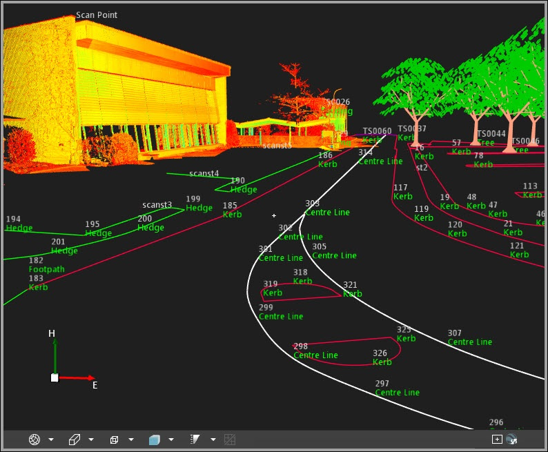
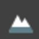

# Graphical View

### Graphical View

The graphical view displays the project content graphically in 2D or 3D. It is the main representation of project content and is always visible in the background. It cannot be switched off or hidden.

|  |  |
| --- | --- |

Zooming/Panning/Rotating the view:

**Zooming/Panning/Rotating the view:**

When you open a project, the graphical view is zoomed to the full extent. The whole project content is shown.

To zoom into inspect the data in detail:

**To zoom into inspect the data in detail:**

Scroll the mouse wheel back and forth to zoom in and out.

Alternatively select Ctrl+ or Ctrl- on the keyboard.

**Ctrl+**

**Ctrl-**

When you have zoomed in and you want to shift the view to neighbouring areas (pan the view):

**When you have zoomed in and you want to shift the view to neighbouring areas (pan the view):**

Press the mouse wheel and move the mouse into any direction until the displayed area suits your needs.

Alternatively press the Right, Left, Up or Down arrows on the keyboard.

**Right**

**Left**

**Up**

**Down**

To rotate the view:

**To rotate the view:**

Click into the view with the left mouse button and move the mouse.

The axis in the bottom left corner of the view follows your rotations and indicate the current view direction.

To look around:

**To look around:**

By default, the rotation in the graphical view is around the centre of the graphical view, marked by a little white cross. Look around, allows reverse rotation around the current camera position.

Select the    Look Around option on the status bar to rotate around the camera position. Click into the view with the left mouse button and move the mouse.

**Look Around**

Use Ctrl+R to turn on/off the look around.

**Ctrl+R**

To lock zooming to the pivot point:

**To lock zooming to the pivot point:**

By default, the pivot point is identified by your mouse pointer. When you start zooming the view is zoomed into the area that your mouse points at. But you can also lock the pivot point to the centre of the graphical view marked by the little white cross.

Select the    Lock the Pivot Point option at the bottom of the graphical view to lock the direction of view to its centre.

**Lock the Pivot Point**

Alternatively, press and hold Alt while zooming.

**Alt**

To zoom into the insides of an object:

**To zoom into the insides of an object:**

Switch to    Perspective View and zoom until you break through the surface of the object. Once inside you can rotate the view to look at the insides of the object.

**Perspective View**

Switching between Standard Views:

**Switching between Standard Views:**

You can switch between the following standard view options:

| Icon | Description |
| --- | --- |
|  | 2D Plane View:Select 2D Plane View to enforce a 2D view from the top down onto the data. The data is displayed as in a map only showing the position information. You cannot rotate the view when it is set to 2D.3D:Select 3D to see your data including its position and height information.3D Clamped:Select 3D Clamped to enforce a projection of the data to the height level of the lowest point in your project. |
|  | Parallel:Select Parallel to enforce a parallel projection of the data in the 3D view.Perspective:Select Perspective to allow for a perspective view.Zooming into the insides of an object is only possible in perspective view.The overview window is only available when the view is set to Parallel projection. When you switch to perspective the overview window disappears. |
|  | Select how you want to look at the data, that means select your Camera position. In the 3D view, you can freely rotate the view. But if you want to orientate the view such that you can look at your data exactly from, for example, the front or back or from the left or right then you have a choice here.The 2D view is set to be a top-down view. |
|  | Select whether you want to see the entities shaded (with or without edges) or whether you want to see just the wireframe. |
|  | Select the intensity of shading. |
|  | Enable the 3D terrain in order to view base maps, orthophotos or georeferenced images in 3D.The default DEM (SRTM) has a resolution of approximately one arcsecond.Due to the low accuracy, the DEM is only intended for visualisation purposes. |
|  | Select whether you want the coordinate grid to be shown or hidden. |
|  | Select the Look Around feature. |

**2D Plane View:**

**2D Plane View**

**3D:**

**3D**

**3D Clamped:**

**3D Clamped**

**Parallel:**

**Parallel**

**Perspective:**

**Perspective**

Zooming into the insides of an object is only possible in perspective view.

The overview window is only available when the view is set to Parallel projection. When you switch to perspective the overview window disappears.

**Parallel**

**Camera**

The 2D view is set to be a top-down view.

**DEM (SRTM)**

Due to the low accuracy, the DEM is only intended for visualisation purposes.

**Look Around**

Turn on Google Earth View Synchronisation:

**Turn on Google Earth View Synchronisation:**

When you turn on    Google Earth View Synchronisation, then Google Earth follows all zoom, pan and rotation operations you make in Infinity.

**Google Earth View Synchronisation**

Reset the View:

**Reset the View:**

To reset the view to the initial camera position right-click into the background of the graphical view and select Zoom All from the background menu.

**Zoom All**

Alternatively press Ctrl+Shift+R on the keyboard.

**Ctrl+Shift+R**

The zoom status is reset, which means that the view is zoomed to the full extent. Any panning and/or rotation operation is reset, too, so that you have a look at the data as if you had just opened the project.

Managing Layers:

**Managing Layers:**

How your data is represented in the graphical view can be modified in the layer manager, which allows you to switch layers on and off, lock them so that they cannot be modified and change the colour and style of their appearance. For more information, refer to Layer Manager.

Hiding Elements from View:

**Hiding Elements from View:**

When the data structure of your project is complex you can filter the view by switching elements or whole groups of elements off. This way the graphical view can be reduced to show the jobs and elements that you currently work on or that need revision.

To Switch Elements On or Off:

**To Switch Elements On or Off:**

Select the Eye    in the navigator to hide points and objects or even whole jobs from view. When the eye is shown in the navigator then the element or all elements in a job are visible in the graphical view.

**Eye**

Selecting Elements:

**Selecting Elements:**

| Action | Result |
| --- | --- |
| Single left mouse click onto an element | Selects the element. |
| Ctrl+single left mouse clicks onto elements | Selects a series of elements. |
| Shift (↑)+single left mouse clicks into background | Draws a polygon and selects all elements inside. |
| Shift (↑)+left mouse button+dragging the mouse | Draws window and selects all elements inside. |
| Shift (↑)+Ctrl+dragging window/drawing polygon | Selects all elements outside the window/polygon. |

**Single left mouse click onto an element**

**Ctrl**

**+single left mouse clicks onto elements**

**Shift (↑)**

**+single left mouse clicks into background**

**Shift (↑)+left mouse button**

**+dragging the mouse**

**Shift (↑)+Ctrl**

**+dragging window/drawing polygon**

The properties of the selected element are loaded to and shown in the property grid.

In the graphical view, selected elements change their colour as specified in the layer manager.

Centring Elements:

**Centring Elements:**

To centre the view on a selected element select an element in the navigator or in theiInspector, right-click onto it and select Centre To from the context menu.

**Centre To**

The view shifts to show the selected element in the centre.

