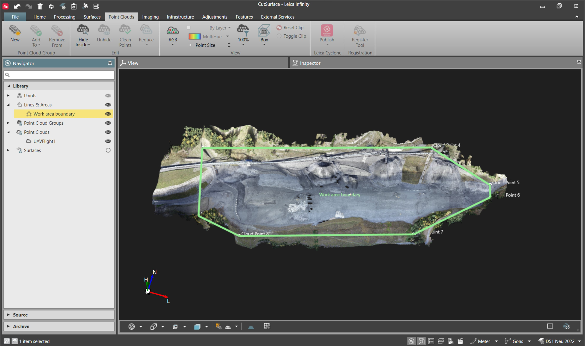
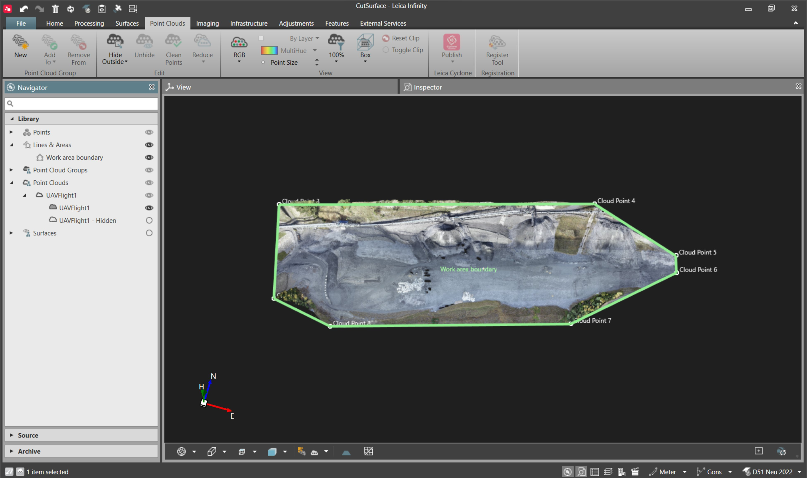

# Hide/Unhide

### Hide/Unhide

Hide/Unhide allows you to move scan points you do not want to work with to the hidden layer or to bring them back to the visible one.

Point cloud points can be selected either from the graphical view or using some existing features (closed lines/areas).

To hide point cloud points to the hidden layer:

**To hide point cloud points to the hidden layer:**

| 1. | In the Inspector, select the    Features tab and select a closed line or area. In the Navigator, a closed line/area can be selected from the Library section. You can also select lines or areas in the graphical view.OR:Alternatively, select a set of point cloud points from the graphical view. |
| --- | --- |
| 2. | Select    Hide Inside from the Point Clouds ribbon bar if you want to hide points inside the selection made or select    Hide Outside to hide points outside the selection. The selected closed line/area is projected along the height axis and all point clouds that are visible in the graphical view are affected.OR:Alternatively, point clouds points can be hidden from the context menu. Right-click the selected closed line/area and select    Hide Inside or    Hide Outside or right-click the point cloud in the graphical view and select    Hide. |

**Features**

**Hide Inside**

**Hide Outside**

**Hide Inside**

**Hide Outside**

**Hide**

A subitems structure is created both in the project library and in the inspector.

The hidden points subitem can only be visualised with single colour (by layer) colouring mode. This can be changed from the layer manager.

|  |  |
| --- | --- |

|  |  |
| --- | --- |

To unhide point cloud points to the visible layer:

**To unhide point cloud points to the visible layer:**

| 1. | From the project navigator Library, expand the parent point cloud object or navigate to the subitem in the    Features tab of the inspector. Then switch on the visibility eye for the hidden point cloud points subitem. In the graphical view, highlight the points that must be moved back to the visible layer. |
| --- | --- |
| 2. | Select    Unhide from the Point Clouds ribbon bar or right-click the point cloud in the graphical view and select    Unhide from the context menu. |

**Unhide**

**Unhide**

If all points belonging to the hidden layer are unhidden, the subitem structure is removed from the project library and the inspector.

Enable point cloud lighting to improve point cloud visibility. Brightness can be changed using the slider to the right.

**Enable point cloud lighting**

