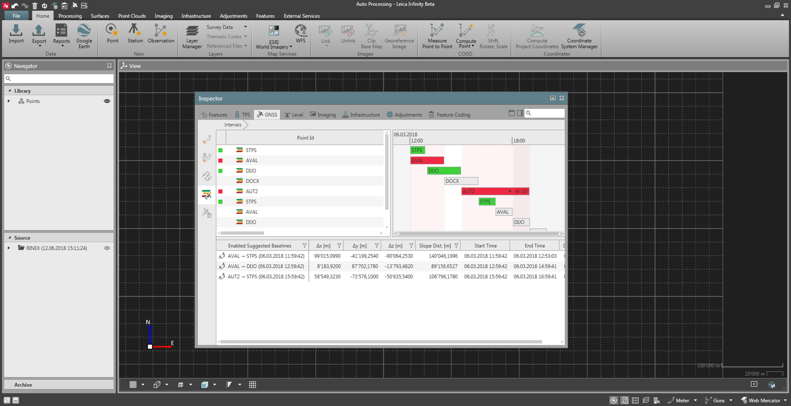
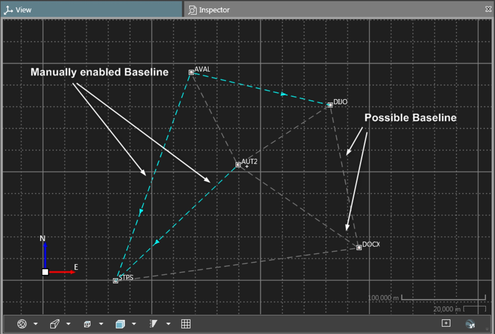
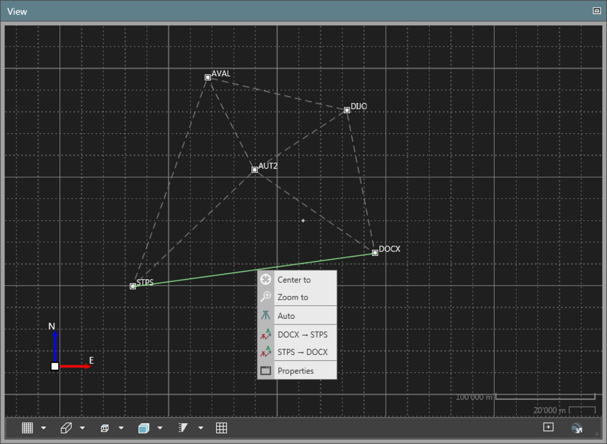
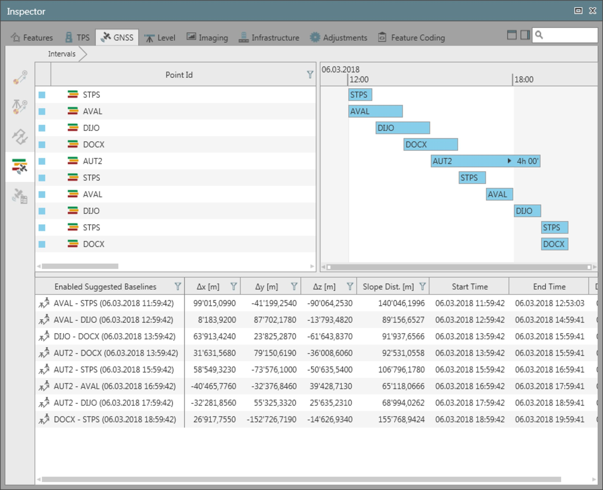
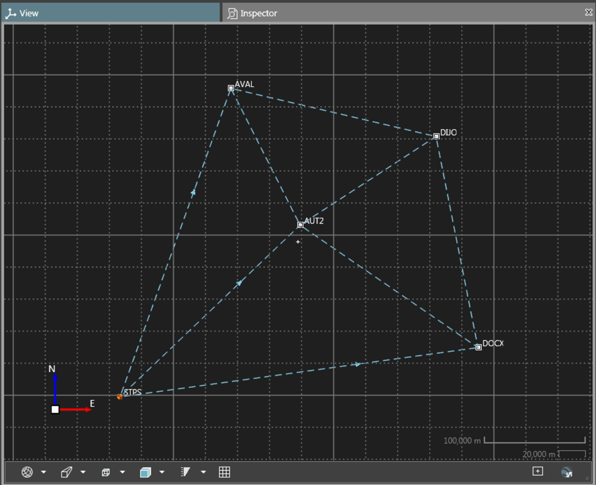
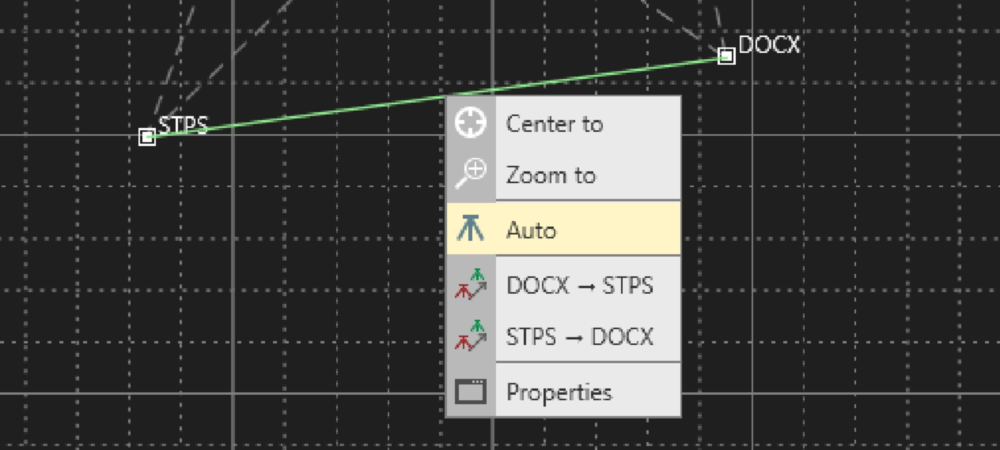
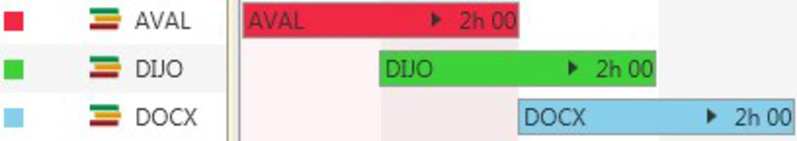
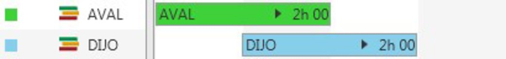
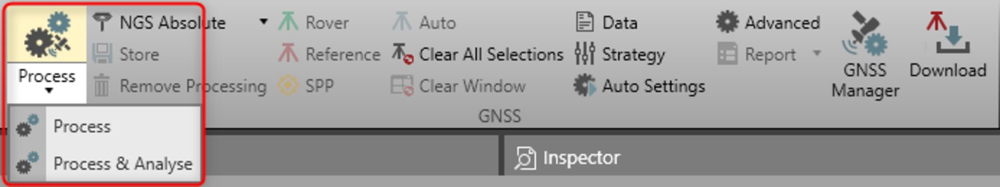

# How to Post-Process GNSS Data?

### How to Post-Process GNSS Data?

Setting up your project

**Setting up your project**

Setting up your project to post-process GNSS data. Import data to a project and adapt the processing parameters if necessary.

| 1. | Import the GNSS raw data to your project.See also:New Project Data Import GNSS raw data is only supported in the DBX (SmartWorx) or RINEX format. |
| --- | --- |
| 2. | Import and select a local grid coordinate system.Infinity can process pure WGS84 data, but it can only display local grid coordinates in the graphical view. This is the reason why you cannot view the points. The navigator shows you the following icon:   .Once you have selected a coordinate system the icon in the navigator changes to    and you can see the points in the graphical view.On how to import or define a coordinate system, see Coordinate Systems.On how to select a coordinate system within a project, see Coordinate Systems inside a Project. |
| 3. | Adapt the processing parameters. In the main menu, go to the Processing tab. Its ribbon bar offers you all GNSS relevant functionality.Select    to open the Data settings dialog.See also:Data Select    to open the Processing Strategy dialog.See also:Processing Strategy You can also define the data settings and the processing strategy through File > Info & Settings > Data Processing > GNSS.Select    to open the GNSS Manager.For further details on different processing strategies, see GNSS Manager. |

**See also:**

GNSS raw data is only supported in the DBX (SmartWorx) or RINEX format.

Infinity can process pure WGS84 data, but it can only display local grid coordinates in the graphical view. This is the reason why you cannot view the points. The navigator shows you the following icon:   .

Once you have selected a coordinate system the icon in the navigator changes to    and you can see the points in the graphical view.

On how to import or define a coordinate system, see Coordinate Systems.

On how to select a coordinate system within a project, see Coordinate Systems inside a Project.

**See also:**

**See also:**

You can also define the data settings and the processing strategy through File > Info & Settings > Data Processing > GNSS.

**File**

**Info & Settings**

**Data Processing**

**GNSS**

Manual processing

**Manual processing**

To post-process the imported raw data manually, proceed as follows. You see that directly after import the role of each point is navigated. When you have successfully processed the data, it is GNSS post-processed.

| 1. | Go to the Inspector GNSS tab.Select the    Intervals to display the list of all imported intervals.SelectStart Time in the header to sort the intervals by time.Select the    option next to the Search field to see a graphical representation. |
| --- | --- |
| 2. | Be sure to have assigned the correct point roles that you use as a reference. To assign as control, right-click on the interval and select Assign Control Point. |
| 3. | Specify the    reference and the    rover intervals. To do so right-click on an interval in the Inspector and select either Reference or Rover from the context menu.After setting your reference and rover station, the enabled baselines are listed in the GNSS > Inspector > Enabled Suggested Baselines. If there is a coordinate system attached to the project, the manually enabled baselines are also visible in the graphical view (before processing). The line colour of the manually enabled baseline is taken from the GNSS observation layer. Line width and line style of the manually enabled baselines are taken from the GNSS suggested baseline layer.You can also enable a baseline by selecting it from the graphical view (GNSS suggested baseline layer) and setting the direction from the context menu. After this action, the interval view is updated to reflect the changes.Intervals multi-selection is possible.Reference station data can also be downloaded from the Internet.See also:GNSS Manager |
| 4. | When you have selected a reference and all its rover intervals select    in the ribbon bar to process the data.Short-cut functionality is available here to change the antenna calibration set before starting the processing run. |
| 5. | Highlight the rover and its intervals again in the Inspector and select Reset from the context menu to remove the reference and rover flags.Specify the next reference and its rovers.Select the Processing option again in the ribbon bar. |
| 6. | Repeat Step 4 until all baselines are processed. |
| 7. | In the Inspector, the Results tab has become active. Drill into each processing run by selecting the little arrow    right next to it and inspect the results for each baseline.Select    in the ribbon bar to generate a report on the currently selected element. You can generate reports on single baselines, single tracks as well as on whole processing runs. |
| 8. | Select the results to be stored and select    in the ribbon bar.You can store single baselines, single tracks as well as whole processing runs.When you store points that have been computed with two or more different reference stations, then the point average is computed regardless of the solution type. This means that if a phase fixed solution and a code solution shall be averaged then the average is computed in any case and it is left to the user to decide whether the code solution shall be ignored or not.When you store tracks that have been computed with two or more different reference stations, then the track average is computed to the solution type. This means that if a phase fixed solution and a code solution shall be averaged then automatically the phase fixed solution is taken into account while the code solution is ignored.Only stored results are displayed in the graphical view. |

**Intervals**

**Start Time**

**Assign Control Point**

**Reference**

**Rover**

After setting your reference and rover station, the enabled baselines are listed in the GNSS > Inspector > Enabled Suggested Baselines. If there is a coordinate system attached to the project, the manually enabled baselines are also visible in the graphical view (before processing). The line colour of the manually enabled baseline is taken from the GNSS observation layer. Line width and line style of the manually enabled baselines are taken from the GNSS suggested baseline layer.

**GNSS**

**Inspector**

**Enabled Suggested Baselines**

You can also enable a baseline by selecting it from the graphical view (GNSS suggested baseline layer) and setting the direction from the context menu. After this action, the interval view is updated to reflect the changes.

Intervals multi-selection is possible.

Reference station data can also be downloaded from the Internet.

See also:

**See also:**

GNSS Manager

Short-cut functionality is available here to change the antenna calibration set before starting the processing run.

**Reset**

**Processing**

Select    in the ribbon bar to generate a report on the currently selected element. You can generate reports on single baselines, single tracks as well as on whole processing runs.

When you store points that have been computed with two or more different reference stations, then the point average is computed regardless of the solution type. This means that if a phase fixed solution and a code solution shall be averaged then the average is computed in any case and it is left to the user to decide whether the code solution shall be ignored or not.

When you store tracks that have been computed with two or more different reference stations, then the track average is computed to the solution type. This means that if a phase fixed solution and a code solution shall be averaged then automatically the phase fixed solution is taken into account while the code solution is ignored.

Only stored results are displayed in the graphical view.

Automatic processing

**Automatic processing**

To find the possible baselines automatically and post-process the imported raw data, proceed as follows.

| 1. | Go to the Inspector GNSS tab. |
| --- | --- |
| 2. | Be sure to have assigned the correct point roles for your control stations. To assign as control, right-click on the interval and select Assign Control Point. |
| 3. | Highlight all the intervals you want to consider for the baselines creation. Set the intervals to automatic from the GNSS ribbon bar or from the interval context menu.After setting your intervals to automatic, the enabled possible baselines are listed in the GNSS > Inspector > Enabled Suggested Baselines. If there is a coordinate system attached to the project, automatically enabled baselines are also visible in the graphical view (before processing). The direction of the baseline is not always known before processing, but it is determined once that the automatic algorithm is started.The line colour of the automatically enabled baseline is blue by default. Line width and line style of the automatically enabled baselines are taken from the GNSS suggested baseline layer.You can also enable a baseline by selecting it from the graphical view (GNSS suggested baseline layer) and selecting Auto. |

**Assign Control Point**

After setting your intervals to automatic, the enabled possible baselines are listed in the GNSS > Inspector > Enabled Suggested Baselines. If there is a coordinate system attached to the project, automatically enabled baselines are also visible in the graphical view (before processing). The direction of the baseline is not always known before processing, but it is determined once that the automatic algorithm is started.

**GNSS**

**Inspector**

**Enabled Suggested Baselines**

The line colour of the automatically enabled baseline is blue by default. Line width and line style of the automatically enabled baselines are taken from the GNSS suggested baseline layer.

You can also enable a baseline by selecting it from the graphical view (GNSS suggested baseline layer) and selecting Auto.

**Auto**

Manual processing and automatic processing can also be used together. In such a setting, the manual processing has the priority to the automatic processing in the baselines computation order. Moreover, results of manually selected baselines can be used to feed the automatic processing.

For example, in the following setting, the baseline AVAL -> DIJO is computed first. Therefore the coordinates of DIJO have been established and can be used to solve the baselines DICO -> DOCX.

A lonely interval set to reference (without rover), or a lonely interval set to rover (without reference) is not combinable with an interval set to automatic. In the setting below, no processing is performed.

Processing

**Processing**

To launch the processing, select the Process or Process & Analyse option in the GNSS ribbon bar.

**Process**

**Process & Analyse**

The processing options work as follows:

**The processing options work as follows:**

- **Process:**Run the GNSS data processing and show in the results basic data quality information, such as satellite tracking, DOP, ambiguity statistics. Additional data analysis products (observations residuals, position residuals) are not available in the results so to reduce the processing time.Choose this option to process a large amount of data.
- **Process & Analyse:**Run the GNSS data processing and output additional products to analyse the results. By default, Infinity outputs observation residuals (for all kinds of datasets) and position residual (for static dataset).The behaviour of the option can be modified from the GNSS advanced settings.Select this option to make a complete and deep data analysis.

