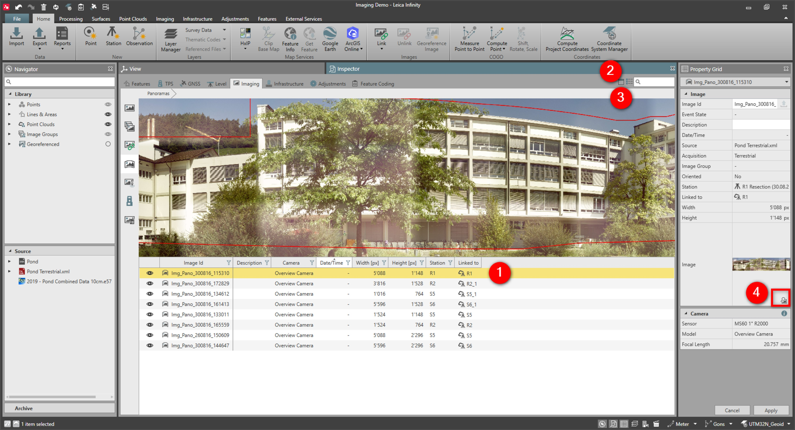

# Image Viewer

### Image Viewer

You can view the selected image in a resizable image viewer that is part of the inspector or in separate window.

To open/close the image viewer:

**To open/close the image viewer:**

|  |  |
| --- | --- |

| 1. | Select an image in the content view. |
| --- | --- |
| 2. | Select Open Image Viewer to see the image in a window.The image fits to the window size. |
| 3. | To close the image viewer, select Close Image Viewer. |
| 4. | Alternatively you can open the image viewer in a separate window by selecting the icon in the Property Grid. |

**Open Image Viewer**

The image fits to the window size.

**Close Image Viewer**

You can shift the separator between the content view and the image viewer to change the size of the display.

