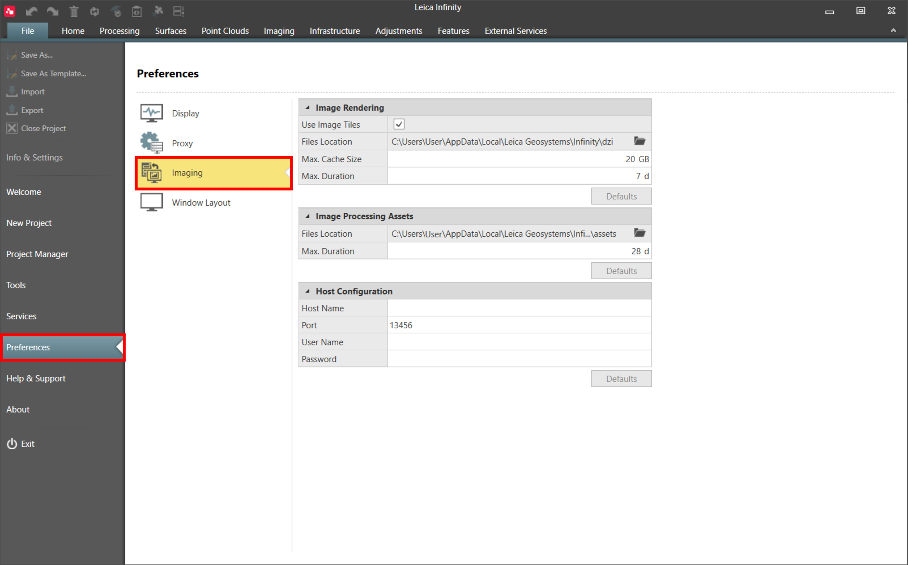
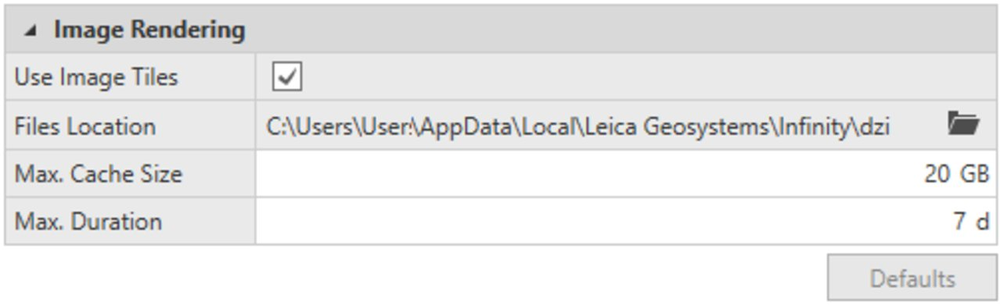
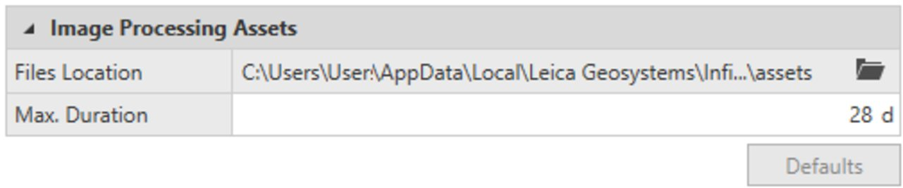
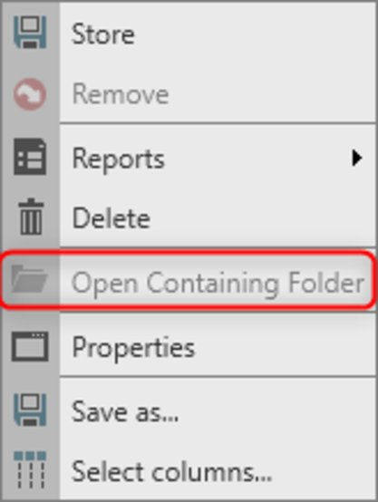

# Imaging

### Imaging

Under imaging, you can configure the preferences for image rendering, image processing assets and host configuration.

The settings you configure here apply to all projects.

|  |  |
| --- | --- |

### Image Rendering

Image import creates a directory to store temporary image-related data objects for large georeferenced images.

The default path for this folder is: C:\Users\[USER]\AppData\Local\Leica Geosystems\Infinity\dzi\.

The default Max. Cache Size for this folder is 20 GB.

The default life length for this folder is seven days.

In File > Preferences > Imaging > Image Rendering, these defaults can be modified.

**File**

**Preferences**

**Imaging**

**Image Rendering**

|  |  |
| --- | --- |

When Use Image Tiles is checked, temporary image-related data are created when images are imported or created (for example, when an orthophoto is created during image processing). The use of image tiles improves image rendering in the graphical view for large georeferenced images.

The Files Location is the location of the folder that has the image tiles.

Using the folder icon, a different folder can be selected. The selected folder contains the automatically generated dzi folder. Inside the dzi folder, a subfolder for each project is generated.

Consider the free disk space, when setting the Files Location.

To improve the processing time, use a fast read-write disk to store the folder containing the image tiles.

The Max. Cache Size defines the max. size of the folder that has the image tiles. Older data is deleted once the Max. Cache Size is reached. This process reduces the size of files on the computer used for image rendering. If deleted, image tiles are created again when images are requested to be shown in the graphical view. Increase this number if there is enough free space in the image tiles location.

The Max. Duration is the life length of the folder that has the image tiles. When the defined threshold is passed, the image tiles are deleted. This process reduces the size of the files on the computer used for image rendering. If deleted, image tiles are created again when images are requested to be shown in the graphical view. Increase this number if there is enough free space at the image tiles location.

Image tiles are anyway deleted when the project is deleted.

### Image Processing Assets

Image-processing tasks create an asset directory to store temporary image-processing related data objects.

The default path for this folder is: C:\Users\[USER]\AppData\Local\Leica Geosystems\Infinity\mvs\assets\.

The default life length for this folder is 28 days.

In File > Preferences > Imaging > Image Processing Assets, these defaults can be modified.

**File**

**Preferences**

**Imaging**

**Image Processing Assets**

|  |  |
| --- | --- |

The Files Location is the location for the folder containing the Image Processing Assets. Using the folder icon, a different folder can be selected. The selected folder has the automatically generated assets folder. Inside the assets folder, a subfolder for each project is generated.

When the path is modified, the change applies to projects created from that moment on, and to old projects where results are not yet generated. If a project already has a result from image processing: a change in the Files Location does not apply to it, even if new processes are started in this project.

For each project, all the asset folders are stored in the same parent folder.

When the assets folder directory for a project differs from the one set in Files Location, an already generated result in that project cannot be stored. The Open Containing Folder is greyed out when opening the context menu for such a result.

|  |  |
| --- | --- |

Once the same path is set again in the Files Location: the result can be stored again and results can be accessed using Open Containing Folder from context menu.

Another option to make the old results and the old asset folder path available again, is to run a new task for each project.

If Files Location is modified while a task is running, the change is applied to the next task, as soon as the processing engine is idle.

When the local computer is connected to a host computer for processing: the Image Processing Assets is greyed out since the assets folder is created on the host computer. To modify the settings, go to File > Preferences > Imaging > Image Processing Assets on the host computer and modify the Files Location.

**File**

**Preferences**

**Imaging**

**Image Processing Assets**

To improve the processing time, use a fast read-write disk to store the assets folder.

The Max. Duration is the life length of the folder containing the Image Processing Assets. When the defined threshold is passed, the assets are deleted.

Time is computed from the most recently created files in the assets folder. When the time passed from the creation of the most recent file is longer than the Max. Duration, the assets are deleted for that project. This process reduces the size of the files on the computer used for image processing.

Objects created like for example dense point clouds or orthophotos are still accessible in the project, but a not stored result, cannot be stored anymore.

Set a bigger value if results should be set to stored after more than 28 days. Set a smaller value if once the process is done and stored there is no need to store other results eventually present in the project.

The Max. Duration applies to all the assets folders on the computer used for processing, so a change in this value also impacts previous generated folders.

If Max. Duration is modified while a task is running, the change is applied as soon as the processing engine is idle.

When the local computer is connected to a host computer for processing: the Image Processing Assets is greyed out since the assets folder is created on the host computer. To modify the settings, go to File > Preferences > Imaging > Image Processing Assets on the host computer and modify the Max. Duration.

**File**

**Preferences**

**Imaging**

**Image Processing Assets**

When you delete a result from the Inspector > Imaging > Imaging Results, the correspondent assets folder is also deleted.

**Inspector**

**Imaging**

**Imaging Results**

The asset folder is anyway deleted when the project is deleted.

### Host Configuration

Imaging tasks can be sent to a different computer (host) for processing, as long as the following requirements are met:

- Both computers have an Infinity licence with the point clouds from images option.
- Both computers have the same version of Infinity.
- The Infinity image-processing worker host is already running on the computer that is used for processing.
- Infinity is running on the computer that sends the processing task.
- The computers are working within the same network.

By default, the host for image-processing tasks is the local computer, that is the computer where the project is already running.

