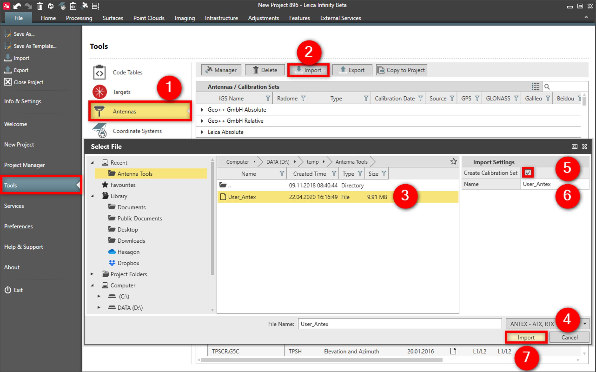

# Import

### Import

Except for the predefined antennas, it is possible to import new antennas and add them to the list.

The following actions can also be done from within the GNSS Manager.

To import a new antenna:

**To import a new antenna:**

|  |  |
| --- | --- |

| 1. | Select File, then Tools and then Antennas from the menu. |
| --- | --- |
| 2. | Select Import. |
| 3. | Select the antenna file you want to import. |
| 4. | Select the file type from the drop-down menu. |
| 5. | Select the checkbox Create Calibration Set in the import settings, to add all the antennas in the file, under a new calibration set. |
| 6. | Specify the name of the new calibration set. |
| 7. | Select Import. |

**File**

**Tools**

**Antennas**

**Import**

**Create Calibration Set**

**Import**

