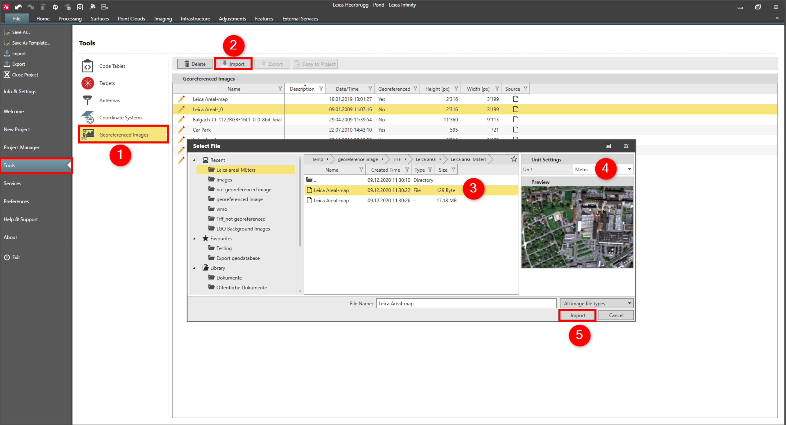

# Import

### Import

Images can be imported from PNG, JPG, TIFF or PDF.

When the images include a matching world file TIFF+TFW, PNG+PNW or JPG+JPW, then they are imported and translated as a georeferenced image. Otherwise it is possible to reference these images using the Georeference Images.

To import images:

**To import images:**

|  |  |
| --- | --- |

| 1. | Select File, then Tools and then Georeferenced Images from the menu. |
| --- | --- |
| 2. | Select Import. |
| 3. | Select the image you want to import. |
| 4. | Select the unit settings.You now see the image preview. |
| 5. | Select Import. |

**File**

**Tools**

**Georeferenced Images**

**Import**

You now see the image preview.

**Import**

See also:

**See also:**

Local and Global Data Objects

Georeference Images

The video "Leica Infinity - Home Module - Georeferencing Images" https://www.youtube.com/watch?v=m-U29-ipJgs

**"Leica Infinity - Home Module - Georeferencing Images"**

