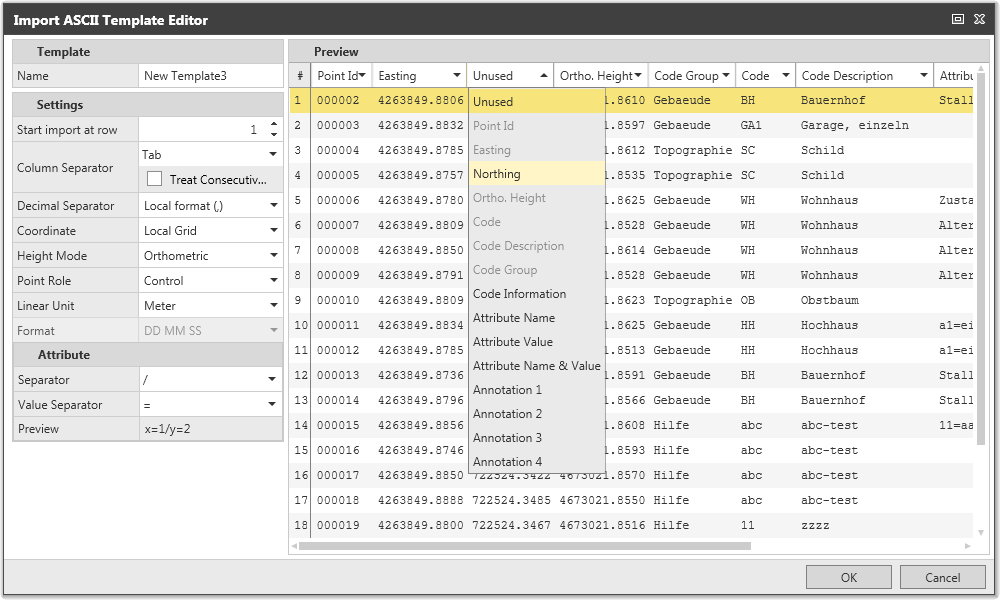
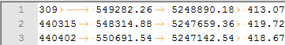
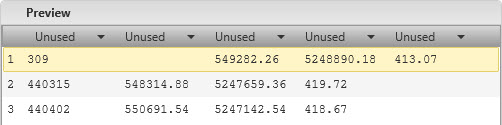
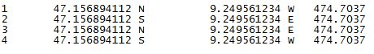
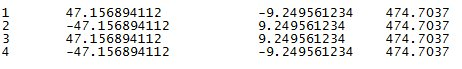
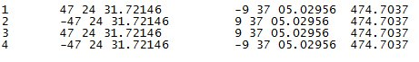
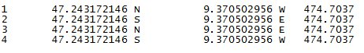

# Import ASCII Data

### Import ASCII Data

To import ASCII files into your project you have to use the ASCII import. A template must be defined to identify user-specific data structures which are typical of ASCII files.

Without a suitable and correctly defined template, it is not possible to read the data structure in the ASCII file nor to import the data.

To import ASCII data:

**To import ASCII data:**

| 1. | Go to the file tab and select Import from the menu on the left side or go to the Home tab and select Import from the ribbon bar. |
| --- | --- |
| In the Import dialog: |
| 2. | Select ASCII as the type of source file to be imported. |
| 3. | Browse to the file to be imported and select the file. |
| 4. | Under ASCII Settings select an existing Template that fits the file format or select New... to define a new one.Confirm a newly defined template with OK. |
| 5. | Select the Import option. |

**file**

**Import**

**Home**

**Import**

**Import**

**ASCII**

**file**

**existing Template**

**New...**

**OK**

**Import**

Defining an ASCII Import template:

**Defining an ASCII Import template:**

|  |  |
| --- | --- |

Settings:

**Settings:**

- Define at which row the import shall be started.If the ASCII files have a header in row 1 then start the import at row 2 (for example, at the row that has the first data set).
- Identify the Column Separator.Select **Treat Consecutive Delimiters as One** if necessary. See the following for further information.
- Identify the Decimal Separators that are used in the ASCII file.
- Identify the correct Coordinate Format and Height Mode of the data to be imported.
- Select the **Point Role** that shall be assigned to the imported points.
- Identify the Linear Unit.
- If you intend to import geodetic coordinates identify the Coordinate Format.For more information, refer to:

Attributes:

**Attributes:**

| Identify the Attribute and Value Separators that are used in the ASCII file.A preview shows you which structure is expected based on your settings.Preview and ASCII file must correspond to each other. |
| --- |

- Identify the Attribute and Value Separators that are used in the ASCII file.
- A preview shows you which structure is expected based on your settings.

Preview and ASCII file must correspond to each other.

Preview:

**Preview:**

| Identify the data type in each column by selecting a type from the drop-down menus.To identify the column point ID is mandatory. All other data types can optionally be set.Columns of type Unused are ignored during import.For the height, only the previously selected mode is available for selection.If a column only has attribute values (without the attribute name) then select Attribute Value from the drop-down menu.If the name is given in the file header then it is taken from there.If the header is empty a default name is assigned. |
| --- |

- Identify the data type in each column by selecting a type from the drop-down menus.To identify the column point ID is mandatory. All other data types can optionally be set.

Columns of type Unused are ignored during import.

For the height, only the previously selected mode is available for selection.

If a column only has attribute values (without the attribute name) then select Attribute Value from the drop-down menu.

**Attribute Value**

If the name is given in the file header then it is taken from there.

If the header is empty a default name is assigned.

Treat consecutive delimiters as one

**Treat consecutive delimiters as one**

It may happen that your ASCII file looks like this:

Using two tabs following each other in the first row but only one as separator in the following rows. ASCII Import would interpret this as:

Making it impossible to identify the columns.

Select Treat consecutive delimiters as one to achieve a correct interpretation of the columns.

**Treat consecutive delimiters as one**

The resulting columns in the Preview are inline and you are able to identify each by its header.

Geodetic Coordinate Formats

**Geodetic Coordinate Formats**

If you intend to import geodetic coordinates from a text file the coordinates have to be in one of the following formats:

DD.DDDD

**DD.DDDD**

Or

With the "-" sign indicating West and South.

DD MM SS

**DD MM SS**

Or

With the "-" sign indicating West and South.

DD.MMSS

**DD.MMSS**

Or

With the "-" sign indicating West and South.

