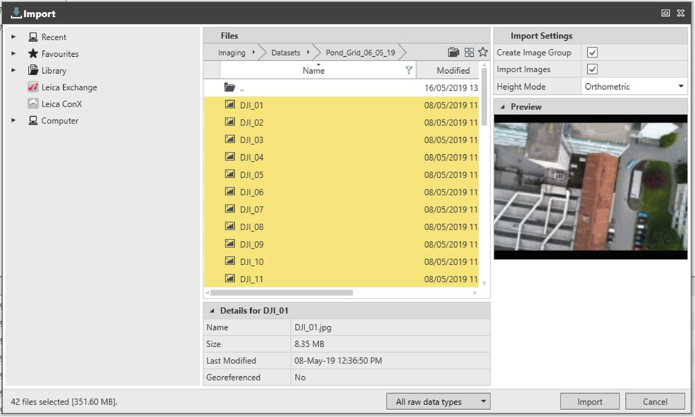

# Import Images

### Import Images

Images can be imported through the Import dialog or by drag and drop option. Currently, JPG, PNG, TIFF and PDF file types are supported for images. JPG, PNG and TIFF file types are supported for georeferenced images.

Import dialog:

**Import dialog:**

|  |  |
| --- | --- |

| 1. | Check or uncheck the desired Import Settings. |
| --- | --- |
| 2. | Select Import to start the import. |
|  | For images imported by drag and drop, the default Import Settings are applied. |

**Import Settings**

**Import**

Import Settings

**Import Settings**

When the Create Image Group box is checked, an image group is created directly after closing the import dialog. In order to be processed, images must be added to an image group. If no image group is created on import, one can be created after the import and images can be added to it. For further information, see Image Group.

**Create Image Group**

At least two images must be selected for this option to become available.

By default, this setting is checked. However, if unchecked, Infinity remembers the selection at the following import.

When the Import Images box is checked the images are copied to the project. If this option is unchecked, the images are not copied into the project but linked to it through the path specified in the import dialog. If, after importing, the images are deleted or moved to a different path, no processing is allowed. A warning message is displayed if the images cannot be found at the expected location.

**Import Images**

When moving the project to another computer for further processing, the link is no longer valid and no further processing is possible.

By default, this setting is checked. However, if unchecked, Infinity remembers the selection at the following import.

