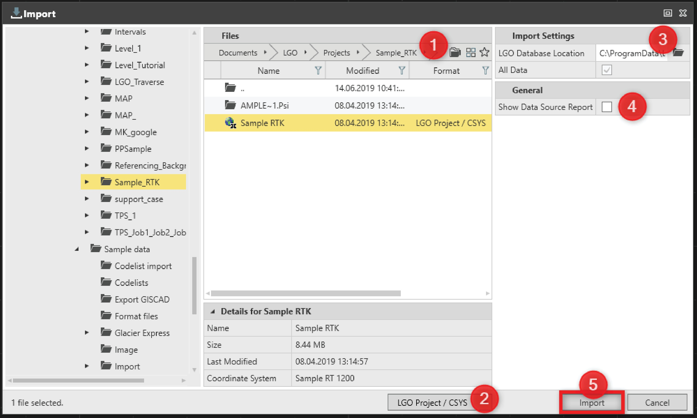

# Import LGO Project

### Import LGO Project

With this function, it is possible to import data from LGO projects into Infinity.

To import an LGO Project:

**To import an LGO Project:**

| Drag and drop: |
| --- |
| 1. | Navigate to the LGO project folder in Windows File Explorer or similar. |
| 2. | Select, then drag the LGO project folder and drop it into Infinity. |

**Drag and drop:**

Default import settings are used.

Or

Import dialog:

**Import dialog:**

|  |  |
| --- | --- |

| 1. | Navigate to LGO project folder and select the project to import data from. |
| --- | --- |
| 2. | Choose the data format for import to LGO Project/CSYS to filter the import view. |
| 3. | Specify the path of the LGO database (ODB).If LGO is installed on the computer the path is recognised automatically. If LGO is not installed, copy the ODB directory from another computer and the path to it is defined here. |
| 4. | Select whether to Show Data Source Report. |
| 5. | Select Import. |

If LGO is installed on the computer the path is recognised automatically. If LGO is not installed, copy the ODB directory from another computer and the path to it is defined here.

**Show Data Source Report**

**Import**

The list of supported LGO objects and the data that can be imported is explained in the following table:

**The list of supported LGO objects and the data that can be imported is explained in the following table:**

| Object | What is supported or not supported |
| --- | --- |
| Features | Supported: Points, lines, areas with codes and assigned Images.Not supported: Shading styles for areas. |
| Coordinate System CSYS | Supported: Coordinate systems from the CSYS manager or a project.Not supported: If the coordinate system has a geoid.exe file or a stepwise/interpolation transformation, the CSYS is skipped on import. |
| TPS | Supported: Stations, observations, setups, traverse, Sets of Angles.Set orientation with known azimuth option from LGO is transferred to known backsight method. |
| GNSS | Supported: Stations, observations with QC values, tracks and interval events, antennas.Not supported: Raw data is not imported.Use the RINEX format to export from LGO and import to Infinity if reprocessing is required. |
| GNSS Hidden Points | Supported: Offset information. |
| Level | Supported: Observations and level lines.To view misclosure and height errors, reprocess the level line. |
| Codelists | Supported: Project codelist imported to Infinity as field codes.Not supported: Global codelists. |
| Images | Supported: Images linked to points, lines, areas, TPS stations as well as not linked images. |
| Georeferenced Images | Supported: If LGO is installed on the same computer as Infinity and the path to the database folder (ODB) is defined. |
| Free Codes | Supported: LGO free codes are imported as with the option Apply leap seconds set in LGO. |
| Surfaces | Supported: Surfaces with boundaries and breaklines. If the surface vertices are stored in WGS84, the created surface is not editable.Not supported: Importing contours. |
| DXF Background Maps | Not supported: Imported separately using the DXF/DWG import. |

**Supported:**

**Not supported:**

**Supported:**

**Not supported:**

**Supported:**

Set orientation with known azimuth option from LGO is transferred to known backsight method.

**Supported:**

**Not supported:**

Use the RINEX format to export from LGO and import to Infinity if reprocessing is required.

**Supported:**

**Supported:**

**Supported:**

**Not supported:**

**Supported:**

**Supported:**

**Supported:**

**Supported:**

If the surface vertices are stored in WGS84, the created surface is not editable.

**Not supported:**

**Not supported:**

