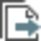

# Info & Settings

### Info & Settings

In this section of the file tab, you can find information on the settings for the Infinity project that you are currently working on. You can adapt the settings to your personal requirements.

### Project Information

Project Details and Project Customer & Details

**Project Details and Project Customer & Details**

View and/or edit the project details and project customer details as set when you created a project under File > New Project.

**File**

**New Project**

See also:

**See also:**

New Project

Feature Coding

**Feature Coding**

Choose a different Code Table to be used with the current project. Select Apply to make your changes become effective in the current project.

**Apply**

Point Cloud Classification

**Point Cloud Classification**

Chose the Classification Tables to be used with the current project. Select Apply to make your changes become effective in current project.

**Apply**

### Coordinates & Units

Units

**Units**

Decide on your preferred distance, area, volume and angle units and the decimal places to be available.

Decide on your preferred temperature and pressure units and the decimal places to be available.

Choose the coordinate order you prefer. Available are easting/northing or northing/easting.

Your choice is applied to the listing of coordinates in, for example, the wizards or the property grid. It does not apply to the content views, though, where a change in the column order can be achieved by drag and drop of columns.

Coordinate Systems

**Coordinate Systems**

Choose one of the coordinate systems that are stored with the project to be used as the master. Coordinate systems are either stored to a project automatically by being imported together with raw data or can be    copied to a project manually from inside the global coordinate system management under File > Tools > Coordinate Systems.

**File**

**Tools**

**Coordinate Systems**

The coordinate system you choose is used for converting between WGS84 and local coordinates.

See also:

**See also:**

Coordinate Systems inside a Project

Coordinate Systems

Choose None if you want each job to be converted using its own coordinate system.

**None**

If you want a different coordinate system to be attached to a job then change the job properties accordingly in the property grid.

View information on the transformation and residual distribution, on the ellipsoid and projection as well as on the geoid and CSCS model used with the selected coordinate system. A different geoid or CSCS model can be selected in the coordinate system properties.

See also:

**See also:**

Coordinate System Properties

Coordinate Display

**Coordinate Display**

Choose local if you want Infinity to hide WGS84 coordinate representations in the inspector, the property grid and the graphical view. Only WGS84 observations which can be converted to local grid shows up in the graphical view.

Choose Local and WGS84 if you want Infinity to output local grid and WGS84 coordinates. To display local grid coordinates is by default always selected. You can additionally select geodetic and/or cartesian coordinate representations to be output in either local and/or WGS84 if available or convertible. The inspector shows the additional columns. In the property grid switch between representations by selecting a different output.

**Local and WGS84**

To be able to convert coordinates from one format to another, a coordinate system must be selected to be used with the project data.

Coordinate Direction

**Coordinate Direction**

Choose to switch the northing and/or easting.

### Points & Angles

Point Averaging Settings

**Point Averaging Settings**

Define the maximum distance allowed between an average and the measurements from which it has been computed.

Define whether weighted averages shall be computed for the current project. The setting is applied to points and GNSS tracks.

For GNSS tracks the average is computed with respect to the solution type.

Meaning that if a phase fixed solution and a code solution shall be averaged automatically, the phase fixed solution is taken into account while the code solution is ignored.

Angle Reduction Parameters

**Angle Reduction Parameters**

Define the angle residuals and slope distance residuals to be allowed when computing sets of angles.

The tolerance settings can also be changed for single computation runs in the sets of angles wizard or for single targets once a sets of angles computation is completed. To change the tolerances for single targets select the    option in the Observation section of the Sets of Angles Target properties. The tolerances shown correspond to the last used, but can be changed for single targets if necessary.

**Observation**

**Sets of Angles Target**

Define the maximum face differences to be allowed when computing sets of angles.

Image Point Tolerances

**Image Point Tolerances**

Defines the maximum 3D accuracy allowed for the computed image points. If the 3D accuracy is outside of this value, no point is computed.

You can always reset your changes to the factory defaults.

### Staked Points

Define the stakeout tolerances.

Defaults are available.

When you import stakeout data to Infinity then the delta values that exceed the defined tolerances are marked in red bold in the stakeout report.

See also:

**See also:**

Reports

### Checked Points

Define the checked tolerances.

Δ Azimuth - Is the difference between the calculated azimuth and the current orientation.

Δ Hz Distance - Is the difference between the calculated and the current horizontal distance.

Height Difference - Is the difference between the calculated and the current height.

Defaults are available.

When you import checked points data to Infinity then the delta values that exceed the defined tolerances are marked in red bold in the checked points report, as well as the TPS inspector.

See also:

**See also:**

Reports

### Data Processing: TPS

Default Traverse Adjustment Parameters

**Default Traverse Adjustment Parameters**

Define the default parameters for adjusting traverses like method and balancing.

Decide whether you want to apply scale to observations.

Tolerance Checks in Traverse Wizard

**Tolerance Checks in Traverse Wizard**

Define which tolerance checks shall be used in the traverse wizard and enter different values for the limits.

Station Difference before and after Adjustment

**Station Difference before and after Adjustment**

Define the maximum allowed difference between stations before and after the adjustment computation.

The changes you make here are used as defaults in the traverse wizard. You can always reset your changes to the factory defaults.

For entering different values for tolerance checks, the available decimal places should be set to at least five positions after the decimal point for angles and three for distances.

For detailed information on single parameters, see:

**For detailed information on single parameters, see:**

Traverse Processing Parameters

### Data Processing: GNSS

The sections data and processing strategy, correspond to dialogs in the GNSS processing module.

See also:

**See also:**

Data

Processing Strategy

Advanced Settings

The defaults used in the advanced settings are suffice in most cases. Only modify them if you are an advanced user and have special data to be processed.

The section time, sets the time format used in the Inspector > Intervals View.

**Inspector**

**Intervals View**

See also:

**See also:**

GNSS Intervals

The section Computation, steers automated behaviour that follows a computation.

You can also decide whether navigated tracks are processed on import. Only when this setting is active are GNSS tracks automatically recognised as data objects on import.

### Data Processing: Level

Level Line

**Level Line**

Define the default level line adjustment method - By distance or equally.

Set the default tolerance values to flag the line information before applying adjustment.

Observations

**Observations**

Set the default tolerance values to flag the observation information to help identify data issues.

Point Heights

**Point Heights**

Set the default tolerance values to flag the height differences to be applied to the points.

Staff Corrections

**Staff Corrections**

Set the default staff correction values that could be applied in a level line adjustment.

### Registration

Cloud-to-Cloud

**Cloud-to-Cloud**

Define default parameters for the cloud-to-cloud routine including max. iterations and search radius. The max. points density and normal threshold can also be set in this section.

Targets

**Targets**

Define default parameters for the match targets routine including max. target error and prioritise targets.

Unified Point Cloud

**Unified Point Cloud**

Define the default parameter for the max. number points.

Registration Tolerances

**Registration Tolerances**

Define the flagging tolerances for a number of registration metrics in the application and scan registration report.

See Point Cloud Registration Settings for descriptions on individual settings.

### Image Processing

Images can be processed to create quality 2D and 3D data deliverables, such as Dense Point Clouds (DPC), Digital Surface Models (DSM) and Orthophotos.

Default settings are intended to be the most suitable solution in most cases.

See Image Processing Settings for descriptions on individual settings.

### Network Adjustments: General

General

**General**

Set the general parameters for adjustment computations and iterations.

Test Criteria

**Test Criteria**

Define the Test Criteria to be used in adjustment computations.

**Test Criteria**

Advanced Terrestrial Parameters

**Advanced Terrestrial Parameters**

Decide whether reduced observations and/or refraction coefficients and scale factor corrections shall be used.

Define the values for the refraction coefficients and scale factor corrections.

Coordinate System

**Coordinate System**

Decide on the coordinate system and the height mode in which your observations shall be adjusted.

Define rotations about the axis and a scale if necessary.

The changes you make here are used as defaults in the adjustments module of your project. You can always reset your changes to the factory defaults.

For entering different values, the available decimal places should be set to at least five positions after the decimal point for angles and three for distances.

For detailed information on single parameters see:

**For detailed information on single parameters see:**

General Adjustment Settings

Test Criteria

Advanced Terrestrial Parameters

Coordinate System Settings

### Network Adjustments: Accuracy

TPS

**TPS**

Define standard deviations and centering and height errors for TPS observations.

GNSS

**GNSS**

Define standard deviations and centering and height errors for GNSS observations.

Level

**Level**

Define standard deviations and centering and height errors relative to the level data.

### Surfaces & Contours

Meshing

**Meshing**

Define the Max. Triangle Size and the Min. Triangle Size for the surfaces created with the refined, regular and 2.5D method.

**Max. Triangle Size**

**Min. Triangle Size**

Occasionally, triangles can exceed the maximum and minimum defined size. This may occur when the surface must be continuous, for example while creating a watertight mesh. Like for example on surface boundaries, the triangle size may exceed the defined maximum and minimum size to produce a more reasonable and realistic shape of the surface.

Fill Holes

**Fill Holes**

Fill Interpolation - Define the method. The level of interpolation uses surrounding surface geometry to determine the number of extra triangles to create between hole edges.

**Fill Interpolation**

Contours

**Contours**

Minor Interval - Define the distance between contour lines that are drawn.

**Minor Interval**

Major Frequency - Define when a major contour is drawn. Usually this setting is set at five or ten.

**Major Frequency**

Min. Length - Define the minimum contour length. Contours shorter than this value are not created.

**Min. Length**

Smoothing - Define the degree of smoothing applied to the contour lines.

**Smoothing**

Cut Fill

**Cut Fill**

Cut Definition - Define if the cut positive values are referring to the material Above Reference or Below Reference.

**Cut Definition**

**Above Reference**

**Below Reference**

Cut Fill/Comparison Map

**Cut Fill/Comparison Map**

Define the Type of cut fill and comparison map. Should only differences in the height be calculated (Height Difference) or if a value above and below the reference should be used for calculation and visualisation (Tolerance).

**Type**

**Height Difference**

**Tolerance**

If Tolerance is selected for the Type, then define the Upper Tolerance, Lower Tolerance values and the Min. Segment Distance.

**Upper Tolerance**

**Lower Tolerance**

**Min. Segment Distance**

Then define the Colour Mode, Colour Ramp and the Colour Transition.

**Colour Mode**

**Colour Ramp**

**Colour Transition**

### Copy CAD to Library

The copy from CAD settings can be set separately for points, lines, areas, surfaces, alignments roads and tunnels.

Define the point role that points copied from CAD shall have. Choose between User-entered or Control.

**User-entered**

**Control**

Define a naming scheme (a prefix or a suffix) that entities copied from CAD shall have.

Separate prefixes and/or suffixes can be defined for points, lines, areas, surfaces, alignments and roads.

Decide if/how the imported entities shall be coded.

A code table needs to be defined.

Surfaces and roads cannot be coded.

Decide on which layer the imported entities shall be:

**Decide on which layer the imported entities shall be:**

- By default the layer structure is taken over from the source file.
- If the source file does not have layer information, then the entities are imported to a default layer.

If a code table is defined and codes are assigned to layers, then layer selection is blocked.

Define how heights shall be managed for points copied from CAD.

Define a default height that 2D objects shall get.

You can also specify a height to be excluded. Entities with that height are copied either as 2D objects (with no height) or they get the specified default.

Defaults can be restored separately for points, lines, areas and surfaces.

### Infrastructure

General

**General**

Choose the way and with which precision chainages are displayed in the graphical view, inspector and the property grid.

Choose major interval and minor frequency to define how the alignment shall be segmented visually.

Define your own abbreviations for horizontal and vertical points of interest.

Road

**Road**

Set the tolerance thresholds for the maximum deflection angle that two consecutive elements are allowed to have in a horizontal or vertical alignment.

Exceeding values are flagged in the application and reports.

The stringline chord tolerance defines the spacing used for digitising stringlines.

Curves must be digitised as a sequence of straight segments and the tolerance defined here is used for it.

Angular and metric units can be changed under Coordinates & Units.

Tunnel

**Tunnel**

Material Surface

**Material Surface**

Max. Profile Interval:

**Max. Profile Interval**

The maximum distance between two consecutive profiles when creating a material surface.

The interpolated profiles are not stored as individual profiles. They are only computed on the fly for surface creation. Use a smaller value for tunnels that include changing geometry elements. This increases the number of interpolated profiles to better define the material surface.

When creating a material surface, profiles are interpolated using the maximum interval specified. However, profiles are always interpolated at alignment points of interest such as transition from curve to spiral, grade breaks, and so on. They are also more frequently interpolated along the alignment curves, regardless of the maximum value specified. This helps create a more accurate material surface.

Close Tunnel Profiles:

**Close Tunnel Profiles**

If tunnel profiles are not closed and a closed material surface is desired, check this setting before creating a material surface.

Changing these settings does not update the existing material surfaces. They only apply to new ones. To apply the new settings on an existing surface, make an edit to the tunnel which then updates the surface. Alternatively, delete and recreate the surface.

Profile Rotations

**Profile Rotations**

Set the unit and precision to be applied on the items from the rotation tables.

Rotation units are independent from the angular units defined in Coordinates & Units.

### Features

General

**General**

Define how arcs are drawn. Draw arcs using height interpolation, or draw them on a horizontal or inclined plane.

Linework Flags

**Linework Flags**

Set the strings for your linework to be exported using the Custom ASCII File Export.

The following linework strings can be selected:

Begin line:

Set the string to be exported for the first point of a line. If a line starts with an arc or with a spline then the linework strings defining the beginning of the arc or spline are exported.

Begin 3 pt arc:

Set the string to be exported for the first point of an arc.

Begin best fit arc:

Set the string to be exported for the first point of a best fit arc.

Begin spline:

Set the string to be exported for the first point of a spline.

Begin 2 pt circle:

Set the string to be exported for the first point of a 2 pt circle.

Begin 3 pt circle:

Set the string to be exported for the first point of a 3 pt circle.

Begin 3 pt rectangle:

Set the string to be exported for the first point of a 3 pt rectangle.

Begin area:

Set the string to be exported for the first point of an area.

Cont line:

Set the string to be exported for all points between the start and the end point of a line.

Cont 3 pt arc:

Set the string to be exported for the point between the start and the end point of a 3 pt arc.

Cont best fit arc:

Set the string to be exported for all points between the start and the end point of a best fit arc.

Cont spline:

Set the string to be exported for all points between the start and the end point of a spline.

Cont 3 pt circle:

Set the string to be exported for the second point of a 3 pt circle.

Cont 3 pt rectangle:

Set the string to be exported for the second point of a 3 pt rectangle.

Cont area:

Set the string to be exported for all points between the start and the end point of an area.

End line:

Set the string to be exported for the last point of a line.

End 3 pt arc:

Set the string to be exported for the last point of a 3 pt arc.

End best fit arc:

Defines the string to be exported for the last point of a best fit arc.

End spline:

Defines the string to be exported for the last point of a spline.

End 2 pt circle:

Set the string to be exported for the second point of a 2 pt circle.

End 3 pt circle:

Set the string to be exported for the third point of a 3 pt circle.

End 3 pt rectangle:

Set the string to be exported for the third point of a 3 pt rectangle.

Close area:

Set the string to be exported for the last point of an area.

If the last point of the spline is simultaneous: The start point of a 3 point curve or the end of the line or the last point in an area (which has to be closed with a straight line after the end of the spline). Then the "End Spline" string is overridden with the corresponding strings for "Begin of a 3 point curve" or for "End line" or for "Close area".

