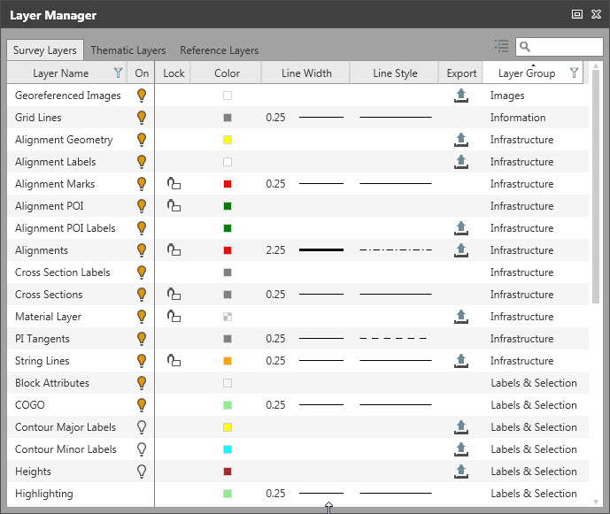
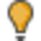

# Layer Manager

### Layer Manager

When you import data into an Infinity project, it is automatically organised into layers. Each layer is given a name in relation to its status and a pre-defined graphical representation. Each layer consists of a pre-defined colour, line style and shading style of the elements that belong to a layer. In the layer manager, you can change the status (on/off, locked/unlocked) and the graphical settings.

|  |  |
| --- | --- |

To open the layer manager:

**To open the layer manager:**

Select the    icon in the home tab or in the Infinity status bar.

Survey data layers:

**Survey data layers:**

All surveyed data is organised in layers. On the survey layers, you can find all the Infinity objects that are imported as field data from SmartWorx (DBX) jobs or HeXML files. Survey layers can be exported to *.dxf, *.dwg, *.xml or *.HeXML files.

See also:

**See also:**

Objects, Point Roles and Symbols

Labels and selection layers:

**Labels and selection layers:**

On these layers, elements are grouped so that label survey data entities like point ID and point code ID, line/area ID or position and height labels.

Survey data layers:

**Survey data layers:**

On these layers, the survey data is grouped by object type.

Thematic layers

**Thematic layers**

All feature codes are organised in layers. On a thematic layer, the thematic information of feature objects like points, lines or areas are grouped. The thematic layers can be exported to *.dxf or *.dwg.

Thematic layers can either be edited directly in the code manager or in the layer manager. You can also create new thematic layers from inside the layer manager. In both cases, the code table is updated accordingly.

To create new layers in the layer manager:

**To create new layers in the layer manager:**

Select the    New Layer option in the top right corner and define the new layer through inline editing and selecting features from the drop-down list in each column. The layer name can also be changed through inline editing.

**New Layer**

To delete selected layers:

**To delete selected layers:**

Select one or more layers and select the    Delete option to delete layers. The layers are deleted without any further warning message.

**Delete**

Reference layers

**Reference layers**

Under Reference Layers you can find all the layers as defined in referenced files like imported *.dxf or *.dwg files or *.ifc files. For those layers, you can also change the appearance, switch layers on/off or lock/unlock them, without having to modify the source files themselves.

**Reference Layers**

See also:

**See also:**

Data Import

Settings

**Settings**

Switching layers on or off:

**Switching layers on or off:**

If the data in your project is organised in many different layers you can reduce the view to just the layers you are currently working on by switching others off:

Select the    option to switch off a layer, select the    option to switch on a layer.

Switched off layers are not visible in the graphical view.

Locking or unlocking layers:

**Locking or unlocking layers:**

If you want to make sure that elements in a specific layer cannot be selected then you can lock that specific layer.

Select the    option to unlock a layer and the    option to lock a layer.

The properties of data in locked layers cannot be edited.

Defining the graphical settings:

**Defining the graphical settings:**

To redefine the graphical appearance of a layer (for example, the colour of the point symbols or the line style of an area boundary) you can modify the line colour, its width and style as well as shading colour and style of area objects.

Excluding layers from export:

**Excluding layers from export:**

Most of the layers can separately be excluded from export.

In the Export column, select the    option to exclude a layer from being exported.

**Export**

To visualise the new status the option is crossed out,   .

