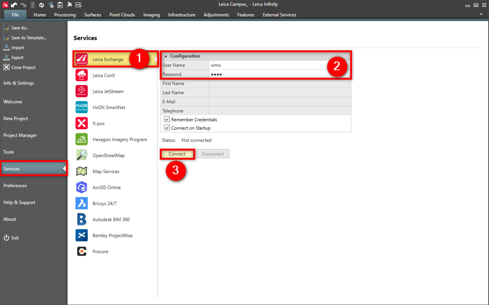
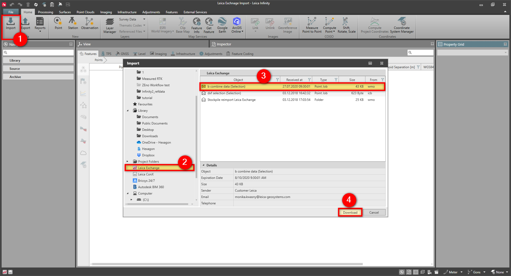
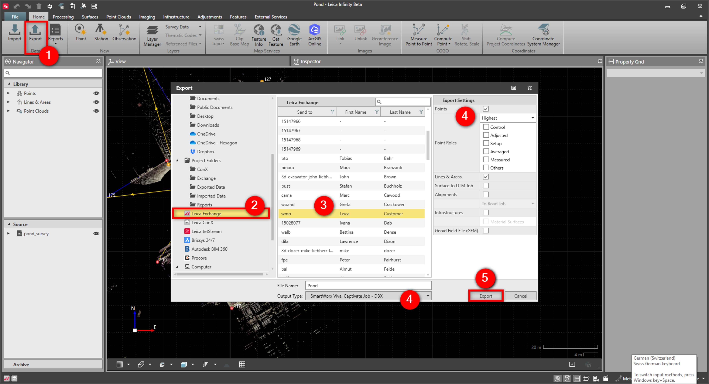

# Leica Exchange

### Leica Exchange

Infinity supports the Leica Exchange service.

Transfer objects easily between the field and the office with Leica Exchange.

**Requirements:**

- Valid subscription.

The yearly Leica Exchange service allows an unlimited number of exchanges to an unlimited number of users.

To connect to the Leica Exchange service:

**To connect to the Leica Exchange service:**

|  |  |
| --- | --- |

| 1. | Select File, then Services and then Leica Exchange from the menu. |
| --- | --- |
| 2. | Enter your User Name and Password. |
| 3. | Select Connect. |

**File**

**Services**

**Leica Exchange**

**User Name**

**Password**

**Connect**

- Select remember credentials.
- Connect on start-up.

To import data:

**To import data:**

|  |  |
| --- | --- |

| 1. | Select Import from the Home tab. |
| --- | --- |
| 2. | In the Import window, select Leica Exchange. View the available files from the Bricsys 24/7 window. |
| 3. | Highlight the file to import to the project. |
| 4. | Select Download.The selected file is imported to Infinity and downloaded to the Leica Exchange directory, in the current Infinity project directory. |
| 5. | Select the data and if necessary specify import settings. |
| 6. | Select Import. |

**Import**

**Leica Exchange**

**Download**

The selected file is imported to Infinity and downloaded to the Leica Exchange directory, in the current Infinity project directory.

**Import**

To export data:

**To export data:**

|  |  |
| --- | --- |

| 1. | Select Export from the Home tab. |
| --- | --- |
| 2. | In the Export window, select Leica Exchange. |
| 3. | In the Leica Exchange window, select the user or users to send data to. |
| 4. | Select the output type and export settings. |
| 5. | Select Export. |

**Export**

**Leica Exchange**

**Export**

See also:

**See also:**

https://leica-geosystems.com/services-and-support/workflow-services/leica-exchange

The tutorial "How to send and receive the data to and from the field - Working with Leica Exchange" https://leica-geosystems.com/-/media/279c6f19b6ce49479aa9942529c85994.ashx

**"How to send and receive the data to and from the field - Working with Leica Exchange"**

The tutorial can be downloaded in the Localisation Tool.

