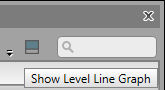
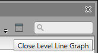
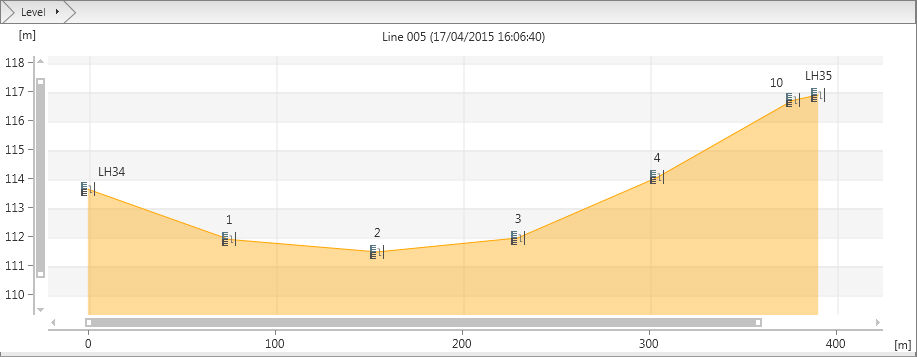
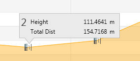

# Level Line Graph View

### Level Line Graph View

The level line view is a graphical representation of the data given in the booking sheet. The profile of the selected level line is visualised, for instance the rises and falls resulting from calculated point heights. Since the distances between the instrument setups and the staff setups are known a proportionally correct overview on the line structure may be provided.

From within the inspector the level lines list has by default the graph view.

To view the graph view of a level line when drilled into a line, use the level line graph toggle at the top right view:

**To view the graph view of a level line when drilled into a line, use the level line graph toggle at the top right view:**

|  |  |
| --- | --- |

|  |  |
| --- | --- |

Navigating

**Navigating**

You can zoom in/out and pan in the graph view. The mouse uses the same settings as when working in the main graphical display.

Selecting and viewing heights

**Selecting and viewing heights**

Using the mouse you can hover and or select a turning point from the display.

|  |  |
| --- | --- |

