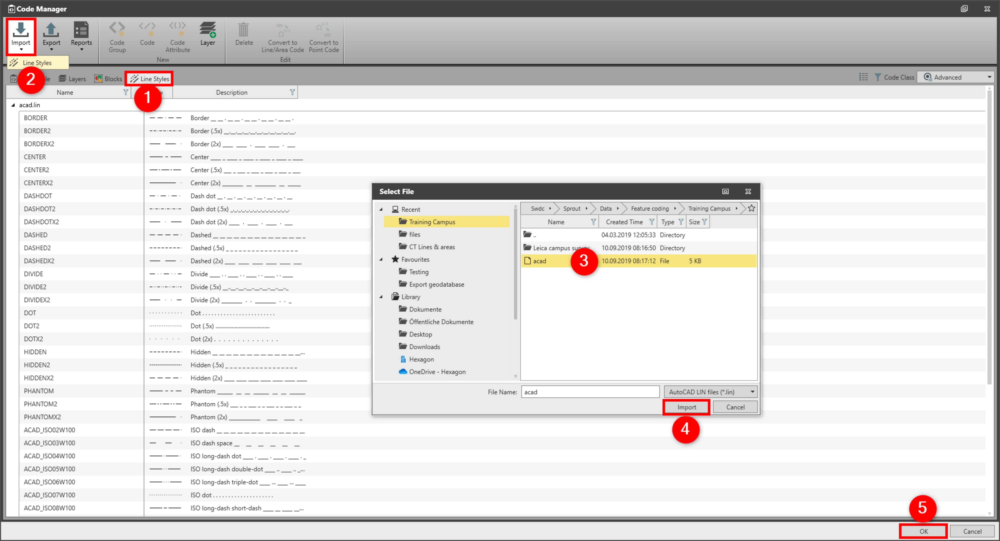

# Line Styles

### Line Styles

Line style is a visual property that can be assigned to geometric objects. Line styles can be for example a pattern of dashes, dots or text.

Line styles are defined in a line style definition LIN file. You can import the line styles from the LIN file and use them with your codes.

The line style functionality is not supported in SmartWorx Viva or Captivate. Therefore, line styles are not exported to the codelist. Collect your data as normal and assign the code table to the project for the correct style representation.

Line style names are case-sensitive. During an import, line styles with the same name are overwritten.

To import line styles from a LIN file to a code table:

**To import line styles from a LIN file to a code table:**

|  |  |
| --- | --- |

| 1. | In the Code Manager, select the Line Styles tab. |
| --- | --- |
| 2. | Select Import and select Line styles from the drop-down menu. |
| 3. | Select the LIN file to import. |
| 4. | Select Import. |
| 5. | Select OK to save the changes and to close the Code Manager. |

**Line Styles**

**Import**

**Line styles**

**Import**

**OK**

Line styles combo box is only available for the code type line or point with linework set to start line or start area.

See also:

**See also:**

Code Manager

The video "Leica Infinity – Feature Coding Part 3 - How to use custom line styles" https://www.youtube.com/watch?v=ze9ganVf6AU

**"Leica Infinity – Feature Coding Part 3 - How to use custom line styles"**

The video "Leica Infinity – Feature Coding Part 4 - How to process features and export to CAD" https://www.youtube.com/watch?v=ASLoVHHAYGQ

**"Leica Infinity – Feature Coding Part 4 - How to process features and export to CAD"**

