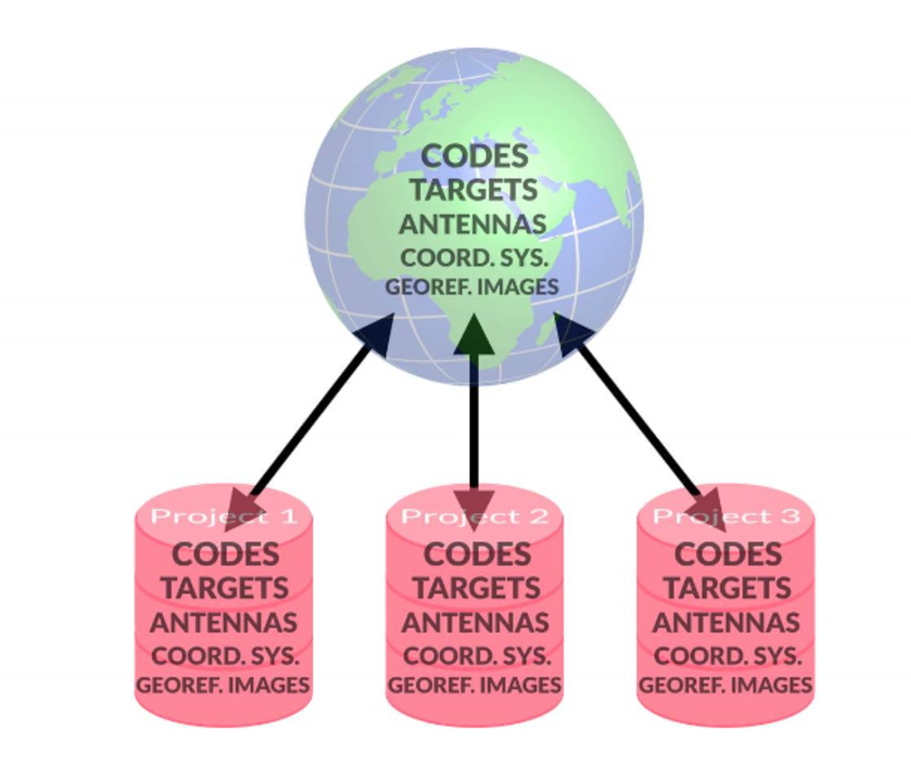

# Local and Global Data Objects

### Local and Global Data Objects

In Infinity, we distinguish between objects and settings from the File global and within the Project-Local.

**File**

**Project-Local**

A project holds all objects that allow it to be opened on a machine, and some of these objects are global. We have global objects so that they can be reused for single projects.

Global Objects:

**Global Objects:**

- All objects which are stored in Infinity under the **Tools** within the File tab.
- Use **Copy to Project** to use them inside your active project.

Global Settings:

**Global Settings:**

- All settings that are listed under **Preferences** within the File tab.
- Project templates that are used when creating a new project.

Local Objects:

**Local Objects:**

- The data object is imported or found only in your project.
- Use **Export** to global to copy data from the project to the global objects.

Local Settings:

**Local Settings:**

- Settings that are only valid within a single project.
- Are available only when an individual project is opened.
- Found under Info & Settings.

Working with Local and Global Data Objects:

**Working with Local and Global Data Objects:**

|  |  |
| --- | --- |

| No. | Name | Description |
| --- | --- | --- |
| 1. | Code Tables | Feature codes can be imported from Leica field software jobs into a global code table. The global code table can then be made available to any Infinity project. |
| 2. | Targets | TPS target definitions are automatically imported into Infinity projects from Leica field software jobs (along with the survey data they relate to).New TPS target definitions can be manually entered globally and from there they can be copied to projects. |
| 3. | Antennas | GNSS antenna definitions can be imported into the GNSS manager from a dedicated antenna file (not from a Captivate job). You can do it globally, or inside a project. Antennas are automatically mapped during import of GNSS data to the project. When the GNSS antenna is found in the global antenna list, then all antenna calibration definitions are copied into the project automatically. |
| 4. | Coordinate Systems | Coordinate systems are often imported into Infinity projects (along with survey data), in jobs from Leica field software.They can then be saved to the global libraries and from there they can be copied into any other project. |
| 5. | Georeferenced Images | Background map images can be georeferenced backstage (using the points from a project) or inside an Infinity project, then saved to the global library. |
| 6. | Classification Tables | Manage classification tables. |

Any editing we do in Tools is on the global objects. Changes to these global objects do not affect any existing projects. But any new project that we create uses the updated global objects.

When having to work with different coordinate systems, project units, code tables and classification tables, use project templates to Save as Template.

See also:

**See also:**

Tools

Save as Template

