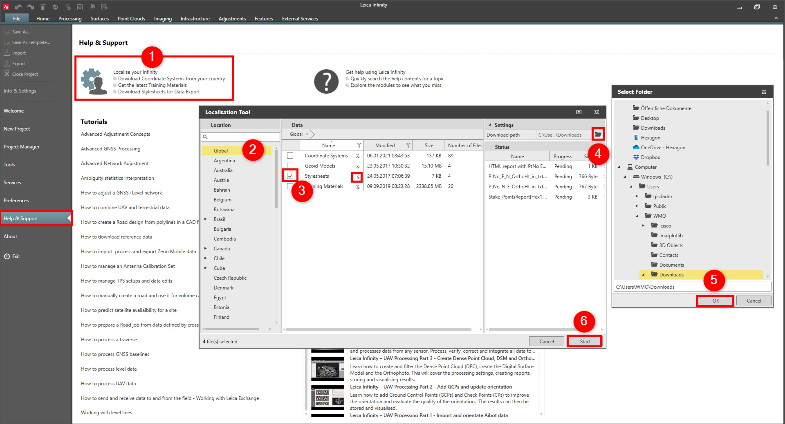

# Localisation Tool

### Localisation Tool

The localisation tool allows you to download and/or import data that are pre-defined for your region.

**Requirements:**

- Latest version of Infinity available.

The following objects are supported:

**The following objects are supported:**

- Coordinate Systems
- Geoid Models
- Stylesheets
- Training Materials
- Documents
- ASCII Import and Export Templates
- Code Tables

To download/import data:

**To download/import data:**

|  |  |
| --- | --- |

| 1. | Select File, then Help & Support and then Localise your Infinity. |
| --- | --- |
| 2. | Select your Location. |
| 3. | Select the check box of the data category you want to download/import. Drill into the category by clicking the little arrow    to select single files. |
| 4. | Select the folder icon to define a download location. |
| 5. | The Select Folder window appears and you can change the default download path. |
| 6. | Select Start to start the download/import. |

**File**

**Help & Support**

**Localise your Infinity**

**Start**

Pre-defined data:

**Pre-defined data:**

| Coordinate Systems | Downloaded coordinate systems are automatically imported and available for use under Coordinate Systems.In the coordinate system manager, select Copy to Project, to make the selected coordinate system available for use in the currently active project. |
| --- | --- |
| Geoid Models | Geoid models and CSCS models can be downloaded and imported separately. After download, they are automatically available for further use in the coordinate system manager. |
| Stylesheets | Downloaded stylesheets are automatically imported and available to select in the settings for exporting data using stylesheets. |
| Training Materials | Downloaded training materials, for example tutorials, are saved in the selected download location. |
| Documents | Downloaded documents, for example readme files, are saved in the selected download location. |
| ASCII Import/Export Templates | Downloaded templates are automatically imported and available to select in Import ASCII Data or Export ASCII Data. |
| Code Tables | Downloaded code tables are automatically imported and available for use under Code Tables. |

**Coordinate Systems**

**Copy to Project**

**Geoid Models**

**Stylesheets**

**Training Materials**

**Documents**

**ASCII Import/Export Templates**

**Code Tables**

Only data provided by your local Leica distributor is available for download.

See also:

**See also:**

Coordinate Systems

Training Materials

Import ASCII Data

Export ASCII Data

