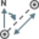
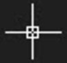
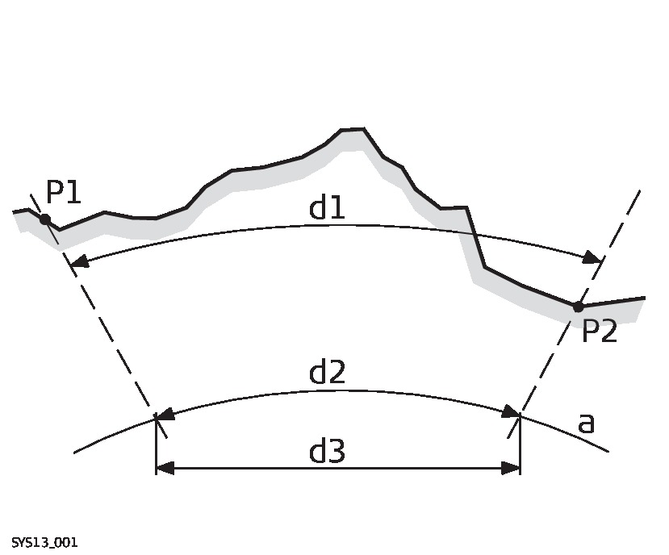

# Measure Point to Point

### Measure Point to Point

Measure point to point is a COGO function and can be used to determine horizontal and vertical angle differences as well as horizontal and slope distance differences between two points in your project. The coordinate differences in Easting, Northing and height are also computed and displayed in the Measure: Point to Point window.

To start the measure point to point function:

**To start the measure point to point function:**

Select the    Measure Point to Point option in the Home tab to open the Measure: Point to Point window and switch to the Measure Point to Point COGO mode.

**Measure Point to Point**

The cursor changes to    and you are able to pick start and end points graphically.

Overall behaviour:

**Overall behaviour:**

Apart from the changed appearance of the cursor in the graphical view, a green line indicates that you are in the measure point to point mode once you have selected a start point. When you select the Cancel option in the right bottom corner of the window:

**Cancel**

- The cursor returns to its standard appearance.
- The green line disappears.
- The Cancel option becomes a measure option.

You can leave the Measure Point to Point window open next to the Propertiy Grid and by selecting the Measure option, you can always pick up the COGO calculation again. By default, the Measure Point to Point window is docked to the Propertiy Grid and opened in its own tab. When you close the Measure Point to Point window, the Propertiy Grid remains.

**Measure**

Input options:

**Input options:**

| Field | Option | Description |
| --- | --- | --- |
| Mode |  | There are two input modes of determining angles and distances between two points. You can switch the mode without having to re-invoke the function. |
| Radial | In the Radial mode you can select a central point from which angles and distances to other points shall be determined in a star-like manner around the selected point. Select the Finish option to:Complete a measuring loop.Stop the COGO function.Return to the standard mode. |
| Sequential | In the Sequential mode you can select a start point and an end point for your calculations and after that another start and another end point. Select the Finish option in the right bottom corner of the window to:Stop the COGO function.Return to the standard mode. |

**Radial**

**Finish**

- Complete a measuring loop.
- Stop the COGO function.
- Return to the standard mode.

**Sequential**

**Finish**

- Stop the COGO function.
- Return to the standard mode.

In the Sequential mode a measuring loop is automatically finished when the end point has been selected. In the Radial mode the measuring loop is kept open (graphically this is visualised by the green line sticking to the cursor) until you manually select to finish it.

| Field | Option | Description |
| --- | --- | --- |
| Distance type |  | The type of distances displayed in the results. |
| Grid | Distances are calculated as the trigonometric distance between the position of two points. The distance field is horizontal distance. |
| Ground | Distances are horizontal distances between two points at the mean elevation parallel to the ellipsoid of the active coordinate system. The distance field is horizontal distance (ground). |
| Ellipsoid | Distances are reduced to the ellipsoid. They are calculated as the shortest distance between the two points on the ellipsoid. A scale factor is applied. The distance field is horizontal distance (ellipsoid).In the attached coordinate system, a projection, an ellipsoid and a transformation have to be defined to calculate grid, ground and ellipsoid coordinates. |
|  | EllipsoidKnownFirst known pointSecond known pointUnknownGround distanceEllipsoid distanceGrid distance |

**Grid**

**Ground**

**Ellipsoid**

In the attached coordinate system, a projection, an ellipsoid and a transformation have to be defined to calculate grid, ground and ellipsoid coordinates.

**Known**

**Unknown**

How to measure point to point?

**How to measure point to point?**

When you are in the Measure Point to Point mode and the cursor appears as   :

| 1. | In the graphical view, click on the start point from which you want to determine angles and distances to one or more end points.The Point ID is automatically entered into the 1st Point field at the top of the window. |
| --- | --- |
| 2. | Click on the end point. The Point ID is automatically entered into the 2nd Point field at the top of the window. |
|  | If there exists more than one point role for the selected points, pick the required one from the point selection menu that automatically appears if for a point more than one point role is available.Select the    option in the 1st Point/2nd Point fields to select the start and end points for the calculation non-graphically from a flyout. |
| 3. | Inspect the results in the Measure: Point to Point window. The results are listed one below the other. Each result section can be collapsed or closed individually. |

**start**

**end**

If there exists more than one point role for the selected points, pick the required one from the point selection menu that automatically appears if for a point more than one point role is available.

Select the    option in the 1st Point/2nd Point fields to select the start and end points for the calculation non-graphically from a flyout.

Create a report:

**Create a report:**

You can create a report of the measured points by selecting the Report option at the bottom of the Measure Point to Point window.

**Report**

The Report Manager opens and shows the generated report.

