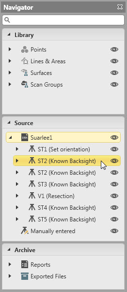

# Navigator

### Navigator

The navigator allows you to navigate through the project content. It shows the whole project content for searching for and locating single data items.

Search has got a filter effect. You can filter the points and other objects by their ID or date and time. All other points and objects are hidden from view.

The project content is structured into three main parts:

**The project content is structured into three main parts:**

|  |  |
| --- | --- |
| In the Library section, all objects are grouped by the type of object they belong to and all points and objects are listed by their ID. |
|  |
|  |
| In the Source section, all imported jobs are listed by date and time. All setups are grouped by the jobs they belong to. Inside each job, all points are grouped by the setups they belong to and listed by their ID. |
|  |
|  |
|  |
| In the Archive section, all reports and exported files are listed in chronological order by their creation date and time. |
|  |

**Library**

**Source**

**Archive**

If you have closed the navigator you can make it reappear by selecting the    Navigator option in the status bar.

**Navigator**

Functions

**Functions**

Showing/hiding items:

**Showing/hiding items:**

To hide points and other objects or even whole jobs from view in the graphical view select the    icon. This way the graphical view can be reduced to show the jobs and elements that you currently work on or that need revision.

Recovering points/observations:

**Recovering points/observations:**

Files/objects indicated by the    icon, have been deleted externally and cannot be accessed.

Points and/or observations deleted in the field can be restored by selecting    Recover from the context menu.

**Recover**

