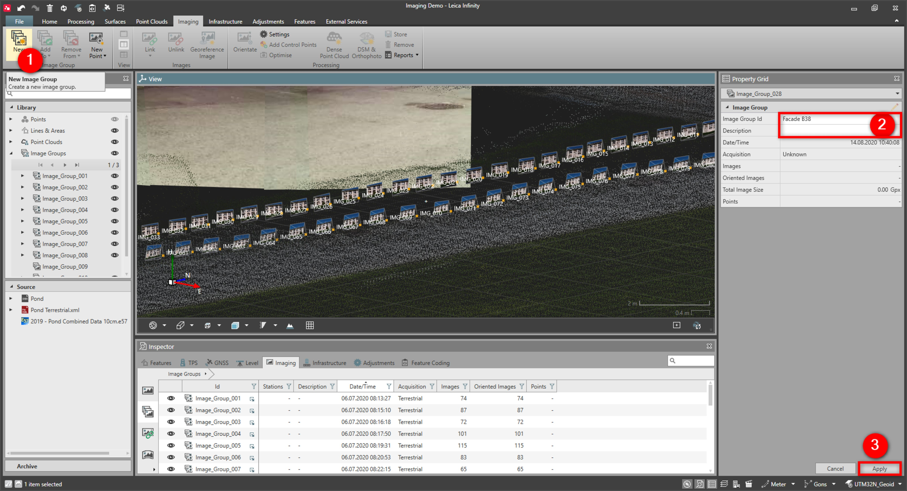

# New Image Group

### New Image Group

To create a new image group:

**To create a new image group:**

|  |  |
| --- | --- |

| 1. | Select New from the Imaging tab.Alternatively select images from the Inspector, Library or the graphical view to be grouped and select New from the Imaging tab. |
| --- | --- |
| 2. | Define the Image Group ID and optionally the Description. |
| 3. | Select Apply. |

**New**

**New**

**Apply**

The new image group is created and added to:

**The new image group is created and added to:**

- The image groups section in the library of the navigator. If the image groups subsection does not yet exist, it is created.
- The image groups section in the imaging tab of the inspector.

