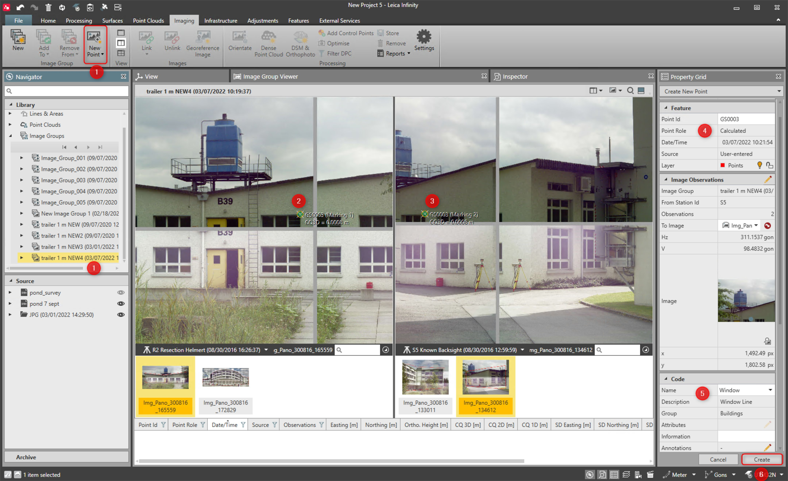
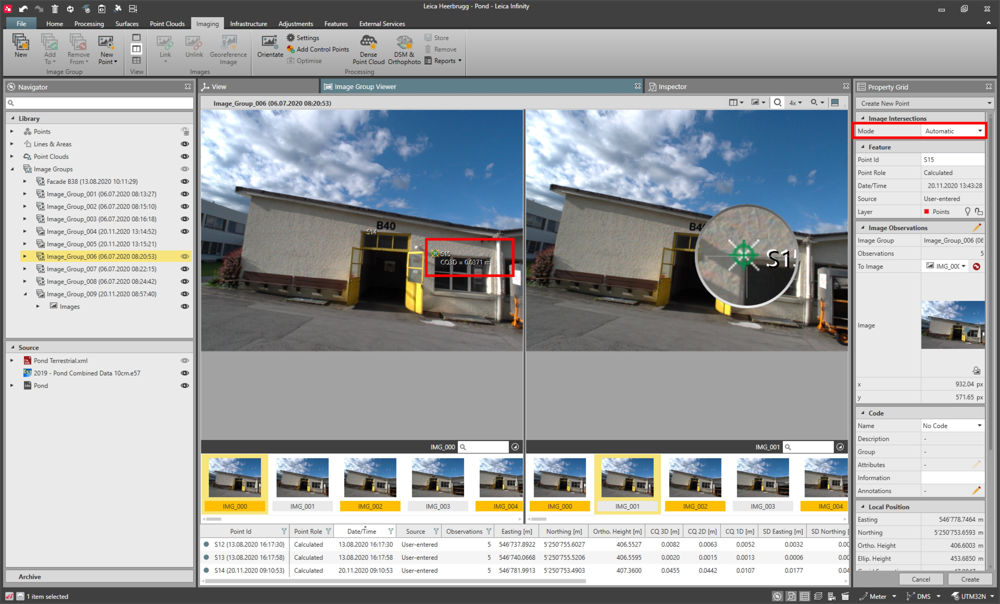

# New Image Point

### New Image Point

Points can be computed when:

**Points can be computed when:**

Using the image group viewer and selecting a common target feature from the image, the forward intersection from each image position arrives at a 3D intersection point. These points from images are stored to the points and have the point role computed.

To create new points from images:

**To create new points from images:**

|  |  |
| --- | --- |

| 1. | Select New Point either from the ribbon bar or the context menu. |
| --- | --- |
| 2. | Mark the target point in the first image. |
| 3. | Mark the target in the second image. |
| 4. | Once the target has been selected in two or more images the projected point is shown. |
| 5. | Add thematic data if needed. |
| 6. | Select Create to store the point to the project. |

**New Point**

**Create**

When working with GS18 I images, the default mode for point creation is the automatic target selection mode. With this method, a single click defines the point. For other cases, the intersection mode is automatically set to manual, and the point can be created after being marked on two or more images.

|  |  |
| --- | --- |

Image Point Settings

**Image Point Settings**

The computation of image points is following the same principle as with point averaging. You set a tolerance threshold for which the computed 3D point quality is acceptable and when the results are within this tolerance a position is computed. When the 3D accuracy is outside of that tolerance, then no point is computed.

Set the image point accuracy in the Points & Angles options page.

See also:

**See also:**

The video "Leica Infinity - Imaging Module - How to work with GS18 I data" https://www.youtube.com/watch?v=1TwomI2lxw0

**"Leica Infinity - Imaging Module - How to work with GS18 I data"**

The video "Leica Infinity - Imaging Module - Points from Images" https://www.youtube.com/watch?v=PDR4ROLrKbA

**"Leica Infinity - Imaging Module - Points from Images"**

