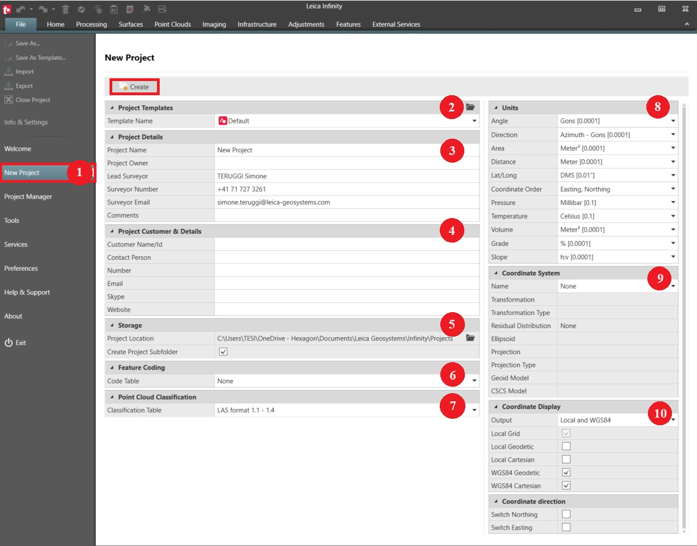

# New Project

### New Project

New projects can only be created from inside the File tab.

To create a new project:

**To create a new project:**

|  |  |
| --- | --- |

| 1. | Go to the File tab and select New Project from the menu on the left. |
| --- | --- |
| 2. | Define the Project Templates. |
|  | The default project template is from the user settings which were set using the save as project defaults option in an older version of Infinity. For more information, refer to Save as Template. |
| 3. | Define the Project Details:Give the project a unique Project Name.Optionally, fill in the details on the surveyor.Optionally, add Comments and tags. |
| 4. | Optionally, fill in Project Customer & Details. |
| 5. | Define the Storage information, for example where to save the project and if you want to create project subfolders.Project subfolders provide a clear folder structure to organise the following data:Data sent and received through ConX.Data sent and received through Leica Exchange.Exported data from Infinity.Imported data to Infinity.Reports generated within Infinity. |
| 6. | Optionally, choose a Code Table to be used with the project. To be able to do so, at least one code table has to be globally available from File > Tools > Code Table Management.It is copied to the project. If there are no global objects yet, leave as None. |
| 7. | Chose a Classification Table to be used with the project. If no custom tables have been created, the default table is applied, refer to Classification Tables. |
| 8. | Define Units for various measurement types. |
| 9. | Optionally, choose a Coordinate System to be used with the project. To be able to do so, at least one has to be globally available from inside File > Tools > Coordinate Systems.It is copied to the project. If there are no global objects yet, leave as None. |
| 10. | Choose from the Coordinate Display, which coordinate format you want to see in the project. |
| 11. | Set the Coordinate Direction, which switches the coordinate system axes for the Northing, Easting or both. For example, used in South Africa. |
| 12. | Select    Create to create and open the project in the home module. |

**File**

**New Project**

- Give the project a unique Project Name.
- Optionally, fill in the details on the surveyor.
- Optionally, add Comments and tags.

- Data sent and received through ConX.
- Data sent and received through Leica Exchange.
- Exported data from Infinity.
- Imported data to Infinity.
- Reports generated within Infinity.

**File**

**Tools**

**Code Table Management**

**None**

**File**

**Tools**

**Coordinate Systems**

**None**

**Create**

