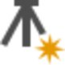

# New Station

### New Station

In Infinity you can create stations manually. When you define observations on a manually created station, the station becomes a setup with the orientation unknown.

Creating a station:

**Creating a station:**

| 1. | Select    New Station from the Home tab or the Processing tab. |
| --- | --- |
| 2. | The new station has to be defined in the Property Grid: In the Station section, select the Position Source. Select the    option on the right to search for and select a point from the fly-out list. |
| 3. | Optionally, change the coordinates and/or attach a code. |
| 4. | Select Create to create the station. |

**New Station**

**Position Source**

**Create**

When you create a new station its orientation is unknown. It does not have any observations attached to it yet.

The new, manually entered station is added to:

**The new, manually entered station is added to:**

- The    Points section in the **Navigator** > Library.
- The    Points section of the **Inspector** > Points, Lines & Areas.

Results:

**Results:**

You see that:

**You see that:**

- With creating the first observation on a newly defined station, its point role changes to be a TPS setup with a still unknown orientation.

The new, manually created setup is added to:

**The new, manually created setup is added to:**

- The navigator as    manually entered in the source section.
- The inspector as a    setup in the TPS tab.

