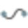

# Objects, Point Roles and Symbols

### Objects, Point Roles and Symbols

Infinity is an object-oriented software. The objects are the basic entities for performing operations. All objects are intelligent objects which means that they are interrelated with each other.

| Icon | Object | Description |
| --- | --- | --- |
|  | Points | A point is a named object that represents a location with either local or global latitude and longitude coordinates, and possibly a height or elevation. |
|  | Lines | A line is used to describe feature objects by drawing a line between two or more points. |
|  | Areas | An area is a closed line object. |
|  | Setups | A setup is the source of any measurement observation. |
|  | Observations | An observation is the measurement that defines the source of a point. |
|  | GNSS Tracks | A GNSS track is an object resulting from processing moving or mixed data. |
|  | Traverses | A traverse is a series of intervisible points at which angles are measured and also distances can be measured, to determine the station setups. |
|  | Sets of Angles | A set of angles are a series of observations that are reduced to an angular value. The angular value is then coordinated from the source of the observations. |
|  | Surfaces | A surface is a triangulation network representing points, cloud points, lines and areas. |
|  | Point Cloud Groups | A point cloud group is a defined group of point clouds that represents a single object, used for cleaning or surface creation. |
|  | Point Clouds | A point cloud is a measurement object from the data source. |
|  | Image Groups | An image group is a defined group of images that you can measure image points from. |
|  | Images | An image is a picture captured that is represented by its position or object it is assigned to. |
|  | Georeferenced Images | An image that has been ortho-rectified and can be placed in the project coordinate reference frame. |
|  | Alignments | The alignment is a linear object made of multiple segments geometrically defined and joined together.It defines the route of a road construction, generally its centreline or axis. |
|  | Roads | A road is made of several objects including a centreline and a material layer. The material layer describes the stringlines assigned to it. |
|  | Material Layers | Are the layers constituting a road. A material layer groups a set of stringlines that belong to the same level, material or phase of construction. |
|  | Cross Sections | A cross section is a slice or cut at a certain chainage of the road, displaying the position of different linear features connected together in a cross section view. |
|  | Cross Section Assignments | Result from cross sections templates being assigned to a road. Stringlines result from interconnecting cross section assignments. |
|  | Stringlines | Are special line objects that can either be imported from CAD or defined through cross section assignment. |
|  | Scan Setup | A setup belonging to a BLK360, RTC360 or RTC360LT. |
|  | Scan Group | A group of scan setups that have been joined together by links. |
|  | Registration Link | A line shown between two scan setups to symbolise that they have been joined by visual alignment or target matching. |
|  | Used Registration Target | A target that has been used to join setups by target matching. |
|  | Unused Registration Target | A target that has not been used to join setups by target matching. |

Interval Icons for GNSS Tracks:

**Interval Icons for GNSS Tracks:**

| Icon | Object | Description |
| --- | --- | --- |
|  | Static Interval | This icon indicates that GNSS raw data is acquired with static mode. |
|  | Moving Interval | This icon indicates that GNSS raw data is acquired with kinematic mode. |
|  | Mixed Interval | This icon indicates that GNSS raw data is acquired with alternating static and kinematic modes. |

Point Roles and Point Symbols:

**Point Roles and Point Symbols:**

| Icon | Point Role | Description |
| --- | --- | --- |
|  | Control Point (not fixed in adjustment) | Is a control point that is not considered for adjustment and not fixed. |
|  | 1D Control Point (fixed in height) | Is a 1D control point that is considered for adjustment, fixed only in height. |
|  | 2D Control Point (fixed in position) | Is a 2D control point that is considered for adjustment, fixed only in position. |
|  | 3D Control Point (fixed in position and height) | Is a 3D control point that is considered for adjustment and fixed in position and height. |
|  | Adjusted Measured Point | Is a measured point adjusted by the least squares method or in a traverse computation.The adjusted least squares point role, include the adjustment method 3D, 2D or 1D. |
|  | Station Setup | Is a point on which a station setup exists after import of field data. |
|  | Averaged Point | This point is derived by averaging two or more measured points. |
|  | TPS Reduced Measurement | This point is generated from the reduced observation computed from sets of angles, reduced foresights or a traverse. |
|  | TPS Measured with Reflector | Is a point that has been measured using a reflector. |
|  | TPS Measured Reflectorless | Is a reflectorless measured point. |
|  | TPS Measured with Reflector (compensated) | Is a tilt compensated point that has been measured using a reflector and the Leica AP20 sensor. |
|  | TPS Measured | Is a point that has been measured without instrument EDM information.Typically, such points are imported from XML. |
|  | TPS Measured Setup Point (with reflector) | Is a control point used in a Setup application and a measurement has been taken with reflector EDM. |
|  | TPS Measured Setup Point (reflectorless) | Is a control point used in a Setup application and a measurement has been taken with reflectorless EDM. |
|  | Fixed Real-Time Kinematic (RTK)/Fixed PP | Is a GNSS RTK measured or post-processed phase fixed point (most accurate). |
|  | xRTK/Widelane PP | Is GNSS xRTK measured or a widelane post-processed phase fixed point. |
|  | PPP Converged | Is a GNSS point measured with precise point positioning, final position converged. |
|  | Float RTK/Float PP | Is a GNSS RTK measured or post-processed point with float solution (less accurate). |
|  | PPP Converging | Is a GNSS point being measured with precise point positioning, final position not yet converged. |
|  | Code RTK/Code PP | Is a GNSS RTK measured or post-processed point with code solution (least accurate). |
|  | Navigated RTK/Navigated PP | Is a GNSS RTK measured or post-processed point with lower accuracy. It is measured without using a reference station. |
|  | When the GNSS point roles have got a green background, this indicates a tilted measurement. |
|  | GNSS Measured | Is a measured GNSS point with unknown solution type.Typically, such points are imported from XML or SKI ASCII. |
|  | GNSS Track Post-Processed | Is a post-processed GNSS track (using a reference station). |
|  | GNSS Track Navigated | Is a post-processed GNSS track computed by applying the SPP technique (without using a reference station). |
|  | GNSS Track Averaged | Is a GNSS track derived by averaging two or more post-processed tracks. |
|  | Level Measured | Is a point measured by level staff. |
|  | Offset Point | Is a point for which an offset observation has been measured or entered. |
|  | Auto Point | Is a point measured with the auto points application. |
|  | Computed Point | Is a point calculated by an application and not measured with an instrument. |
|  | User-entered Point | Is a manually entered point. |
|  | Point (unknown) | Is a point for which no point role can be defined on import.Typically, such points are imported from XML. |
|  | Point (deleted) | Is a point which has been deleted on the instrument and could be recovered. |

When the GNSS point roles have got a green background, this indicates a tilted measurement.

