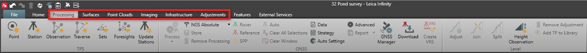

# Optional Modules

### Optional Modules

Optional modules in Infinity, are designed to support the user by grouping product features to workflows. These workflows are grouped to modules, and most modules are optional, allowing you choose what work you perform in Infinity. The optional modules are: TPS-Processing, GNSS-Processing, Level-Processing, Surfaces, Point Clouds (including surfaces), Imaging, Point Clouds from Images (including imaging), Infrastructure and Adjustments.

TPS-Processing

**TPS-Processing**

- Create or edit TPS setups to update orientation or positions.
- Support of further point calculations: Sets of angles, measure foresights.
- Build or edit traverses.
- Update stations.

GNSS-Processing

**GNSS-Processing**

- Process single or multi-frequency GNSS raw static and kinematic data for determining the most reliable and accurate solution.
- View cycle slips, SNR and residual plots with statistics using advanced GNSS data analysis tools.
- Process multiple frequencies of GPS, GLONASS, BeiDou, Galileo and QZSS.
- Use Autoprocessing to build up automatically all possible combination of baselines and process your data within one click.

Level-Processing

**Level-Processing**

- Manage level lines - Edit start/end points, join or split lines.
- Process level lines - Edit staff corrections, reprocess and generate reports.
- Level network adjustment (1D) - Complete levelled height networks.

Surfaces

**Surfaces**

- Compute 3D or 2.5D surface using individual points and point clouds.
- Add break lines, boundaries or exclusion areas, to edit a mesh.
- Calculate volumes.
- Create contours.
- Cut fill maps and compute tolerance lines.
- Comparison maps.

Point Clouds (including surfaces)

**Point Clouds (including surfaces)**

- Measure within point clouds for comparison and checks.
- Visualise scan data in different colour modes - SNR, Intensity, RGB.
- Automatic and manual point cloud cleaning tools.

Imaging

**Imaging**

- Manage image data using integrated image group viewer. Sort and organise by groups and features and compute points from images taken from total stations and GNSS sensors.

Point Clouds from Images (including imaging)

**Point Clouds from Images (including imaging)**

- Orientate images.
- Create dense point clouds.
- Generate digital surface models and orthophotos.

Infrastructure

**Infrastructure**

- Import, visualise and organise road design data.
- Repair road data before sending it to the field, for example live edits to road geometry or fixing string line connections.
- Document and report field applications, including stakeout and checks with tolerance flags.
- Manually input a road and compute daylight stringlines.

Adjustments

**Adjustments**

- Combine TPS, GNSS and level data.
- Full 3D, 2D and 1D computation.
- Compute loops and display of error ellipse and reliability.

