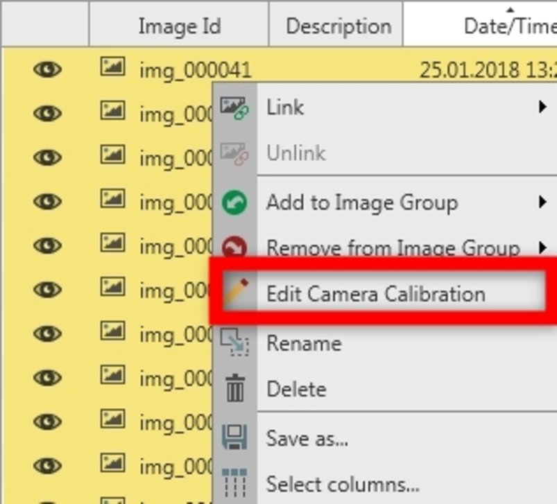
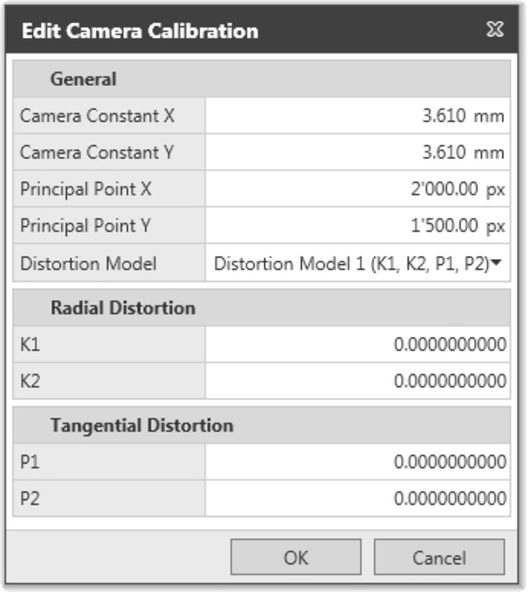
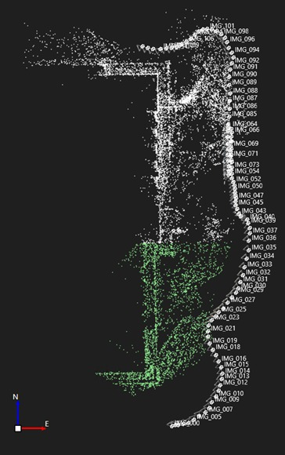
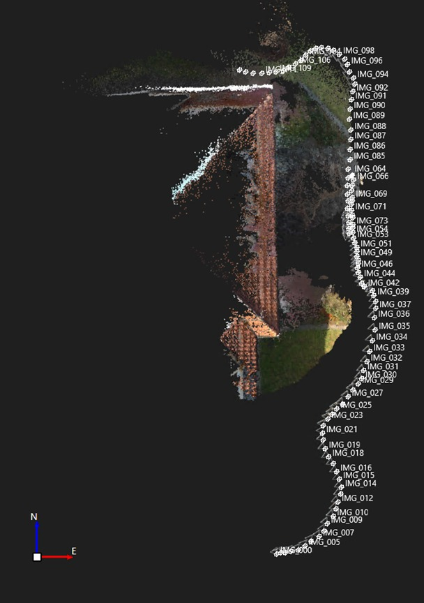

# Orientation of the Images

### Orientation of the Images

After the import and the image group creation, the images can be orientated.

To orientate the images:

**To orientate the images:**

| 1. | Set a master coordinate system in the project. See Working with Coordinate Systems. |
| --- | --- |
| 2. | Select the image group from the Navigator or the Inspector. |
| 3. | Select Orientate from the Imaging ribbon bar or from the context menu. |
|  | Images can be oriented only if they are geotagged and have (at least a rough) camera calibration. |
|  | If the previously mentioned requirements for images and coordinate system are fulfilled, images camera poses should be shown in the view. If not, check that the coordinate system used is the appropriate one for the area considered. |
|  | Infinity reads information for camera focal length and computes the principal point position based on the information stored in the EXIF data. |

**Orientate**

If the camera calibration parameters are provided, for example in the case of a factory calibration, they can be manually entered.

To enter the camera calibration parameters:

**To enter the camera calibration parameters:**

| 1. | Select all the images of the image group from the Inspector or from the Navigator. |
| --- | --- |
| 2. | Use the context menu option Edit Camera Calibration. |
| 3. | According to the selected distortion model, the calibration values can then be entered. |
| 4. | As described in Images, once the orientation is triggered, the processing task appears in the Task pane of the Imaging tab in the Inspector, and in the Task Manager. |
| 5. | When the orientation is computed, you can drill in the orientation result to view details about:The exterior orientation.The interior orientation.The control and the check points, if any have been used. For further information, see Marking of Control Points. |
| 6. | To store the orientation result, highlight it and select Store from the Imaging ribbon bar or from the context menu. The sparse point cloud appears in the view. |
|  | Together with the orientation of the images, Infinity computes the 3D position of the common features that were matched and used for orientation, also called tie points. These points form a sparse point cloud. This point cloud shows a rough representation of the area, that is reconstructed during the dense point cloud computation. |
|  | After the orientation, the images along with the updated position in the EXIF data can be exported. |

**Edit Camera Calibration**

- The exterior orientation.
- The interior orientation.
- The control and the check points, if any have been used. For further information, see Marking of Control Points.

**Store**

If you realise that the used settings are not compliant with the desired outcome, you can remove the orientation result in order to run a new orientation.

To run a new orientation:

**To run a new orientation:**

| 1. | Highlight the orientation result and select Remove from the Imaging ribbon bar or from the context menu. |
| --- | --- |
| 2. | You can also select the image group and then Remove the stored orientation. |
|  | Every time you remove an orientation from an image group, the position and the attitude of each image rollback to the values they had after import. |

**Remove**

**Remove**

To see the number of Oriented Images, select the Image Group and view the Property Grid. This information is also available in the Imaging tab of the Inspector > Image Group.

**Image Group**

**Inspector**

**Image Group**

|  |  |
| --- | --- |

The oriented image groups have a special icon.

Create a Dense Point Cloud (DPC) from an edited Sparse Point Cloud (SPC)

**Create a Dense Point Cloud (DPC) from an edited Sparse Point Cloud (SPC)**

It is possible to limit the processing area after the orientation is computed and the SPC is stored. Consider reducing the area of the SPC to reduce the noise of the DPC and to reduce processing time.

From the graphical view you can hide the points of the SPC that you are not interested in. Then the DPC is created from the remaining visible area.

|  |  |
| --- | --- |

|  |  |
| --- | --- |

The number of oriented images is not affected by reducing the SPC area. If the orientation is optimised after reducing the area, such as when adding Ground Control Points (GCP) and updating the orientation. Then only the images contributing to the edited area of the sparse point cloud are used.

The DPC is then created on the same area anyway.

