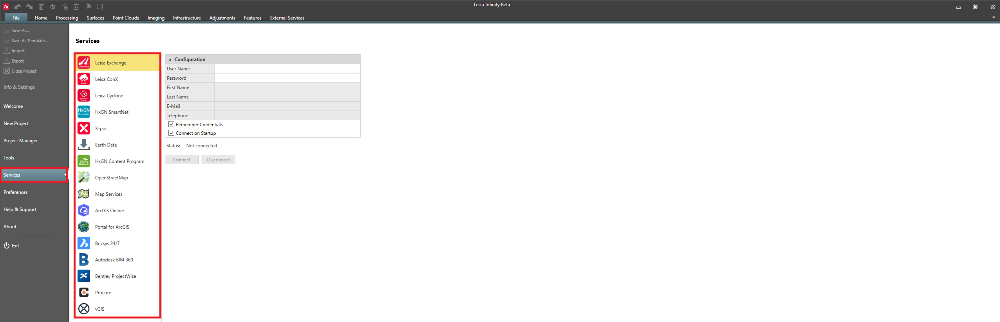

# Overview

### Services

With data services by Leica, Hexagon and third parties are integrated with Infinity, access to data is seamless and effective.

Under services, there is a collection of external services which Infinity can communicate to and from.

|  |  |
| --- | --- |

| Service | Description |
| --- | --- |
| Leica Exchange | Transfer data easily between the field and the office. |
| Leica ConX | Manage and share construction and survey data when working with iCON. |
| Leica Cyclone | Allows you to publish point clouds to an existing storage location. |
| HxGN SmartNet | Access HxGN SmartNet to download reference station data for GNSS post-processing within Infinity. |
| X-pos | Access X-pos to download reference station data for GNSS post-processing within Infinity. |
| Earth Data | Allows you to log in to the data provider used by Infinity to download precise ephemeris and elevation data. |
| HxGN Content Program | Access and use high-quality aerial imagery information for base maps. |
| OpenStreetMap | Access and use the open source map service. |
| Map Services | Define map services (WMS; WMTS; XYZ; Arc GIS Map Server) to use as base maps and feature services (WFS; Arc GIS Feature Server) to get data. |
| ArcGIS Online | Access feature servers to get data and upload data as web maps. |
| Portal for ArcGIS | Access feature servers to get data. |
| Bricsys 24/7 | Share project data connecting to the Bricsys 24/7 service. |
| AUTODESK BIM 360 | Access, download and upload field data. |
| Bentley ProjectWise | Transfer data between Infinity and the Bentley ProjectWise server. |
| Procore | Transfer data between Infinity and the Procore service. |
| vGIS | Transfer digital surface model data to the vGIS service. |

