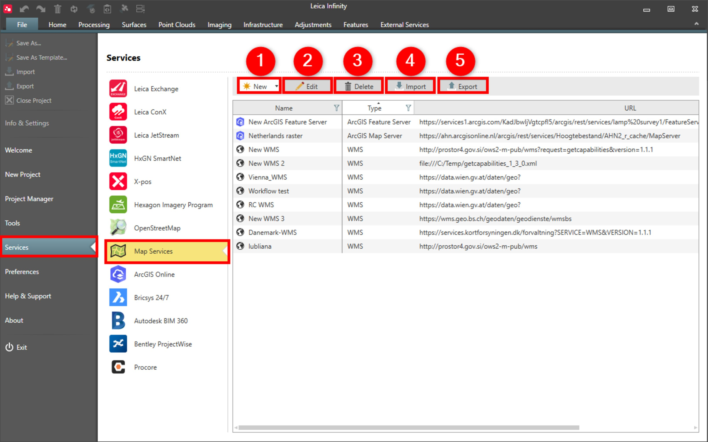

# Overview

### Map Services

Infinity supports the following map services:

**Infinity supports the following map services:**

| Map Service | Description |
| --- | --- |
| WMS (Web Map Service) | A WMS delivers georeferenced map images. A WMS service provides various layers that can be turned on and off. WMS focuses on rendering custom maps and is an ideal solution for dynamic data or custom styled maps. |
| WMTS (Web Map Tile Service) | A WMTS delivers pre-generated georeferenced map images. A WMTS service can have one or more styles, dimensions, or tiling schemes to specify how the WMTS layer is displayed. WMTS trades the flexibility of custom map rendering for the scalability possible by serving of static data where the bounding box and scales have been constrained to discrete tiles. |
| WFS (Web Feature Service) | A WFS serves, queries, and updates feature geometry and attributes using a Geography Markup Language (GML) profile. |
| XYZ Tiles (Tile Map Service) | Known as TMS. This service provides tiled images. X, Y, Z are tile numbers corresponding to a particular area. |
| ArcGIS Map Server | Map service (tile layer, map image layer) hosted by ArcGIS Online or ArcGIS Server, can be used as a  Base Map. |
| ArcGIS Feature Server | A feature service (feature layer) hosted by ArcGIS Online or ArcGIS Server. Used in Get Feature to download feature geometry and attributes. |

**WMS (Web Map Service)**

**WMTS (Web Map Tile Service)**

**WFS (Web Feature Service)**

**XYZ Tiles (Tile Map Service)**

**ArcGIS Map Server**

**ArcGIS Feature Server**

In map services you can do the following:

**In map services you can do the following:**

|  |  |
| --- | --- |

| No. | Name | Description |
| --- | --- | --- |
| 1. | New | Add a new map service. |
| 2. | Edit | Edit an existing map service. |
| 3. | Delete | Delete selected map service. |
| 4. | Import | Import a list of configured WMS/WMTS/WFS services from the Captivate web services list format. |
| 5. | Export | Export selected services to Captivate web services list format. |

See also:

**See also:**

Get Feature

Base Map

The video "Leica Infinity - Services - How to use the ArcGIS Online service" https://www.youtube.com/watch?v=QgFY17R990o

**"Leica Infinity - Services - How to use the ArcGIS Online service"**

