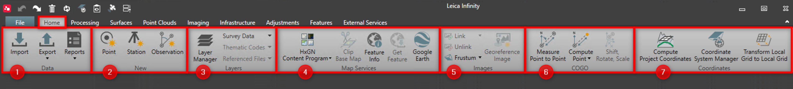

# Overview

### Home

The home tab is the core data flow working module. You can visualise, quality control, perform basic edits and generate reports from this module.

The home tab bundles some general functionality for data handling and data creation.

In the home tab you can do the following:

**In the home tab you can do the following:**

| No. | Group Name | Name | Description |
| --- | --- | --- | --- |
| 1. | Data | Data Import | Import all supported data formats using import dialog or drag and drop. |
| Data Export | Export all or selected data, to many different formats. |
| Reports | Create detailed reports on your project data. |
| 2. | New | New Point | Create new points. |
| New Station | Create new stations. |
| New Observation | Create new observations. |
| 3. | Layers | Layer Manager | Open layer manager and set the colour, style and export settings for the library data. |
| Survey Data | Explore the imported survey data: Switch them on/off or lock/unlock them. |
| Thematic Codes | All feature codes are organised in layers: Switch them on/off or lock/unlock them. |
| Referenced Files | All the layers as defined in referenced files: Switch them on/off or lock/unlock them. |
| 4. | Map Services | Base Map | Turn on or off one of the available base maps. |
| Clip Base Map | Clip a base map as a georeference image stored to the project. |
| Feature Info | Get information about objects at the mouse position. |
| Get Feature | Download data from a Web Feature Service (WFS). |
| Google Earth | Visualise the project data in Google Earth. |
| 5. | Images | Link Images | Select an image and link it to a point, line or area. |
| Unlink Images | Remove an image linked to a feature. |
| Resize Frustum | Set the size of the visible image frustum. |
| Georeference Images | Select an image to ortho rectify. |
| 6. | COGO | Measure Point to Point | Measure point to point. |
| Compute Point | Compute point. |
| Shift, Rotate, Scale | Shift, rotate, scale. |
| 7. | Coordinates | Compute Project Coordinates | Compute project coordinates. |
| Coordinate System Manager | Open the coordinate system manager. |
| Transform Local Grid to Local Grid | Transform local grid coordinates from coordinate system A to another local grid coordinate system B. |

**Data**

**New**

**Layers**

**Map Services**

**Images**

**COGO**

**Coordinates**

