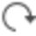

# Overview

### Data Export

From your current project either all data can be exported or just a selection of objects or sources. You can choose from different file formats. When you export a selection make sure that the selected object fits to and can be exported in the chosen format.

Exported files are listed in the Navigator under Archive. Select any file to view its properties in the property grid.

**Navigator**

**Archive**

To export data:

**To export data:**

| 1. | Select the Export option in the ribbon bar. If elements are selected either graphically or in the Navigator or in the Inspector choose between exporting All or Selection from the drop-down menu. |
| --- | --- |
| 2. | In the Export dialog:Select the Destination where the exported data shall be stored to. |
| 3. | Give the file to be exported a Name without extension.The file extension is given automatically according to the selected file type. |
| 4. | Select the Type of the file to be exported. |
| 5. | Choose whether a subdirectory shall be created. If you select the checkbox a subdirectory of the same name as the file is created and the file is written to it. |
| 6. | Select the Export option. |

**Export**

**graphically**

**Navigator**

**Inspector**

**All**

**Selection**

**Export**

**Destination**

**Name**

**Type**

**subdirectory**

**created**

**Export**

Export Formats

**Export Formats**

| ASCII | A template must be defined. See also:Export ASCII Data |
| --- | --- |
| SmartWorx DBX | You can export points and/or lines and areas and/or surfaces as DTM and/or alignments and/or infrastructures and/or GEM files.For points, select the Roles to be exported. Choose between:Highest: To export only the highest role for each point.All: To export all available roles for each point.Selection: To export only the selected roles.For lines/areas, the points that define the line/area are automatically exported, too.For Surface to DTM Job, you can select to export Multiple DTM jobs or to export a Single DTM job.If you export to Multiple DTM jobs, each exported surface is stored in an independent DTM job with one DTM layer. The DTM job and the DTM layer will be named after the Surface ID.If you export to Single DTM job, all the exported surfaces are stored in one DTM job.If all the surfaces are stored in the same thematic/survey Layer, all the surfaces are exported in one DTM layer. The DTM job and the DTM layer will be named after the thematic/survey layer.If the surfaces are stored in different thematic/survey layers, all surfaces assigned to a specific thematic/survey layer are stored in a common DTM layer. The DTM job is generically named surfaces. Each DTM layer will be named after the corresponding thematic/survey layer.For alignments, you can select the export To Road Job , To Rail Job or To Tunnel Job.If you export a selection, make sure that you select the correct object type under Settings to avoid empty files to be written.Select the checkbox to Create .zip file.The suffix _dbx is added to the end of the file name for example " [file name]_dbx.zip".This option is not available when using Leica Exchange service. |
| ESRI - SHP | You can export points and/or lines and areas. For points and for lines and areas, you can select various Additional Attributes.You can select the Dimension: 2D or 3D.You can select if the images should be exported as Individual or Combined.Combined image files are exported as a jpg and html. If the images checkbox is selected in Additional Attributes, only one attribute with multiple images is created.Individual image files are exported as a jpg. If the Images checkbox is selected in Additional Attributes, a separate attribute is created per image. |
| ESRI File Geodatabase - GDB | Export project data with thematic information as an ESRI GDB File Geodatabase. points, lines and areas are exported with their assigned code and code attributes.You can select the Dimension: 2D or 3D.All data is written with WGS84. |
| Coordinate Systems | All coordinate systems available with the current project are exported and saved to the same TRFSET.DAT file or separate iCON/SBG Geo LOK, Trimble JXL files.If you export to DBX, LandXML or HeXML always the master coordinate system is exported with your data. If None is used then your data is exported without any coordinate system information. |
| XML | Supported are HeXML and LandXML.You have the option to use an XSL Stylesheet to format the output. You can use the same stylesheets as available with SmartWorx Viva or define your own. |
| KML/KMZ | All library objects are exported except for cloud points. |
| Images | Images are exported in JPG, PNG and TIFF format. |
| Georeferenced Images | Georeferenced images can be exported in JPG, PNG and TIFF format with the respective world file (JGW, PGW, TFW), and in geoTIFF format. JPG and PNG format can be used by onboard software. |
| Georeferenced DEM - TIFF, geoTIFF | Surfaces are exported as raster in TIFF (with the respective TFW world file) and geoTIFF format. |
| GNSS raw data - RINEX | You can select the following Export Settings:RINEX version: Select whether you want to save files as RINEX files (version 2.11) or as RINEX files (version 3.04).Apply Interval Windows: Select the checkbox if you want to apply the interval windows to the exported RINEX files.Separate files for different tracks: Select the checkbox if you want to write a separate file for each track.The files are named according to the point ID, day of year and session number.Satellite Systems: Select the GNSS constellation to be exported. |
| Point Cloud | Point Clouds can be exported to:*.e57.*.las/*.laz.*.ply.*.pts, which is an ASCII based format.*.IgsWhen exporting to *.las/*.laz/*.ply, point classification is always included.When exporting to *.Igs, a valid Cyclone Publisher or Cyclone Publisher Pro (from Infinity 3.4 on) licence is required.When exporting in .lgs format, point cloud includes:MSxx/TLS data - Point cloud arrived from instruments and panoramas.UAV/GS18 I data - Dense point cloud and images which were used for point cloud reconstruction.A Sparse Point Cloud (SPC) cannot be exported to .lgs format. |
| Surface | Surfaces can be exported to:*.obj*.ply*.glTF*.glb.glTF or .glb formats are always exported in metres.Imaging DSM are exported with their texture.Comparison maps and cut fill maps are exported with their inspection colours. |
| AutoCAD | You can export your project data as well as BIM entities to *.dxf or *.dwg.There is no necessity to first create library objects from BIM entities. |
| Aibotix AiProFlight | Kinematic tracks can be exported for use onboard Aibotix AiProFlight devices. See also:Export UAV Track and Import to AiProFlight Software |
| GeoMoS Now | For points, select the Point Roles to be exported. Choose between:Highest: To export only the highest role for each point.All: To export all available roles for each point.Selection: To export only the selected roles. |
| Bentley - FWD | Project data can be exported to the Bentley FWD format. |

**template**

**Roles**

**Highest:**

**All:**

**Selection:**

**Multiple DTM jobs**

**Single DTM job**

If you export to Multiple DTM jobs, each exported surface is stored in an independent DTM job with one DTM layer. The DTM job and the DTM layer will be named after the Surface ID.

If you export to Single DTM job, all the exported surfaces are stored in one DTM job.

**To Road Job**

**To Rail Job**

**To Tunnel Job**

If you export a selection, make sure that you select the correct object type under Settings to avoid empty files to be written.

**Settings**

**Create .zip file**

The suffix _dbx is added to the end of the file name for example " [file name]_dbx.zip".

This option is not available when using Leica Exchange service.

**Additional Attributes**

**Dimension**

**2D**

**3D**

**Individual**

**Combined**

**Combined**

**Individual**

**Dimension**

**2D**

**3D**

All data is written with WGS84.

If you export to DBX, LandXML or HeXML always the master coordinate system is exported with your data. If None is used then your data is exported without any coordinate system information.

**None**

**Export Settings**

**RINEX version:**

**Apply Interval Windows:**

**Separate files for different tracks:**

The files are named according to the point ID, day of year and session number.

**Satellite Systems**

When exporting to *.las/*.laz/*.ply, point classification is always included.

When exporting to *.Igs, a valid Cyclone Publisher or Cyclone Publisher Pro (from Infinity 3.4 on) licence is required.

When exporting in .lgs format, point cloud includes:

MSxx/TLS data - Point cloud arrived from instruments and panoramas.

UAV/GS18 I data - Dense point cloud and images which were used for point cloud reconstruction.

A Sparse Point Cloud (SPC) cannot be exported to .lgs format.

.glTF or .glb formats are always exported in metres.

Imaging DSM are exported with their texture.

Comparison maps and cut fill maps are exported with their inspection colours.

**Point Roles**

**Highest:**

**All:**

**Selection:**

Navigation features in the export dialog

**Navigation features in the export dialog**

Two special folders support better navigation between locations:

- Under    **Recent**, the last used locations are listed.
- Under    **Favourites**, the locations are listed that you marked as a favourite by pressing the    Set/Reset favourite folder option.**Favourites** can be removed from the list by selecting    Remove from the context menu.

To    Refresh the navigation pane,    Rename or    Delete a folder or to create a    New Directory:

**Refresh**

**Rename**

**Delete**

**New Directory:**

Right-click onto the folder and select the desired function from the context menu.

It is also possible to copy & paste a location. Double-click onto the breadcrumbs in the files pane to make the field become editable and copy the desired path to it.

