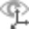

# Overview

### Working with Coordinate Systems

Each Infinity project can support many coordinate systems. These coordinate systems can be imported from data sources such as SmartWorx jobs or copied into the project from the global objects list. Since multiple coordinate systems can exist in the project, the project has settings to define how the coordinate systems are used. The project can have a single coordinate system which is used to project all project data to the same grid positions or each data source can use its own coordinate system to project the data that belongs to that imported data source.

Coordinate systems are global objects.

Master Coordinate System

**Master Coordinate System**

The master coordinate system is what the project is defined to use.

If a coordinate system is chosen when creating a new project, then this is called the master coordinate system. This master is used to project all data to the common grid reference frame. All WGS84 data is projected to local grid values and all local grid values can be converted to WGS84. You see this when working with the project, from the status bar.

When you are exporting data to various formats, it is important to have a master coordinate system set for your project data so all the data is on the same reference frame.

Data Source Coordinate Systems

**Data Source Coordinate Systems**

For many data sources, it is possible that they include their own coordinate system. Importing a SmartWorx job could have a coordinate system as used on the field instrument. You see this in the data source properties if a coordinate system is included.

It is possible to view each coordinate system as was used on the field sensors by choosing None in the status bar. This can be useful to identify potential problems between different data sources.

**None**

Using the Coordinate Systems

**Using the Coordinate Systems**

| Master Coordinate System | What you see with project data when a master coordinate system is in use:WGS84 entered points are convertible to local grid unless they fall outside the projection limits of the selected coordinate system. |
| --- | --- |
| Data source Coordinate Systems | What you see with project data when no master coordinate system is in use and if no coordinate system is assigned to the data source:WGS84 entered points are not convertible to local grid. They are not displayed in the graphic view and are indicated with this icon:   .Point averaging results only include the local grid values if available:When only WGS84 coordinates exist for that point ID, then the average is computed in WGS84.When one or more local coordinates exist for that point ID, then the average only considers the local grid points.Exporting data might not include the coordinates as expected. |

- WGS84 entered points are convertible to local grid unless they fall outside the projection limits of the selected coordinate system.

- WGS84 entered points are not convertible to local grid. They are not displayed in the graphic view and are indicated with this icon:   .
- Point averaging results only include the local grid values if available:When only WGS84 coordinates exist for that point ID, then the average is computed in WGS84.When one or more local coordinates exist for that point ID, then the average only considers the local grid points.
- When only WGS84 coordinates exist for that point ID, then the average is computed in WGS84.
- When one or more local coordinates exist for that point ID, then the average only considers the local grid points.
- Exporting data might not include the coordinates as expected.

- When only WGS84 coordinates exist for that point ID, then the average is computed in WGS84.

- When one or more local coordinates exist for that point ID, then the average only considers the local grid points.

See also:

**See also:**

Coordinate System Properties

