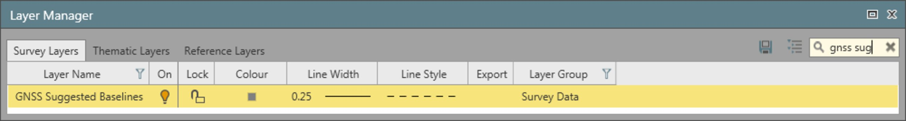

# Overview

### GNSS-Processing

GNSS post-processing considers the three influences of baseline processing to arrive at the most reliable and accurate coordinates.

These three influences are:

**These three influences are:**

- Defining what data the processing engine should consider.
- Selecting the antenna calibration set to minimise errors in the position solution.
- Setting the **Processing Strategy** to be applied to the data.

You can define the baseline to process in two ways:

**You can define the baseline to process in two ways:**

- Manually: Setting the reference and rover station.
- Automatically: Allowing the application to find the possible baseline combination, according to the constrains defined in the auto settings.

In both configurations, the graphical view helps you to visualise (to have a preview) of the possible baselines through the GNSS Suggested Baselines layer.

|  |  |
| --- | --- |

The data processing and the automatic baselines selection are defined by the following project settings:

**The data processing and the automatic baselines selection are defined by the following project settings:**

Data:

**Data:**

Allow you to filter or set which data is sent to the processing engine.

This can be:

**This can be:**

- Choosing which constellations the processing should include to the elevation angle of observation data.
- The ephemeris type or even the observation rate.
- A key data setting is the antenna calibration set, that is considered during processing. Ensuring that both the reference and the rover stations are referring to the same model for determining POC and PCV values, ensures minimising error sources to achieve a dependable solution.

Strategy:

**Strategy:**

Allows you to set parameters to influence the baseline computation based on:

**Allows you to set parameters to influence the baseline computation based on:**

- The length of baseline.
- Common observation times.
- The atmospheric influences.

Auto Settings:

**Auto Settings:**

The automatic processing settings define the logic to identify intelligently pairs of reference and rover stations, building up all possible combinations of baselines.

The rules to create a baseline consider the baselines duration (amount of time of simultaneous measurement at reference and rover station) and the baseline length.

The baseline processing order is defined according to the points role. For example if control points are available, they are used as a starting point for the baselines automatic processing, and the automatic processing settings defined by you.

Advanced:

**Advanced:**

Allows you to tune the processing through specific settings, such as the frequency to use in the computation.

It is recommended to leave these settings at system defaults in order that the processing engine determines the highest reliability of the solution.

See also:

**See also:**

The tutorial "How to process GNSS Baselines" https://leica-geosystems.com/-/media/c614b534942141c8952e7fa8973bc7e2.ashx

**"How to process GNSS Baselines"**

The tutorial "Advanced GNSS Processing" https://leica-geosystems.com/-/media/539597242bfa46b99d1366acae90d133.ashx

**"Advanced GNSS Processing"**

The tutorial "Ambiguity Statistics Interpretation" https://leica-geosystems.com/-/media/41ee41837f7442bfa42d4b746ed088c0.ashx

**"Ambiguity Statistics Interpretation"**

The tutorial data can be downloaded in the Localisation Tool.

