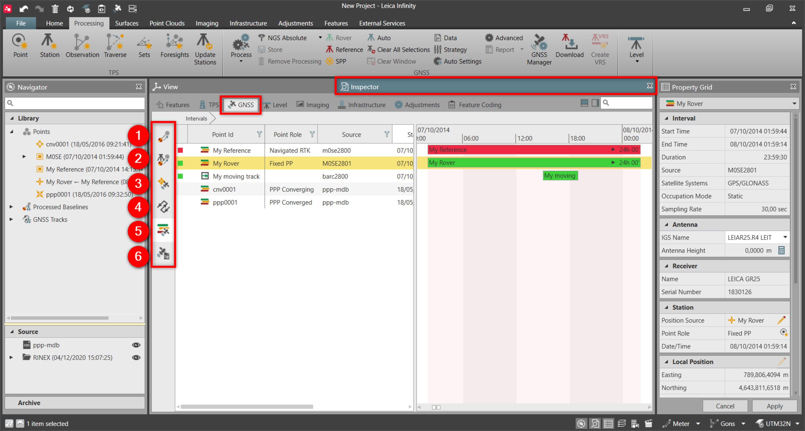

# Overview

### GNSS Inspector

The GNSS inspector is place where you can visualise and work with all the GNSS data.

|  |  |
| --- | --- |

| No. | Name | Description |
| --- | --- | --- |
| 1. | All GNSS Observations | Lists of all the baselines (RTK or Post-processed) existing in your project. |
| 2. | GNSS Observations by Station Source | Lists all the baselines (RTK or Post-processed) organised by reference station. |
| 3. | Point Measured by Precise Point Positioning | List of PPP points measured from Captivate in the field using Smartlink correction service. |
| 4. | GNSS Tracks | Shows the tracks, derived from post-processing of moving intervals. |
| 5. | GNSS Intervals | Shows graphical representation of the raw data to use for post-processing. |
| 6. | GNSS Processing Results | Visualise, analyse and store your processing results. |

**All GNSS Observations**

**GNSS Observations by Station Source**

