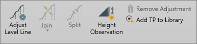

# Overview

### Level-Processing

Level-processing is a purchased option. With this functionality, you can edit and process the level lines but also perform 1D network adjustments in support of level networks.

|  |  |
| --- | --- |

| Icon | Description |
| --- | --- |
|  | Adjust Level Line opens the level line processing dialog to adjust the heights for the line. |
|  | Join allows you to connect two or more level lines to a single level line. The lines are added in order of selection. |
|  | Split allows you to divide a level line into two individual lines. This is important when considering level loops are not participating in a least squares adjustment. |
|  | Height Observation is used to enter observed height difference between two points. |
|  | Add Turning Points (TP) to Library is used for adding turning points to be used for other project data. |
|  | Remove Adjustment resets the heights of the level line. |

Editing Level Lines

**Editing Level Lines**

The height of a level line start or end target can be edited.

See also:

**See also:**

The tutorial "How to process level data" https://leica-geosystems.com/-/media/e1114ca40fda4640a2afc19292063ea8.ashx

**"How to process level data"**

The tutorial "Working with level lines" https://leica-geosystems.com/-/media/0e8524beb85c40ab926eec63b1ecc226.ashx

**"Working with level lines"**

Tutorial data can be downloaded in the Localisation Tool.

