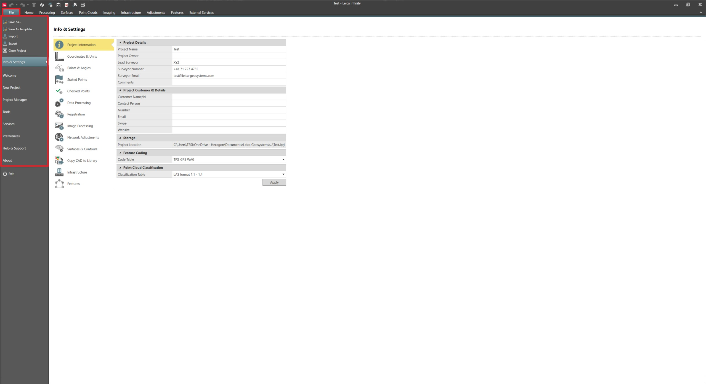

# Overview

### File

The file tab includes all the backstage functionality.

Here you can do the following:

**Here you can do the following:**

|  |  |
| --- | --- |

| Name | Description |
| --- | --- |
| Save as Template | Save the current project as a template. |
| Data Import | Import many different data formats. |
| Data Export | Export all or selected data to many different formats. |
| Info & Settings | Adapt the settings for the Infinity project. |
| Welcome | See all your recent projects and read Leica news. |
| New Project | Create a new Infinity project. |
| Project Manager | See and manage all your projects in one place. |
| Tools | Manage or create Infinity global objects. |
| Services | Access services from Leica, Hexagon and third parties. |
| Preferences | Under preferences, you can configure global application settings. |
| Help & Support | Access Infinity training materials as well as the localisation tool. |
| About | Get Information about your licence and installed Infinity version. |

