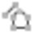

# Overview

### Surfaces

Surfaces that have been created on the instrument can be imported into Infinity together with the measured raw data. Surfaces can be managed in the surfaces tab.

The surface tab allows you to:

**The surface tab allows you to:**

- Create new surfaces by triangulation.
- Calculate volumes based on existing surfaces.

Creating new surfaces:

**Creating new surfaces:**

| 1. | Select the entities from which you want to create a surface either graphically or from inside the Inspector or the Navigator.Surfaces can be created from    Points or    Point Clouds or    Point Cloud Groups.There are two ways how you can select entities graphically. Either press Shift and drag a rectangle with your mouse to enclose a selection of entities or press Ctrl and draw a polygon (polygon selection). You cannot pick disconnected elements.In the case of the graphical view selection, only the highest point role is added. TPS or GNSS setup points, as well as deleted points are not added. |
| --- | --- |
| 2. | Select    New Surface from the Surfaces ribbon bar.The surface type created is indicated in the ribbon icon. |

There are two ways how you can select entities graphically. Either press Shift and drag a rectangle with your mouse to enclose a selection of entities or press Ctrl and draw a polygon (polygon selection). You cannot pick disconnected elements.

**Shift**

**drag a rectangle**

**Ctrl**

In the case of the graphical view selection, only the highest point role is added. TPS or GNSS setup points, as well as deleted points are not added.

**New Surface**

You can also create an empty surface and add points or point clouds to it later on.

The new surface is created and added to:

**The new surface is created and added to:**

- The    Surfaces section in the Library of the Navigator. If the Surfaces subsection does not yet exist, it is created.
- The    Surfaces section in the Surfaces subtab of the Inspector.

Surfaces are always created with a default name. To change the name, click onto a surface in the Navigator or in the Inspector and adapt its name in the Property Grid.

To see only the surfaces triangles in the graphical view, you can switch off the underlying point cloud groups through the eye in the Navigator.

**eye**

To add or remove points or point clouds to or from a surface:

**To add or remove points or point clouds to or from a surface:**

| 1. | In the Inspector, select the    Features tab and select the points or the point clouds or point cloud groups to be added to or removed from a surface.In the Navigator, points can be selected from the Library section. Point clouds can be selected from inside the Source section or from the Library section if they belong to a point cloud group.Alternatively, you can also select points or point clouds in the graphical view. |
| --- | --- |
| 2. | Select    Add to from the Surfaces ribbon bar and select a surface from the drop-down menu or select    Add to Surface... from the context menu.OR:Alternatively, select the Surfaces tab and select    Remove from from the ribbon bar to select a surface from the drop-down menu or select    Remove from... from the context menu. |

**Features**

**Add to**

**surface**

**Add to Surface...**

**Surfaces**

**Remove from**

**surface**

**Remove from...**

Points can also be removed from inside the    Surfaces subtab of the Inspector. Drill down    into the surface from which one or more points shall be removed and further down    into points. Select the points to be removed.

**points**

Only points identified by point ID (so-called Library points) can be selected to be added or removed from a surface. Cloud points are by default not identified by any point ID. Thus can only be added or removed from a surface individually if either library point have been    created from them before or when they belong to a line or area. You can select a subset of cloud points, though, graphically and add or remove it to or from a surface.

Adding and removing lines/areas to or from a surface:

**Adding and removing lines/areas to or from a surface:**

In Infinity, you can add lines as breaklines and areas as exclusion areas or to an existing surface. A single area can also be added as a boundary, with the effect that the border of the area becomes the new boundary of the surface.

Any line/area in your project, for example:

- A line defining the sideline of a road.
- The top of a ridge.
- An area defining the contours of a building.

Can be added to a surface as a breakline, exclusion area or a boundary.

This forces the triangulation of your terrain model to be rebuilt by taking the line/area into account. The line/border lines of an area become triangle edges. As a result, there is not any incorrect interpolation across the resulting breakline, exclusion area or boundary.

To add a line/area to a surface:

**To add a line/area to a surface:**

| 1. | Right-click onto the line/area to be added to the surface either in the graphical view or in the Navigator or in the Inspector. |
| --- | --- |
| 2. | Select   Add to Surface from the context menu.For lines, select    as Breakline from the context menu.For closed lines/areas, select either    as Exclusion or    as Boundary from the context menu.If more than one surface exists in your project, select the surface to which the line/area shall be added.Alternatively, select the Surfaces tab and select    Add to from the ribbon bar to select a surface from the drop-down menu. For areas, decide whether to add the area as an Exclusion or a Boundary. |

**Add to Surface**

**as Breakline**

**as Exclusion**

**as Boundary**

**Surfaces**

**Add to**

**surface**

It is possible to add only one outer boundary to an existing surface.

It is not possible to add different objects at the same time to a surface.

To remove a line/area from a surface:

**To remove a line/area from a surface:**

| 1. | Right-click onto the line/area to be removed from the surface either in the graphical view or in the Navigator or in the Inspector. |
| --- | --- |
| 2. | Select    Remove from... from the context menu. If the line/area has been added to more than one surface, select the surfaces from which the line/area shall be removed.Alternatively, select the Surfaces tab and select    Remove from from the ribbon bar to select a surface from the drop-down menu. |

**Remove from...**

**surfaces**

**Surfaces**

**Remove from**

**surface**

