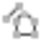
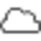
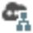

# Overview

### Point Clouds

When a job contains point cloud data, that is imported into Infinity, this data can be managed in the Point Clouds tab.

If you scanned buildings, industrial plants or other huge objects you probably had to take your point clouds on several stations all around the object. It then becomes necessary to group the single point clouds as belonging together, defining one object. Especially, when you scanned more than one object and when you had to scan from several stations around each object, it becomes necessary to group the scan data. The grouped data also gives you a solid basis for future surface calculations.

Creating new point cloud groups

**Creating new point cloud groups**

To group point clouds into a point cloud group:

**To group point clouds into a point cloud group:**

| 1. | In the Inspector, select the    Features tab and open the    Point Clouds section. |
| --- | --- |
| 2. | Select the point clouds to be grouped and select    New from the Point Clouds ribbon bar. |

**Features**

**Point Clouds**

**point clouds**

**New**

**Point Clouds**

The new point cloud group is created and added to:

**The new point cloud group is created and added to:**

- The    **Point Cloud Groups** section in the Library of the Navigator. If the **Point Cloud Groups** subsection does not yet exist, it is created.For each point cloud group, the single scans belonging to it are listed.
- The    **Point Cloud Groups** section in the Features tab of the Inspector.

Point cloud groups are always created with a default name. To change the name, click onto a point cloud group in the Navigator or in the Inspector and adapt its name in the Property Grid.

You can also create an empty point cloud group and add single point clouds to it later on.

Adding and removing point clouds from a point cloud group

**Adding and removing point clouds from a point cloud group**

To add point clouds to a point cloud group:

**To add point clouds to a point cloud group:**

| 1. | In the Inspector, select the    Features tab and open the    Point Clouds section. |
| --- | --- |
| 2. | Select the point cloud to be added to a point cloud group and select    Add to from the Point Clouds ribbon bar. |

**Features**

**Point Clouds**

**point cloud**

**Add to**

**Point Clouds**

OR:

| 1. | In the Source section of the Navigator, select the station setup containing the point cloud to be added. |
| --- | --- |
| 2. | Select the point cloud and select    Add to from the Point Clouds ribbon bar. |

**point cloud**

**Add to**

**Point Clouds**

If there is more than one point cloud group available in your project, select one from the drop-down list.

To remove point clouds from a point cloud group:

**To remove point clouds from a point cloud group:**

| 1. | In the Inspector, select the    Features tab and open the    Point Clouds section. |
| --- | --- |
| 2. | Click the arrow    next to Point Cloud Groups to open the category. |
| 3. | Click the arrow    next to the point cloud group from which one or more point clouds shall be removed. |
| 4. | Select the point clouds to be removed and select    Remove from from the Point Clouds ribbon bar. |

**Features**

**Point Clouds**

**point clouds**

**Remove from**

**Point Clouds**

OR:

| 1. | In the Library section of the Navigator, select    Point Cloud Groups and expand the tree for the point cloud group from which one or more point clouds shall be removed. |
| --- | --- |
| 2. | Select the point clouds to be removed and select    Remove from from the Point Clouds ribbon bar. |

**Point Cloud Groups**

**point clouds**

**Remove from**

**Point Clouds**

Cleaning points

**Cleaning points**

If your point clouds contain random points, like points that have accidentally been taken while scanning a main object. These random points can be identified by Infinity and cleaned from the point cloud data in your project. As a consequence, you only see the relevant point cloud data in the graphical view.

To clean points:

**To clean points:**

| 1. | Select a point cloud or a point cloud group either in the Inspector or in the Navigator. |
| --- | --- |
| 2. | Select    Clean Points from the ribbon bar to clean accidentally taken points from your point cloud data. |

**point cloud**

**point cloud group**

**Clean Points**

In the Property Grid of the point cloud and/or the point cloud group, you see that the total number of points decreases to just the relevant points.

Any clean points operation removes the hidden points from the project and resets the hidden and visible subitem structure in the project library and in the project inspector. For more information, refer to Hide/Unhide.

Colouring Modes

**Colouring Modes**

Select between:

**Select between:**

- **RGB** colouring (natural colours).
- **Intensity**.
- **SNR** (Signal-to-Noise Ratio).
- **Single Colour**.
- **Class**.

For intensity and SNR, you can select a Colour Scale from the drop-down list. By default, MultiHue is set.

**Colour Scale**

For single colour representations, you can select whether the representation shall be By Layer (default) or by a user-selected colour.

**By Layer**

**by a user-selected colour**

For class colour mode, colours are derived from the mapping defined in the Project Classification Manager.

For all colouring modes, the last used settings are remembered when you open another project. By default, the project data is displayed in RGB mode.

Filtering points

**Filtering points**

To reduce the point density in the graphical view:

**To reduce the point density in the graphical view:**

Select    Filter from the ribbon bar and select a percentage to which the point density shall be reduced from the drop-down menu.

**Filter**

The last used settings are remembered when you open another project. Select the option again to filter the points using the same percentage. The icon indicates which percentage has last been used. By default, the project data is displayed with 100%.

