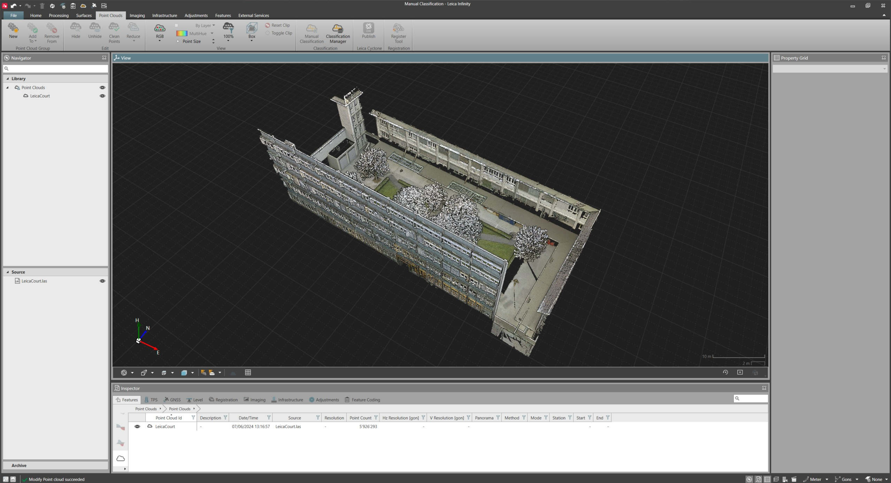
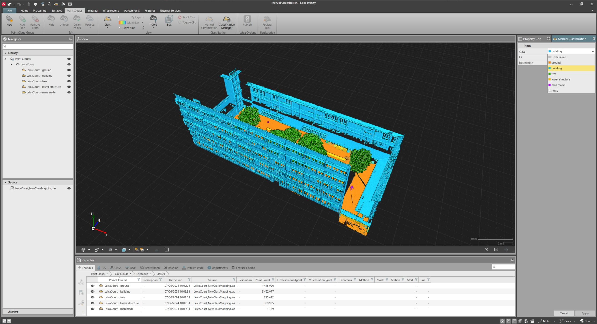

# Overview

### Manual Classification

Point cloud classification, allows you to assign selected point cloud points, to a specified class included in the classification table assigned to the project.

Classification tables are assigned from the File > Info & Settings tab.

**File**

Use the graphical view for point cloud points classification.

To assign point cloud points to a specific class:

**To assign point cloud points to a specific class:**

| 1. | Select a portion of point cloud points from the graphical view. |
| --- | --- |
| 2. | Select Manual Classification from the Point Clouds ribbon bar, to open the Manual Classification window in the property grid. |
| 3. | Select the desired Class to which point cloud points must be assigned from the drop-down list and select Apply. |
|  | Alternatively, Manual Classification can be started from the context menu. |

**Manual Classification**

**Apply**

A subitems structure is created both in the project Library and in the Inspector.

Classified point cloud points are named following the schema <point cloud object name> + <class name associated to the class ID>.

The classified point cloud points subitem can be visualised, either using the class colouring mode or the colouring mode selected for the main point cloud object. The class colour is changed from the Project Classification Manager.

Classified point cloud points, are used to create deliverables, such as surfaces and comparison maps.

Enable point cloud lighting, to improve point cloud visibility when visualising data in class colouring mode. Brightness can be changed using the slider to the right.

|  |  |
| --- | --- |

|  |  |
| --- | --- |

