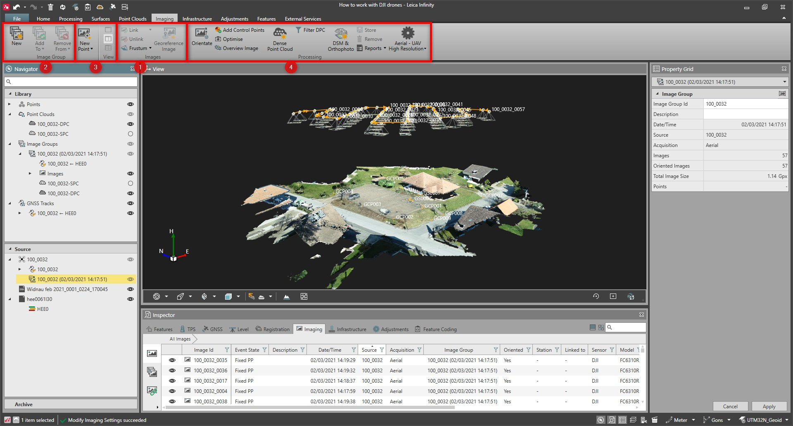

# Overview

### Imaging

Images are a useful way to add context to your project data. Infinity supports working with images in a project for documentation, along with computing points from images where measured data may have been overlooked during field collection. In Reality Capture, images can be used for generating dense point clouds, providing a detailed 3D perspective to a project area and allowing you to extract or create 3D features and data deliverables.

Infinity supports the import of images from SmartWorx and Captivate field jobs, Aibot UAV, other fixed and rotary wing drones and general JPG images. It is also possible to import georeferenced images to display as background maps.

In imaging you get access to:

**In imaging you get access to:**

|  |  |
| --- | --- |

| No. | Group Name | Description |
| --- | --- | --- |
| 1. | Images | Base option needed:Import, export and view images.Link or unlink images, to or from points, lines or areas.View computed image points.Georeference images. |
| 2. | Image Group | Base option needed:Create image groups that allow you to work with related images easier.Edit image groups. |
| 3. | Image Point Computation | Imaging option needed:Image Group Viewer - View images and points computed from images (image points), or compute points from a selected image group.New Image Point - Calculate new points from images. |
| 4. | Image Processing | Point clouds from images option needed:Dense point clouds.Digital surface models.Orthophotos. |

- Import, export and view images.
- Link or unlink images, to or from points, lines or areas.
- View computed image points.
- Georeference images.

- Create image groups that allow you to work with related images easier.
- Edit image groups.

- Image Group Viewer - View images and points computed from images (image points), or compute points from a selected image group.
- New Image Point - Calculate new points from images.

- Dense point clouds.
- Digital surface models.
- Orthophotos.

See also:

**See also:**

The video "Leica Infinity - Imaging Module - How to work with GS18 I data" https://www.youtube.com/watch?v=1TwomI2lxw0

**"Leica Infinity - Imaging Module - How to work with GS18 I data"**

The video "Leica Infinity - Imaging Module - Points from Images" https://www.youtube.com/watch?v=PDR4ROLrKbA

**"Leica Infinity - Imaging Module - Points from Images"**

The video "Leica Infinity - Home Module - Georeferencing Images" https://www.youtube.com/watch?v=m-U29-ipJgs

**"Leica Infinity - Home Module - Georeferencing Images"**

The video "Leica Infinity - UAV Processing Part 1 - Import and orientate Aibot data" https://www.youtube.com/watch?v=F8OdA9sy6q4

**"Leica Infinity - UAV Processing Part 1 - Import and orientate Aibot data"**

The video "Leica Infinity - UAV Processing Part 2 - Add GCPs and update orientation" https://www.youtube.com/watch?v=Y8hLA0RObFA

**"Leica Infinity - UAV Processing Part 2 - Add GCPs and update orientation"**

The video "Leica Infinity - UAV Processing Part 3 - Create Dense Point Cloud, DSM and Orthophoto" https://www.youtube.com/watch?v=XPpLS1cxZIk

**"Leica Infinity - UAV Processing Part 3 - Create Dense Point Cloud, DSM and Orthophoto"**

