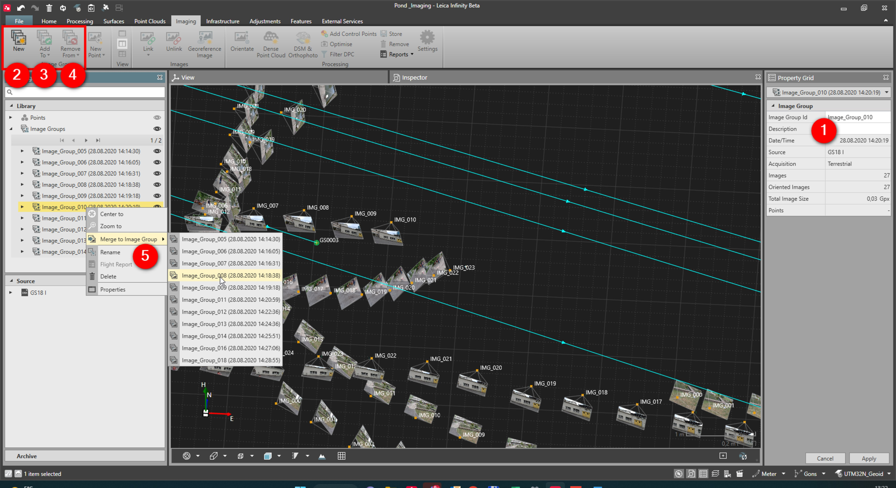

# Overview

### Image Group

To generate data from images, you work with an image group. Image groups are project objects that can be created in Infinity and imported from Captivate.

**Requirements:**

- Base option.

Here you can do the following:

**Here you can do the following:**

|  |  |
| --- | --- |

| No. | Name | Description |
| --- | --- | --- |
| 1. | Image Group Properties | Check the properties of an image group. |
| 2. | New Image Group | Create a new image group. |
| 3. | Add to Image Group | Add images to an image group. |
| 4. | Remove from Image Group | Remove images from an image group. |
| 5. | Merge to Image Group | Merge image groups. |

It is important to know, that data computed from image groups are bounded to that image group. If the image group is deleted, any data generated from the image group is also deleted.

See also:

**See also:**

Optional Modules

The video "Leica Infinity - Imaging Module - How to work with GS18 I data" https://www.youtube.com/watch?v=1TwomI2lxw0

**"Leica Infinity - Imaging Module - How to work with GS18 I data"**

The video "Leica Infinity - Imaging Module - Points from Images" https://www.youtube.com/watch?v=PDR4ROLrKbA

**"Leica Infinity - Imaging Module - Points from Images"**

