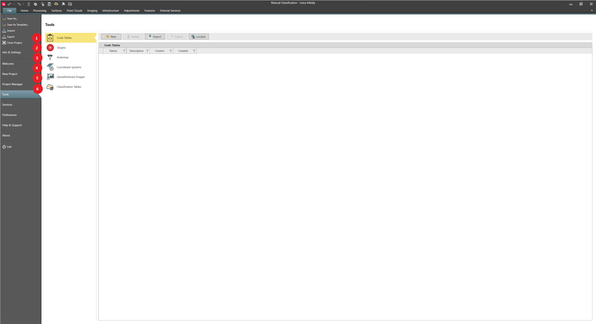

# Overview

### Tools

Tools are available to manage the following global objects:

**Tools are available to manage the following global objects:**

|  |  |
| --- | --- |

| No. | Name | Description |
| --- | --- | --- |
| 1. | Code Tables | Has a collection of codes and attributes. New Infinity code tables can be created here. |
| 2. | Targets | Manage prism constant values. |
| 3. | Antennas | Manage antennas. |
| 4. | Coordinate Systems | Manage coordinate systems. |
| 5. | Georeferenced Images | Manage georeferenced images. |
| 6. | Classification Tables | Manage classification tables. |

Any edit we do in tools is on the global objects. Changes to these global objects do not affect any existing projects. But any new project that we create uses the updated global objects.

See also:

**See also:**

Local and Global Data Objects

