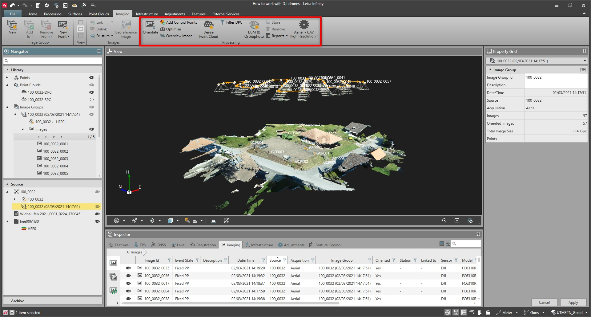
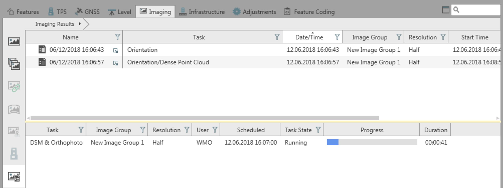

# Overview

### Image Processing

Images can be processed to create quality 2D and 3D data deliverables, such as Dense Point Clouds (DPC), Digital Surface Models (DSM) and Orthophotos.

**Requirements:**

- Point Clouds from Images option.

Here you can do the following:

**Here you can do the following:**

|  |  |
| --- | --- |

| No. | Name | Description |
| --- | --- | --- |
| 1. | Overview Image | Create a fast overview image from the selected Image Group. |
| 2. | Image Processing Settings | Adjust the Image processing settings for achieving best possible results. |
| 3. | Image Processing Workflow | Orientation of the Images - Calculate the exterior and interior orientation of images. Marking of Control Points - Mark Ground Control Points (GCP) or Check Points (CP), before or after running the orientation.Optimisation of the Orientation - Update the exterior and/or interior orientation of images, after changing either the control points (adding, removing or adjusting them) or the camera calibration settings.Generation of the Dense Point Cloud - Create the DPC. If images are not oriented, an orientation is computed first.Filtering of the Dense Point Cloud - Update the DPC after changing the DPC settings, to create a filtered improved version.Generation of the DSM & Orthophoto - Create the DSM and the orthophoto. If the orientation and DPC are not stored, they are computed first. |
| 4. | Image Processing Report | Explore the details. |
| 5. | Task Manager | View the progress of the processing tasks for all the created projects. |
| 6. | Export Image Processing Results | Export deliverables in various format files. |
| 7. | Processing Considerations | Helps with understanding which component has an impact on processing. |

- Orientation of the Images - Calculate the exterior and interior orientation of images.
- Marking of Control Points - Mark Ground Control Points (GCP) or Check Points (CP), before or after running the orientation.
- Optimisation of the Orientation - Update the exterior and/or interior orientation of images, after changing either the control points (adding, removing or adjusting them) or the camera calibration settings.
- Generation of the Dense Point Cloud - Create the DPC. If images are not oriented, an orientation is computed first.
- Filtering of the Dense Point Cloud - Update the DPC after changing the DPC settings, to create a filtered improved version.
- Generation of the DSM & Orthophoto - Create the DSM and the orthophoto. If the orientation and DPC are not stored, they are computed first.

The processing procedure includes three core steps:

**The processing procedure includes three core steps:**

| 1. | Orientation of the Images |
| --- | --- |
| 2. | Generation of the Dense Point Cloud |
| 3. | Generation of the DSM & Orthophoto |

Some further processes can be carried out if necessary.

There are two approaches to process image data:

**There are two approaches to process image data:**

Step-by-Step - Process each task manually, step-by-step, and store it. This allows a better control on the results. Once stored, the output of each step (sparse point cloud, dense point cloud, DSM & Orthophoto) is available in the view and the numerical results in the inspector.

**Step-by-Step**

Onestep - Choose the end data result, such as DPC or DSM & Orthophoto, and all individual tasks are computed automatically.

**Onestep**

Imaging Inspector

**Imaging Inspector**

From the Inspector > Imaging tab, you can access Imaging Results. The view is split into two panes, the results pane and the Task pane:

**Inspector**

**Imaging**

|  |  |
| --- | --- |

See also:

**See also:**

The video "Leica Infinity - Imaging Module - How to work with GS18 I data" https://www.youtube.com/watch?v=1TwomI2lxw0

**"Leica Infinity - Imaging Module - How to work with GS18 I data"**

The video "Leica Infinity - UAV Processing Part 1 - Import and orientate Aibot data" https://www.youtube.com/watch?v=F8OdA9sy6q4

**"Leica Infinity - UAV Processing Part 1 - Import and orientate Aibot data"**

The video "Leica Infinity - UAV Processing Part 2 - Add GCPs and update orientation" https://www.youtube.com/watch?v=Y8hLA0RObFA

**"Leica Infinity - UAV Processing Part 2 - Add GCPs and update orientation"**

The video "Leica Infinity - UAV Processing Part 3 - Create Dense Point Cloud, DSM and Orthophoto" https://www.youtube.com/watch?v=XPpLS1cxZIk

**"Leica Infinity - UAV Processing Part 3 - Create Dense Point Cloud, DSM and Orthophoto"**

### Image Acquisition Suggestions

In order to get a good quality result, it is of main importance to acquire the data set to be processed correctly. A poor quality data set may lead to poor results or even to failed processes.

The following guidelines are recommended for a good outcome:

**The following guidelines are recommended for a good outcome:**

- Use digital cameras with a fixed lens, or keep it fixed throughout the acquiring phase.
- Use focal lengths between 20 mm and 80 mm (in 35 mm equivalent).
- Use 70%-80% forward overlap and 65%-80% side overlap.
- Avoid blurry images.
- Avoid low textured, moving or reflective objects.
- Avoid regions with shadows.
- Do not manipulate original images, for example crop or rotate them.
- Use control points to improve the orientation.
- Use check points to assess results accuracy.

Fisheye, ultra-wide and macro lenses as well as hyperspectral images are currently not supported.

Corrections for the rolling shutter effect are currently not supported.

