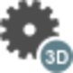
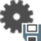
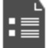
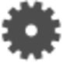

# Overview

### Adjustments

From the observations you have made in the field, the next step is to compute an end result, the coordinates. When redundant observations are available, as should be the case, choose a strategy to get a unique and optimal solution. In geodesy, this strategy is usually a least squares adjustment, which is based on the following criterion: The sum of the squares of the observational residuals must be minimised. After carrying out a least squares adjustment, you know that based on the available observations, you have achieved the best possible solution.

But after you have found the best possible solution, it is further important to be able to assess the quality of this solution to verify whether your network meets the requirements. The quality of a network can be assessed in terms of precision and reliability, which can be quantified by setting the adjustment parameters.

Finally, quality control has to include statistical testing to clear the result of possible outliers. The effectiveness of testing depends on the reliability of the network. The more reliable a network is, the higher the probability that outliers are detected by the testing.

To summarise the relationship between least squares adjustment, precision and reliability and statistical testing we can say that:

**To summarise the relationship between least squares adjustment, precision and reliability and statistical testing we can say that:**

- Based on the available data, the least squares adjustment produces the best possible result.
- Statistical tests check the result to make it error-free.**See also:**Statistical Testing
- The precision and reliability settings quantify the quality of the result.**See also:**General Adjustment Settings

In Infinity, the adjustment computation is performed using the MOVE3 adjustment kernel, licensed to Leica Geosystems AG by Grontmij Geo Informatie, bv, Rosendaal, The Netherlands. For detailed information, see https://move3software.com/.

See also:

**See also:**

The tutorial "How to adjust a GNSS+Level network" https://leica-geosystems.com/-/media/94056ba161ce4993b46bd2848ad58902.ashx

**"How to adjust a GNSS+Level network"**

The tutorial "Advanced Network Adjustment" https://leica-geosystems.com/-/media/02614143f73640338df088b7f7123ef0.ashx

**"Advanced Network Adjustment"**

The tutorial "Advanced Adjustment Concepts" https://leica-geosystems.com/-/media/80026c2d4e22481fb05a0df1fd2224f8.ashx

**"Advanced Adjustment Concepts"**

The tutorial data can be downloaded in the Localisation Tool.

Prepare the data for adjustment:

**Prepare the data for adjustment:**

In Infinity there are four basic steps to performing an adjustment:

**In Infinity there are four basic steps to performing an adjustment:**

| 1. | Define the control points - Fixed in 3D, 2D, 1D or not fixed. |
| --- | --- |
| 2. | Select the observations to be considered in the adjustment - TPS, GNSS and level observations. |
| 3. | Run the adjustment and evaluate the results, even comparing several adjustment runs. |
| 4. | Store the results that satisfy the adjustment criteria. |

Run full adjustment:

**Run full adjustment:**

To run a network adjustment:

**To run a network adjustment:**

Select the    option in the Adjustments ribbon bar to run an adjustment.

Select from the drop-down menu whether you want to adjust 3D (position and height), 2D (position only) or 1D (height only).

**3D**

**2D**

**1D**

The last selected method is remembered.

Depending on the chosen dimension, the following types of data is adjusted:

**Depending on the chosen dimension, the following types of data is adjusted:**

|  | TPS | GNSS | Level |
| --- | --- | --- | --- |
| 3D | Direction, Zenith Angle and Slope Dist. | DX, DY, DZ | --- |
| 2D | Direction and Horizontal Dist. | DX, DY, DZ | --- |
| 1D | Trig. Height Diff. | --- | Height Diff. |

**3D**

**2D**

**1D**

| Adjustment Method | Description |
| --- | --- |
| 3D | Data is adjusted in all available dimensions.If only 2D or 1D data is available the 2D and 1D observations are adjusted instead. |
| 2D | If your network has GNSS baselines these are always adjusted in 3D even if the dimension is set to 2D.TPS slope distances and zenith angles are reduced to horizontal distances.Slope distances without zenith angles are ignored.This adjustment is stored with the adjusted least squares 2D point role. |
| 1D | If you choose 1D the GNSS baselines are excluded from the adjustment.TPS slope distances and zenith angles are reduced to trigonometric height differences. TPS directions are ignored.This adjustment is stored with the adjusted least squares 1D point role. |

**3D**

**2D**

**1D**

The adjustment result is available in the    Adjustment Results view of the Inspector and can be    stored if it meets your needs for accuracy.

The results of all adjustment runs are kept in the list until you select them and delete them. To delete a result from the list select it and select the    Delete option in the top left corner of the main Infinity window.

**Delete**

Network Reports

**Network Reports**

For each result in the Inspector, you can create a report to compare individual adjustment runs.

Select the    Reports option in the ribbon bar and select Network Adjustment Report from the drop-down menu.

**Reports**

**Network Adjustment Report**

The report opens in a separate window and can be saved as a PDF or HTML file. Both types of file are added to the Archive section of the Navigator under Reports and can be opened from there again.

Store Result

**Store Result**

In the    General Adjustment Settings, you can choose to automatically store a result after the network computation is finished. If you have deselected this setting, you can store the result manually. A reason for doing that, can be to first inspect a result before storing it.

See also:

**See also:**

General Adjustment Settings

Inspecting Adjustments

| 1. | Go to the    Adjustment Results view of the Inspector and select the result which you want to store from the list. |
| --- | --- |
| 2. | Select the    Store Result option in the ribbon bar to store the adjustment result manually. |

**Adjustment Results**

**Store Result**

After saving a result, the point role    adjusted least squares are assigned to all adjusted points. You can select this point role for each point in the Navigator and inspect the properties in the Property Grid.

Only one result can be selected to be stored. You cannot store multiple Results.

When you want to store another result, select it from the list and select the Store Result option again.

**Store Result**

When you want to remove the adjusted least squares point roles from the project, select the Remove Adjustment option in the ribbon bar.

**Remove Adjustment**

What is stored to the project:

**What is stored to the project:**

A useful feature of Infinity is allowing you to run several adjustments to compare results and in general decide which adjustment satisfies the adjustment criteria.

It is important to recognise the adjustment results are stored to the project and merged with the existing data.

The adjusted coordinate values are merged to the library points and the point role reflects the value that was stored.

It is also possible to merge the coordinate values from two adjustment runs and to combine the 2D and 1D runs.

Adjusted least squares point roles:

**Adjusted least squares point roles:**

After storing an adjustment result, the following table explains the point role that is stored to the points project data:

| Point Role | Storing Adjustment Dimension |
| --- | --- |
| Adjusted Least Squares 3D | Storing 3D creates a point role that indicates all three coordinate values are from the adjustment.If an existing adjusted point role exists, then it is replaced with the adjustment values of the most recent store. |
| Adjusted Least Squares 2D | Storing 2D creates a point role that indicates the position coordinate values are from the adjustment.If an existing adjusted point role exists, then this store replaces the position coordinate values.The height value is not replaced. |
| Adjusted Least Squares 1D | Storing 1D creates a point role that indicates the height values are from the adjustment.If an existing adjusted point role exists, then this store replaces the height coordinate value only.The position coordinate values are not replaced. |
| Adjusted Least Squares 2D + 1D | When storing a 2D and then a 1D adjustment the height coordinate value is merged with the position coordinate values to provide a 2D + 1D adjusted coordinate.Run and store a 2D adjustment, the adjusted least squares 2D point role is available.Run and store a 1D adjustment, the adjustment respects the 2D value and updates the height value. |
| Adjusted Least Squares 1D + 2D | When first storing a 1D and then a 2D adjustment the position coordinate values are merged with the height coordinate value to provide a 1D + 2D adjusted coordinate.Run and store a 1D adjustment, the adjusted least squares 1D point role is available.Run and store a 2D adjustment, the adjustment respects the 1D value and updates only the position value. |

Remove Adjustment:

**Remove Adjustment:**

To remove a stored adjustment and with it the adjusted point roles:

**To remove a stored adjustment and with it the adjusted point roles:**

Select the    Remove Adjustment option from the ribbon bar to remove the stored result.

**Remove Adjustment**

The status of the stored adjustment run is set back to not stored and the point roles    adjusted least squares are removed from all adjusted points. But the adjustments run itself is kept in the    Adjustment Results section of the Inspector for future reference and could be saved again if necessary.

To delete an adjustment result from the list, select the result and select the    Delete option in the top left corner of the main Infinity window.

**Delete**

