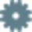
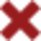
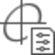
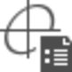

# Overview

### Inspecting Adjustments

With Infinity you are flexible to run adjustments under various pre-conditions and keep the results next to each other. You can inspect and select control points to be fixed, observations not to be used, adapt the settings and compare and judge afterwards which result fits your needs best before you finally save one solution to your project.

To inspect adjustments:

**To inspect adjustments:**

Go to the Inspector and open the    Adjustment tab.

**Adjustment**

Define coordinate constraints:

**Define coordinate constraints:**

The Define Coordinate Constraints view, lists all control points in your project. Control points are needed when you want to adjust a constrained or weighted constrained network.

**Define Coordinate Constraints**

If you want a control point to take part in the adjustment:

**If you want a control point to take part in the adjustment:**

Select the    Fix 2D checkbox, if you want its position coordinates to take part in the adjustment.

**Fix 2D**

Select the    Fix 1D checkbox, if you want only the height coordinate to take part.

**Fix 1D**

Select    both checkboxes, if you want all coordinate components to take part.

**both**

The role of all control points selected here, changes to    Control Fixed 3D (or 2D or 1D) to indicate that these points are considered for taking part in the adjustment.

See also:

**See also:**

Objects, Point Roles and Symbols

If you want to compute a weighted constrained network standard deviations have to be available for each    control point taking part in the adjustment.

Before you start the adjustment, the control coordinates can be edited in the property grid if necessary.

You can import control coordinates, for example, from an ASCII file, or you can enter them manually by selecting a point and selecting    Create Control point next to the existing point role in the Feature section of the Property Grid.

**Create Control point**

Select Observations

**Select Observations**

The select observations view lists all observations in your project. By default all observations are selected to be used in the adjustment computation.

If you want to exclude observations:

**If you want to exclude observations:**

- De-select the **Use** checkbox for a single observation.Or
- Multi-select a set of observations, right-click into the selection and select **Adjustment** >    Don't Use from the context menu.

A reason for excluding an observation could be that it has been identified as an outlier in a previous adjustment run.

See also:

**See also:**

W-Test

Possible reasons for outliers could be mistakes in elements like the target height or type, offsets or the atmospheric or geometric corrections.

All these elements as well as the coding information can be edited in the property grid before you start an adjustment run.

See also:

**See also:**

Observation Properties

Computed Loops Results

**Computed Loops Results**

The computed loops results view lists all loop computation results. To inspect the results open the computed loops report.

For detailed information, see:

**For detailed information, see:**

Loops Computation

Pre-Analysis Results

**Pre-Analysis Results**

The pre-analysis results view lists all pre-analysis results. To inspect the results open the pre-analysis report.

See also:

**See also:**

Pre-Analysis

Adjustment Results

**Adjustment Results**

The adjustment results view lists all adjustments that have been computed within the current project.

On the top level for each adjustment run you can see:

**On the top level for each adjustment run you can see:**

- The Adjustment Type, that has been computed, that is, inner constrained, constrained or weighted constrained.
- The Dimension, that is, the position only or position and height or height only.
- The Confidence Levels, that have been defined for heights and error ellipses.
- The Degrees of Freedom.
- The Critical Value for the F-Test, as computed on the basis of the currently given level of significance plus the F-Test result.

To inspect the resulting adjusted coordinates and observations:

**To inspect the resulting adjusted coordinates and observations:**

Drill into a result by selecting the arrow    next to it.

Under coordinates you can inspect the adjusted coordinates together with:

**Under coordinates you can inspect the adjusted coordinates together with:**

- The values by which they have been corrected in their components.
- The resulting standard deviations for all points that have not been kept fixed or only weighted fixed.
- The values defining the error ellipses.
- The external reliability in each coordinate direction.

Under observations you can inspect the adjusted observations separately for TPS and GNSS together with:

**Under observations you can inspect the adjusted observations separately for TPS and GNSS together with:**

- The residuals that have been amended in each observation component.
- The resulting standard deviations for each observation component.
- The W-Test results for each observation component.

To manually save the result that meets the demanded accuracy best:

**To manually save the result that meets the demanded accuracy best:**

Select it and select    Store result from the ribbon bar to save it.

**Store result**

On how to remove a stored result from the database and on how to remove an adjustment run from the list of results, refer to the overview topic in adjustments.

